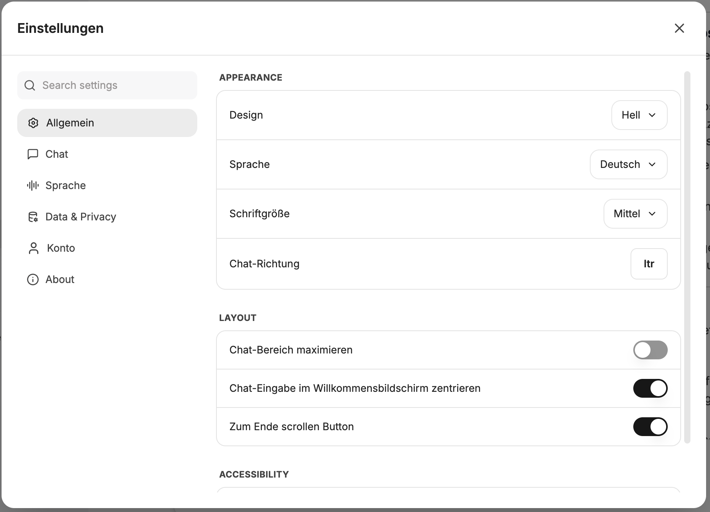

Die Einstellungen können über das Benutzermenü in der linken unteren Ecke aufgerufen werden. Der Einstellungsdialog ist über die linke Navigation in die Bereiche **Allgemein**, **Chat**, **Sprache**, **Daten & Datenschutz**, **Konto** und **Über** gegliedert.

## Allgemein

Unter **Allgemein** werden Darstellung, Layout und Barrierefreiheit konfiguriert:

### Darstellung

#### Design

- Hell
- Dunkel
- System

#### Anzeigesprache

Sprache, in der die Benutzeroberfläche angezeigt wird.

#### Schriftgröße

Auswahl der Schriftgröße, in der die Chatnachrichten dargestellt werden sollen.

#### Chat-Richtung

- `ltr`: Links nach rechts
- `rtl`: Rechts nach links

### Layout

#### Chat-Bereich maximieren

Der Chat-Bereich wird auf die volle Breite ausgedehnt.

#### Chat-Eingabe im Willkommensbildschirm zentrieren

Chat-Eingabe im Willkommensbildschirm zentriert oder mittig unten.

#### Zum Ende scrollen Button

Zeigt einen Button am unteren Ende des Chat-Bereichs an, der es ermöglicht, schnell zum Ende des Chats zu scrollen.

### Barrierefreiheit

#### Bildschirm während der Antwortgenerierung aktiv lassen

Verhindert, dass der Bildschirm während der Antwortgenerierung in den Ruhemodus wechselt.

## Chat

### Allgemeine Chat-Einstellungen

#### Enter drücken, um Nachrichten zu senden

Wenn aktiviert, reicht `Enter` zum Senden von Nachrichten. Neue Zeilen können mit `Shift + Enter` hinzugefügt werden. Wenn deaktiviert, muss `Strg / Cmd + Enter` zum Senden von Nachrichten genutzt werden, `Enter` fügt dann eine neue Zeile hinzu.

#### Code immer anzeigen, wenn der Code-Interpreter verwendet wird

Code wird standardmäßig angezeigt.

#### Entwürfe lokal speichern

Wenn aktiviert, werden der Text und die Anhänge, die in das Chat-Formular eingegeben werden, automatisch lokal als Entwürfe gespeichert. Diese Entwürfe sind auch verfügbar, wenn die Seite neu geladen oder zu einer anderen Konversation gewechselt wird. Entwürfe werden lokal auf dem Gerät gespeichert und werden gelöscht, sobald die Nachricht gesendet wird.

#### Badgestatus speichern

Wenn aktiviert, wird der Status der Chat-Badges gespeichert. Das bedeutet, dass die Badges im gleichen Status wie im vorherigen Chat bleiben, wenn man einen neuen Chat erstellt. Wenn diese Option deaktiviert ist, werden die Badges jedes Mal, wenn man einen neuen Chat erstellt, auf ihren Standardzustand zurückgesetzt.

### Befehle

Befehle sind Kurzbefehle, die in der Nachrichteneingabe ausgeführt werden können und so schnell auf Modelle, Prompts und Mehrfachantworten zugreifen können.

#### Befehl @ zum Wechseln von Modellen

Schaltet den Befehl "@" zum Wechseln von Endpunkten, Modellen, Voreinstellungen usw. um.

#### Befehl + für Mehrfachantwort

Schaltet den Befehl "+" zum Hinzufügen einer Mehrfachantwort-Einstellung um.

#### Befehl / für Promptvorlage

Schaltet den Befehl "/" zur Auswahl einer Promptvorlage über die Tastatur um.

### Nachrichten

#### Benutzernachrichten als Markdown darstellen

Regelt die Darstellung der Benutzernachrichten als Markdown. Markdown ist eine leichte Syntax zur Auszeichnung von Texten. KIs antworten ebenfalls in Markdown, und die Inhalte werden entsprechend dargestellt (z.B. fett). Diese Einstellung regelt, ob die Benutzernachrichten ebenfalls formatiert dargestellt werden sollen.

#### Benutzernamen in Nachrichten anzeigen

Wenn aktiviert, wird der Benutzername des Absenders über jeder Nachricht angezeigt, die gesendet wird. Wenn deaktiviert, wird "Du" über den Nachrichten angezeigt.

#### LaTeX in Nachrichten parsen (kann die Leistung beeinflussen)

Wenn aktiviert, wird LaTeX-Code in Nachrichten als mathematische Gleichungen gerendert. Das Deaktivieren kann die Leistung verbessern, wenn keine LaTeX-Darstellung benötigt wird.

#### Denkprozess-Dropdowns standardmäßig öffnen

Wenn KI-Modelle nachdenken, kann der Denkprozess standardmäßig angezeigt oder hinter einem Dropdown verborgen und bei Bedarf geöffnet werden.

#### Werkzeugdetails automatisch ausklappen

Klappt die Detailansicht von Werkzeugaufrufen automatisch auf, sodass die ausgeführten Schritte direkt sichtbar sind.

### Konversationen

#### Beim Erstellen eines neuen Chats zum Chatverlauf wechseln

Wechselt beim Erstellen eines neuen Chats automatisch zur Ansicht des Chatverlaufs.

#### Automatisch zur neuesten Nachricht scrollen, wenn der Chat geöffnet wird

Diese Einstellung regelt, ob vorhandene Chats automatisch nach ganz unten zur neuesten Nachricht scrollen sollen, wenn sie geöffnet werden.

#### Ermöglicht das Wechseln der Endpunkte mitten im Gespräch

Ermöglicht dem Nutzer, mitten im Gespräch den Endpunkt zu wechseln. Das kann nützlich sein, wenn man beispielsweise feststellt, dass ein anderes Modell für die aktuelle Aufgabe besser geeignet ist.

#### Standardmäßig temporärer Chat

Wenn aktiviert, beginnen neue Chats standardmäßig im temporären Modus. Temporäre Chats werden nicht im Verlauf gespeichert.

#### Standard-Abzweigungsoption verwenden

Verwendet die Standard-Abzweigungsoption, wenn ein neuer Chat erstellt wird. Diese Option kann in den KI-Einstellungen konfiguriert werden.

#### Abzweigung standardmäßig von der Zielnachricht beginnen

Wenn aktiviert, beginnt das Abzweigen von der Zielnachricht bis zur letzten Nachricht in der Konversation, gemäß dem ausgewählten Verhalten.

### Prompts

#### Erweiterter Prompt-Editor

Aktiviert einen erweiterten Editor zum Erstellen und Bearbeiten von Prompts mit zusätzlichen Funktionen.

#### Übernehme neue Prompt Versionen immer auf Produktiv

Neue Versionen eines Prompts werden automatisch als Produktivversion übernommen, ohne dass sie manuell freigegeben werden müssen.

#### Prompts beim Auswählen automatisch senden

Wenn aktiviert, wird ein Prompt beim Auswählen direkt gesendet, anstatt zunächst in das Eingabefeld eingefügt zu werden.

## Sprache

Im CompanyGPT stehen sowohl Sprache zu Text (STT) als auch Text zu Sprache (TTS) zur Verfügung. Beides kann sowohl über die integrierte Browser-Engine als auch über LLMs genutzt werden (die LLMs müssen entsprechend konfiguriert sein).

### Konversationsmodus

Der Konversationsmodus aktiviert die automatische Transkription von Audio und ermöglicht das Einstellen der Dezibel-Empfindlichkeit

### Sprache zu Text

Kann genutzt werden, um Prompteingaben zu diktieren, anstatt zu tippen.

Engines:

- `Extern`: LLM
- `Browser`: Engine des aktuellen Browsers

Sprache: Die Sprache der Eingabe

Audio automatisch transkribieren

Text automatisch senden

Verzögerung

### Text zu Sprache

Kann genutzt werden, um Nachrichten vorlesen zu lassen.

Automatische Wiedergabe der neuesten Nachricht

Engines:

- `Extern`: LLM
- `Browser`: Engine des aktuellen Browsers

Stimme: Verfügbare Stimmen, entweder der Browser-Engine oder KI

Cloud-basierte Stimmmen verwenden

Audio-Wiedergabegeschwindigkeit

TTS-Caching aktivieren

## Daten & Datenschutz

### Gespeicherte Erinnerungen verwenden

Erlaube der KI, bei den Antworten auf deine gespeicherten Erinnerungen zuzugreifen und sie zu verwenden.

### Konversationen Importieren

Konversationen können aus einer exportierten JSON-Datei importiert werden, um sie beispielsweise mit den Kollegen zu teilen.

### Geteilte Links

Ansicht der über Links geteilten Konversationen. Die Links können wieder aufgerufen werden, die Quellchats können geöffnet werden, oder die geteilten Links können gelöscht werden.

### Agenten-API-Schlüssel

Ansicht über die API-Schlüssel, die für die Agenten vergeben wurden. Diese können hier erstellt und widerrufen werden.

### Benutzer API-Keys

Falls KI-API-Keys auf Benutzerebene vergeben wurden, können diese hier widerrufen werden.

### TTS-Cache-Speicher

Der TTS-Cache-Speicher kann geleert werden, falls er verwendet wird.

### Alle Chats löschen

Löschen aller Chats.

:::danger[Vorsicht]
Das Löschen aller Chats kann nicht rückgängig gemacht werden.
:::

## Konto

### Profil

#### Profilbild

Ändern des Profilbildes über **Bild ändern**.

### Abrechnung

#### Guthaben

Übersicht über das aktuelle Guthaben.

#### Einstellungen zum automatischen Auffüllen

Zeigt an, wann das Guthaben zuletzt aufgefüllt wurde, die Nachfüllmenge, das Intervall und den Zeitpunkt des nächsten automatischen Auffüllens.

### Gefahrenzone

#### Konto löschen

Löschen des Benutzerkontos.

:::danger[Vorsicht]
Das Löschen des Benutzerkontos kann nicht rückgängig gemacht werden.
:::

## Über

### Versionsinformationen

Zeigt Informationen zur installierten Version: **Version**, **Commit**, **Branch** und **Built** (Build-Datum). Über **Copy diagnostics** lassen sich diese Angaben kopieren, damit Maintainer den konkreten Build identifizieren können.
