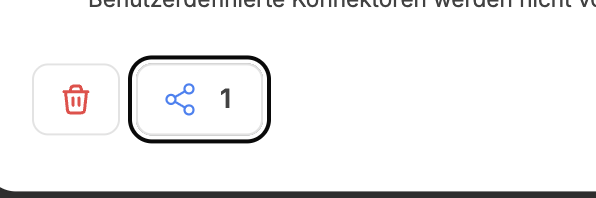

Das Model Context Protocol (MCP) ist ein spezialisiertes Protokoll und eine Schnittstelle, die CompanyGPT die nahtlose Kommunikation mit externen Diensten ermöglicht. Diese Dienste laufen auf kundenspezifischen MCP-Servern, die oft komplexe Backend-Funktionalitäten hosten oder spezifische Unternehmensprozesse orchestrieren. Ursprünglich von Anthropic entwickelt, wird das MCP mittlerweile von nahezu allen KI-Anwendungen unterstützt, wodurch CompanyGPT auf eine breite Masse bestehender MCP-Server zurückgreifen kann. Bei Bedarf lassen sich eigene Server entwickeln, um nahezu jede Anwendung an CompanyGPT anzubinden.

Das MCP basiert auf einer Client-Server-Architektur, bei der CompanyGPT als Client die vom Server bereitgestellten „Tools“ konsumiert. Ein MCP-Server kann beliebig viele solcher Tools beinhalten, wobei das integrierte LLM selbstständig entscheidet, welches Tool genutzt und welche Parameter übergeben werden. Nach der Ausführung wertet das LLM die Ergebnisse aus und formuliert eine entsprechende Antwort an den Benutzer.

Mehr Informationen zu MCP finden Sie hier: [Prompt Engineering / MCP](/prompt-engineering/prompt-techniken/tool-use#das-mcp-model-context-protocol-als-tool)

## MCP Server hinzufügen

MCP Server können in der rechten Seitenleiste über die MCP Einstellungen hinzugefügt werden. Admin-Benutzer können einstellen, wie die MCP Server genutzt werden können. Die Berechtigungen können für Benutzen, Erstellen und Teilen vergeben werden. 

Durch Klick auf **+ MCP hinzufügen** öffnet sich der Dialog, um MCP Server hinzuzufügen. 

### MCP Server Eigenschaften

Folgende Eigenschaften können vergeben werden:

- **Icon** `optional`: Ein Icon, welches in der Übersicht angezeigt wird
- **Name**: Der Name des MCP Servers, sichtbar in der Übersicht und in jeder Auswahl
- **Beschreibung** `optional`: Eine Beschreibung, welche in der Übersicht angezeigt wird
- **MCP-Server-URL**: Die URL für den MCP Server. Diese URLs können sowohl für interne Service (innerhalb des Clusters) oder über das Internet erreichbare MCP-Server URLs sein. 
- **Server Typ**: Streamable HTTP oder SSE (vom Server vorgegeben)
- **Authentifizierung**: 
    - **Auto Detect**: Automatische Erkennung mit OAuth `Dynamic Client Registration` oder gänzlich ohne Authentifizierung
    - **API-Schlüssel**: Authentifizierung mit API Schlüssel, auswählbar ob ein API Schlüssel für alle User oder auf per-User Basis.
    - **Manual OAuth**: OAuth 2.1 konforme Client registrierung mit Client ID, Secret, Redirect Uri, Authorisierungs- und Token-URL.
- **Ich vertraue dieser Anwendung**: Kontrollkästchen zum Bestätigen.

Bei erfolgreicher Initialisierung wird der MCP Server in der rechten Seitenleiste nun in der Übersicht angezeigt und kann über den [Chat](/company-gpt/chat/#integrationen) oder in [Agenten](/company-gpt/agenten/) genutzt werden.

## MCP Server teilen

Sobald ein MCP Server hinzugefügt wurde, kann dieser geteilt werden. Dazu muss in der übersicht in der rechten Seitenleiste auf den Einstellungen Icon geklickt werden. Danach kann das bekannte Teilen-Menü aufgerufen werden: 

Im Detailmenü kann ausgewählt werden, mit wem und mit welchen Rechten der MCP Server geteilt werden soll.

