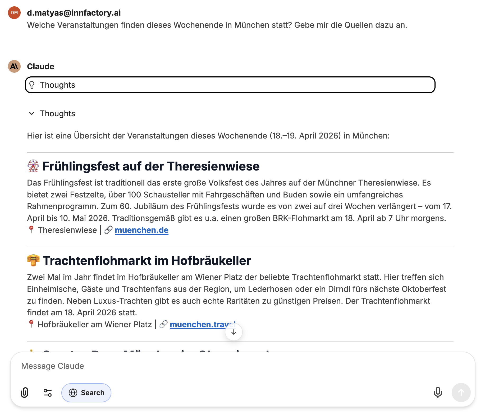
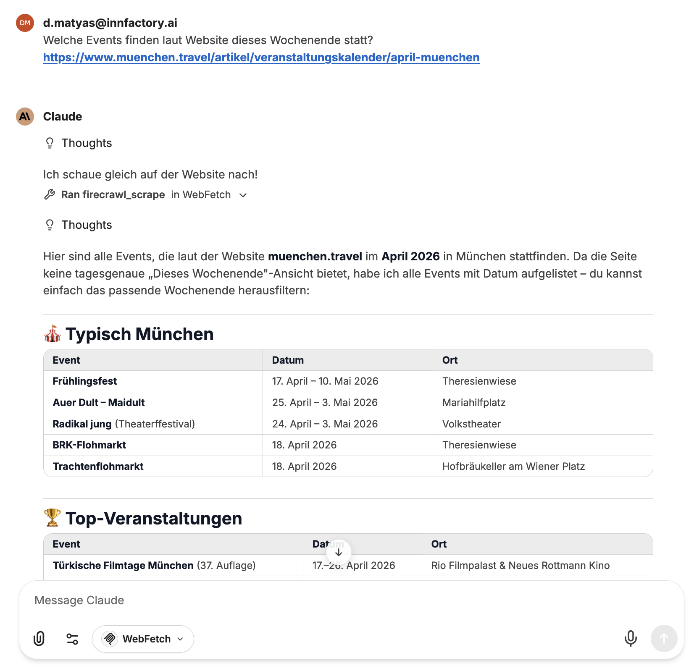

## Websuche

Die Websuche ermöglicht es CompanyGPT, das Internet zu durchsuchen und aktuelle Inhalte in die Antwort einzubeziehen. Die Suche muss vom Benutzer für die aktuelle Nachricht aktiviert werden.

Auf Wunsch können die Quellen direkt in der Antwort mit angegeben werden.

:::tip[Hintergrund: Grounding]
Die Websuche basiert auf dem Prinzip des „Grounding" – das KI-Modell stützt seine Antworten auf aktuelle, öffentlich verfügbare Informationen aus dem Web. Dadurch werden Halluzinationen reduziert und die Aktualität der Antworten verbessert. Mehr dazu im Google Cloud Blog: [Vertex AI Grounding with Google Search](https://cloud.google.com/blog/products/ai-machine-learning/using-vertex-ai-grounding-with-google-search?hl=en)
:::

## WebFetch

WebFetch eignet sich, wenn gezielt der Inhalt einer bestimmten Webseite abgerufen und verarbeitet werden soll. Im Gegensatz zur Websuche, die eigenständig im Internet recherchiert, ruft WebFetch eine vom Benutzer angegebene URL auf und extrahiert deren Inhalt.

Das ist besonders nützlich, wenn Sie den Inhalt einer bekannten Seite zusammenfassen, analysieren oder als Grundlage für eine Antwort verwenden möchten.

