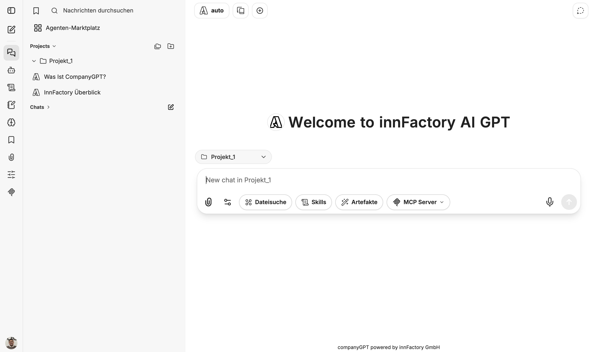
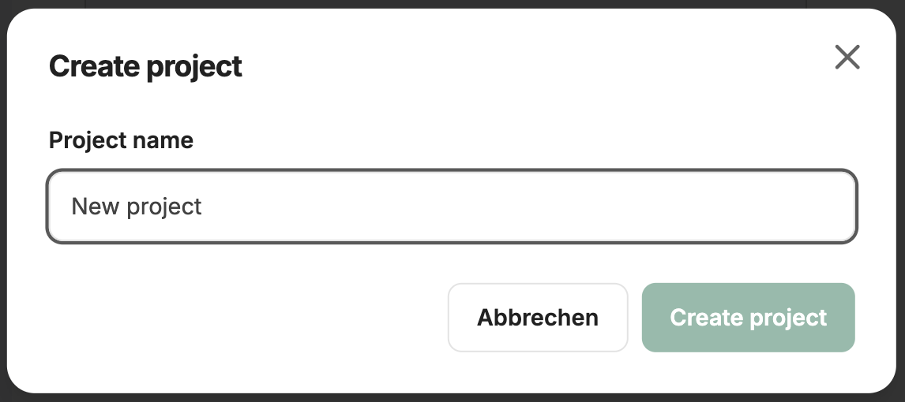
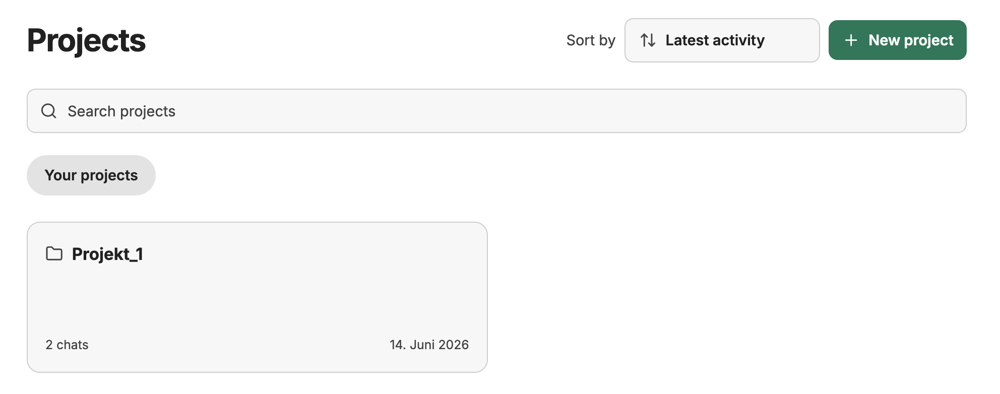
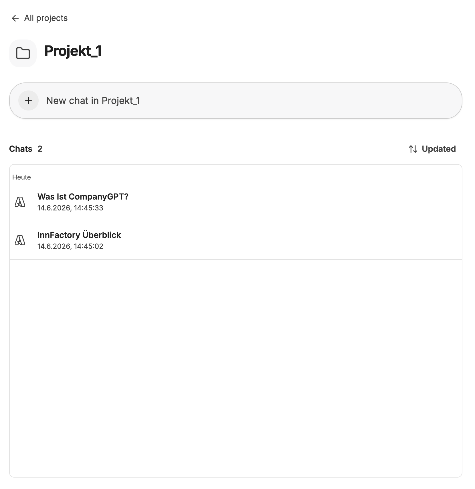

Projekte ermöglichen es, Chats thematisch zu bündeln und strukturiert zu verwalten. So behalten Sie auch bei einer wachsenden Anzahl von Gesprächen den Überblick.

## Projekte in der Seitenleiste

Projekte werden in der linken Seitenleiste im Bereich **Projects** verwaltet. Klicken Sie auf ein Projekt, um es auf- oder zuzuklappen und die enthaltenen Chats anzuzeigen. Über die Schaltfläche **Alle Projekte** gelangen Sie zur Projektübersicht. Mit **Neues Projekt erstellen** legen Sie direkt ein neues Projekt an.

## Projekt erstellen

Klicken Sie in der Seitenleiste auf **Neues Projekt erstellen**, um ein neues Projekt anzulegen. Es öffnet sich ein Dialogfenster, in dem Sie einen **Project name** eingeben können. Bestätigen Sie mit **Create project** oder brechen Sie den Vorgang mit **Abbrechen** ab.

## Alle Projekte

Die Übersichtsseite listet alle Ihre Projekte als Karten auf. Jede Karte zeigt den Projektnamen, die Anzahl der enthaltenen Chats sowie das Datum der letzten Aktivität. Über das Suchfeld **Search projects** können Sie gezielt nach einem Projekt suchen. Mit dem Dropdown **Sort by** lassen sich die Projekte nach **Latest activity**, **Created at** oder **Name** sortieren. Über **+ New project** erstellen Sie ein weiteres Projekt.

## Projektübersicht

Klicken Sie auf ein Projekt, um die Detailansicht zu öffnen. Mit der Schaltfläche **+ New chat in Projekt** starten Sie einen neuen Chat direkt im Projekt. Die Chats können nach der letzten Interaktion oder dem Erstellungsdatum sortiert werden.

## Chat einem Projekt zuordnen

Neue Chats können direkt innerhalb eines Projekts erstellt werden. Wenn Sie einen Chat über die Seitenleiste eines Projekts oder über die Projektübersicht starten, wird er automatisch diesem Projekt zugeordnet.

## Chat-Optionen in der Seitenleiste

Bei jedem Chat innerhalb eines Projekts in der Seitenleiste erscheint beim Hovern ein **⋯**-Menü. Darüber stehen folgende Optionen zur Verfügung:

- **In anderes Projekt verschieben** – weist den Chat einem anderen bestehenden Projekt zu
- **Aus Projekt entfernen** – löst die Verknüpfung zwischen Chat und Projekt, ohne den Chat zu löschen
