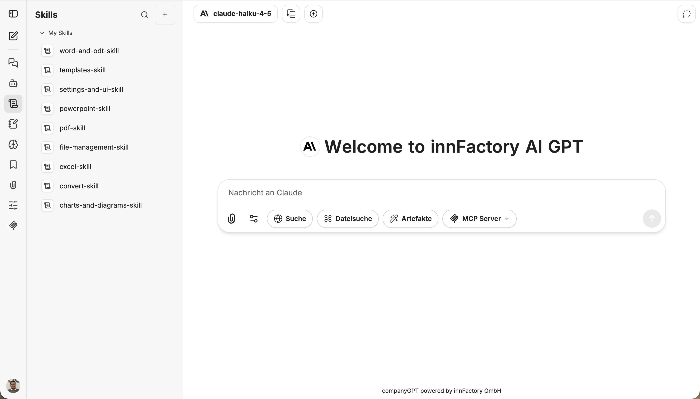
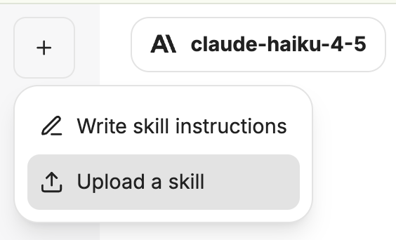
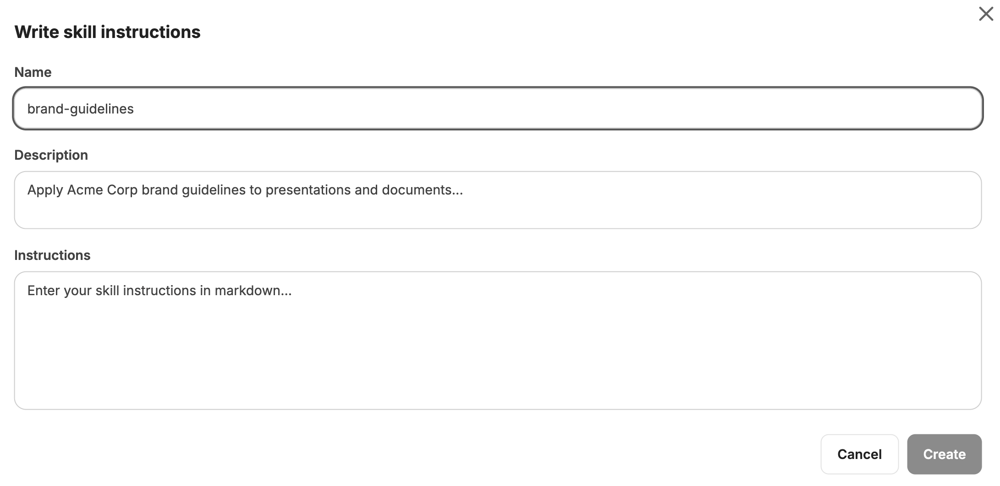
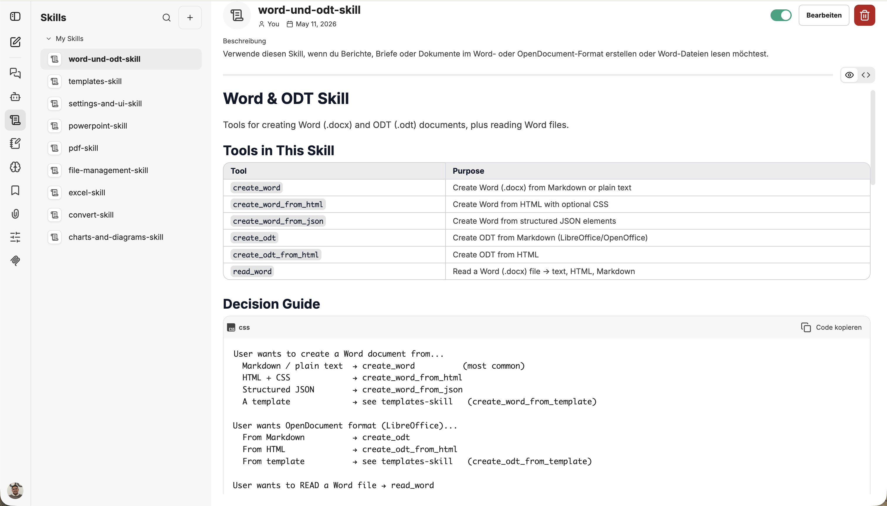
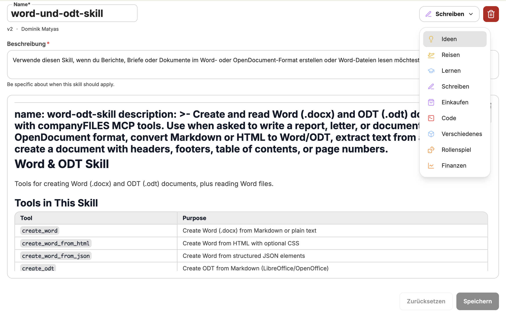
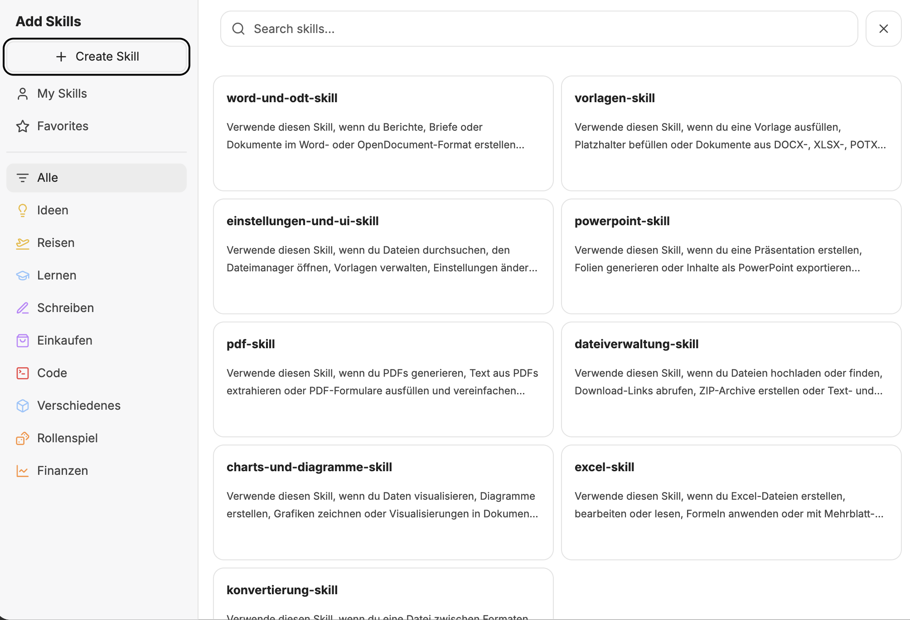

Skills sind wiederverwendbare Anweisungen, die den KI-Assistenten für bestimmte Aufgaben spezialisieren. Sie erweitern die Fähigkeiten des Assistenten, ohne dass Sie jedes Mal komplexe Prompts neu schreiben müssen.

## Skills-Übersicht

Skills werden in der linken Seitenleiste unter **Skills** verwaltet. Unter **My Skills** sehen Sie alle Ihre Skills auf einen Blick.

## Skill erstellen

Klicken Sie auf den **+**-Button oben in der Skills-Sidebar, um einen neuen Skill zu erstellen. Es öffnet sich ein Dropdown-Menü mit zwei Optionen.

### Skill-Anweisungen schreiben

Wählen Sie **Write skill instructions**, um ein Skill selber zu erstellen. Dafür müssen folgende Felder ausgefüllt werden:

- **Name** – Ein eindeutiger Name für den Skill
- **Beschreibung** – Kurze Erklärung, wann und wofür der Skill eingesetzt wird
- **Instructions** – Die eigentlichen Anweisungen im Markdown-Format

### Skill hochladen

Wählen Sie **Skill hochladen**, um eine vorhandene Skill-Datei per Drag & Drop oder Klick hochzuladen.

Folgende Dateiformate werden unterstützt:

| Format            | Anforderungen                                             |
| ----------------- | --------------------------------------------------------- |
| `.md`             | Muss Skill-Name und Beschreibung im YAML-Format enthalten |
| `.zip` / `.skill` | Muss eine `SKILL.md`-Datei enthalten                      |

:::tip
Unter [Skills-Tutorials](/de/tutorials/skills/) finden Sie fertige Skills zum Ausprobieren und Herunterladen.
:::

## Skill-Ansicht

Die Detailansicht eines Skills zeigt den gerenderten Inhalt mit Beschreibung und Markdown-Inhalt, zum Beispiel Tools-Tabellen oder Decision Guides.

Von hier aus können Sie den Skill:

- **Aktivieren oder deaktivieren** – über den Toggle oben rechts
- **Bearbeiten** – Anweisungen, Name oder Kategorie anpassen
- **Löschen** – den Skill dauerhaft entfernen

## Skill bearbeiten

Öffnen Sie einen Skill und klicken Sie auf **Bearbeiten**, um Name, Beschreibung, Anweisungen und Kategorie anzupassen.

:::note
Die **Beschreibung** legt fest, wann der Skill automatisch aktiviert wird. Formulieren Sie sie so, dass der Assistent den richtigen Anwendungsfall erkennt.
:::

## Skills zu Agenten hinzufügen

Skills können auch direkt einem [Agenten](/de/company-gpt/agenten/) zugewiesen werden. Öffnen Sie dazu die Agenten-Einstellungen und aktivieren Sie den **Skills**-Toggle. Standardmäßig hat der Agent Zugriff auf den gesamten Skill-Katalog.

Über **Add Skills** können Sie gezielt einzelne Skills auswählen, die der Agent verwenden darf. So lässt sich der Funktionsumfang eines Agenten präzise steuern.

