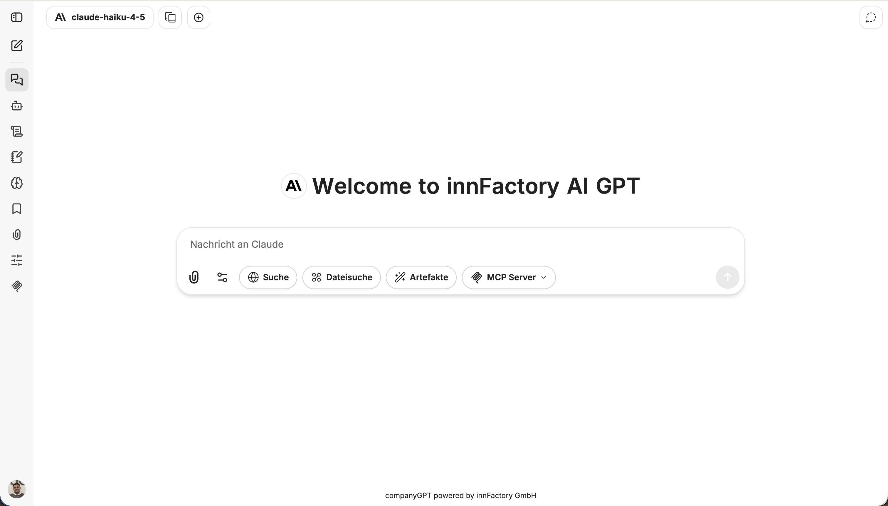
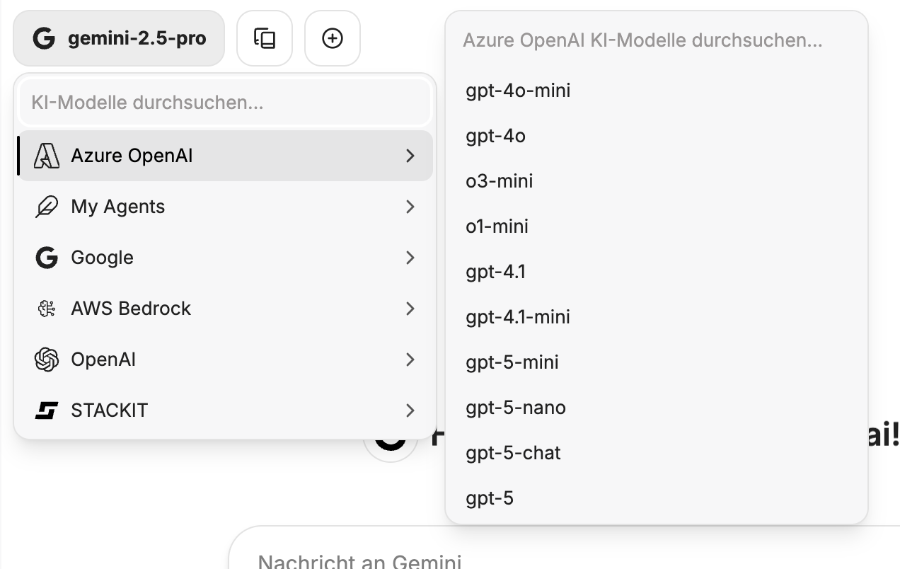

Das User Interface im CompanyGPT ermöglicht es, mit den unterschiedlichen KI-Modellen zu kommunizieren, Agenten zu erstellen, Promptvorlagen zu verwalten und vieles mehr.

## Modellauswahl

Eine Liste der aktuell verfügbaren Modelle finden Sie unter [Modellauswahl](/de/company-gpt/modellauswahl).

## Chat-Eingabe

Prompts lassen sich über Tastatur oder Mikrofon eingeben.
 
 
**[Dateien](/de/company-gpt/dateiverarbeitung/) hinzufügen:**

 
**Einstellungen der Integrationen:**

- [Dateisuche](/de/company-gpt/integrationen/dateisuche/)
- [Websuche](/de/company-gpt/integrationen/websuche/)
- [Artefakte](/de/company-gpt/integrationen/artefakte/)
- [MCP Server](/de/company-gpt/integrationen/mcp-server/)

Durch Auswahl des Stecknadel-Symbols lassen sich die Integrationen dauerhaft an die Chat-Leiste anpinnen.

## Chat-Verlauf

Der Chat-Verlauf zeigt alle Chats an, die in der Vergangenheit erstellt wurden. Chats können geteilt, umbenannt, dupliziert, archiviert und gelöscht werden. Zudem kann mit der Suche der gesamte Chat-Verlauf durchsucht werden.

## Seitenleiste

  
  

    <ol>
      <li>Seitenleiste verbergen</li>
      <li>Neuer Chat</li>
      <li><a href="/de/company-gpt/user-interface/#chat-verlauf">Chat-Verlauf</a> und <a href="/de/company-gpt/agenten/#agenten-marktplatz">Agent Marketplace</a></li>
      <li><a href="/de/company-gpt/agenten/">Erstellen und Bearbeiten von Agenten</a></li>
      <li><a href="/de/company-gpt/prompts/">Promptvorlagen</a></li>
      <li><a href="/de/company-gpt/erinnerungen/">Erinnerungen</a></li>
      <li><a href="/de/company-gpt/lesezeichen">Lesezeichen</a></li>
      <li><a href="/de/company-gpt/dateiverarbeitung/">Dateien</a></li>
      <li><a href="/de/company-gpt/ki-einstellungen/">KI-Einstellungen</a></li>
      <li><a href="/de/company-gpt/integrationen/mcp-server/">MCP-Einstellungen</a></li>
    </ol>
  

