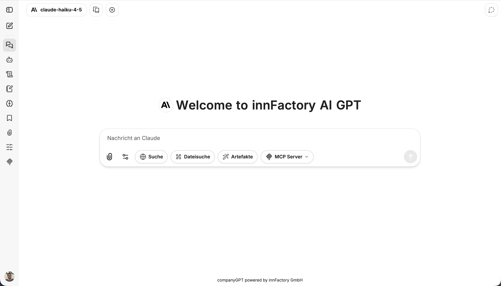
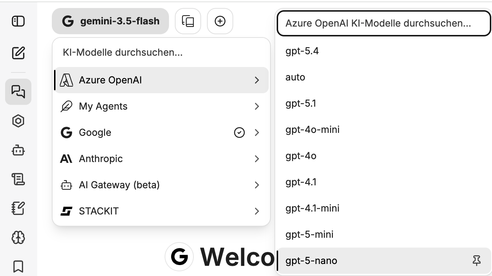
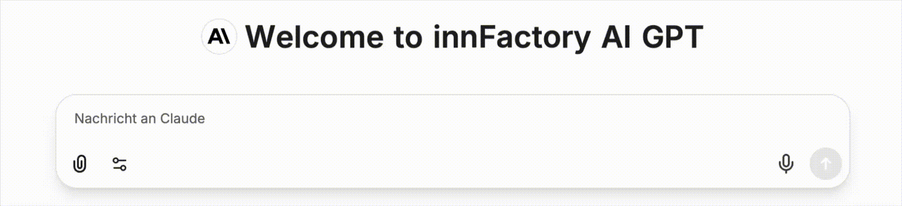
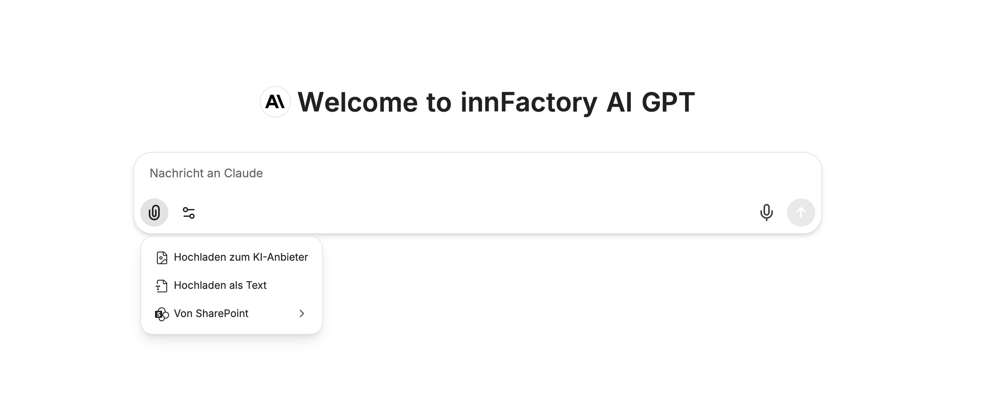
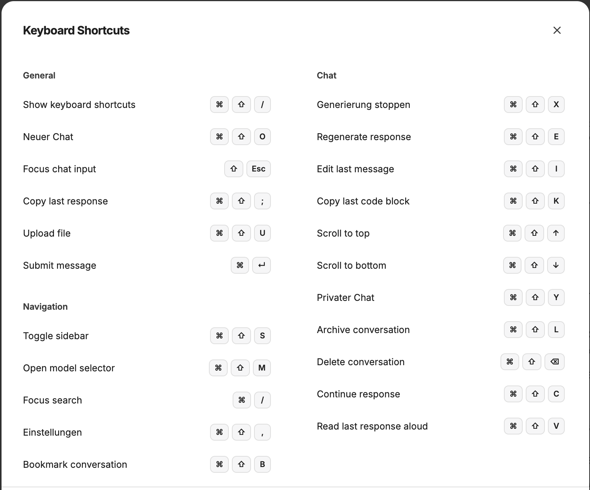

import sidebarImg from "./ui-sidebar.png";
import chatVerlaufImg from "./pinned-chat.png";

Das User Interface im CompanyGPT ermöglicht es, mit den unterschiedlichen KI-Modellen zu kommunizieren, Agenten zu erstellen, Promptvorlagen zu verwalten und vieles mehr.

## Modellauswahl

Eine Liste der aktuell verfügbaren Modelle finden Sie unter [Modellauswahl](/de/company-gpt/modellauswahl).

## Chat-Eingabe

Prompts lassen sich über Tastatur oder Mikrofon eingeben.
 
 
**[Dateien](/de/company-gpt/dateiverarbeitung/) hinzufügen:**

 
**Einstellungen der Integrationen:**

- [Dateisuche](/de/company-gpt/integrationen/dateisuche/)
- [Websuche](/de/company-gpt/integrationen/websuche/)
- [Skills](/de/company-gpt/skills)
- [Code ausführen](/de/company-gpt/code-interpreter/)
- [Artefakte](/de/company-gpt/integrationen/artefakte/)
- [MCP Server](/de/company-gpt/integrationen/mcp-server/)

Durch Auswahl des Stecknadel-Symbols lassen sich die Integrationen dauerhaft an die Chat-Leiste anpinnen.

## Chat-Verlauf

Der Chat-Verlauf zeigt alle Chats an, die in der Vergangenheit erstellt wurden. Chats können geteilt, umbenannt, dupliziert, archiviert und gelöscht werden. Zudem kann mit der Suche der gesamte Chat-Verlauf durchsucht werden. Konversationen können über die drei Punkte angepinned werden: 

## Seitenleiste

  
  

1. **Seitenleiste öffnen/verbergen**
2. **Neuer Chat**
3. **[Chat-Verlauf](/de/company-gpt/user-interface/#chat-verlauf)**
4. **Apps**
5. **[Agenten erstellen](/de/company-gpt/agenten/)**
6. **[Skills](/de/company-gpt/skills)**
7. **[Prompts](/de/company-gpt/prompts/)**
8. **[Erinnerungen](/de/company-gpt/erinnerungen/)**
9. **[Lesezeichen](/de/company-gpt/lesezeichen)**
10. **[Dateien anhängen](/de/company-gpt/dateiverarbeitung/)**
11. **[KI-Einstellungen](/de/company-gpt/ki-einstellungen/)**
12. **[MCP-Einstellungen](/de/company-gpt/integrationen/mcp-server/)**

  

## Tastenkürzel

Die Liste aller verfügbaren Tastenkürzel kann entweder durch Drücken der Taste ? (wenn sich der Cursor nicht in einem Textfeld befindet) oder über das Benutzermenü unten links unter dem Punkt „Tastenkürzel“ aufgerufen werden.

