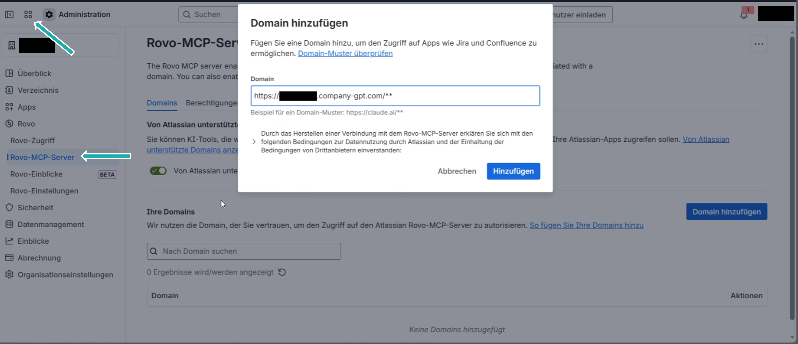
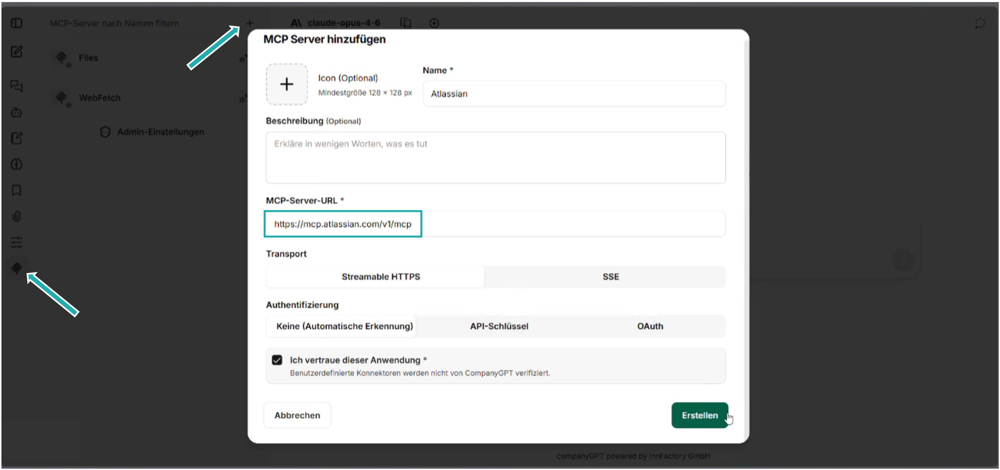

Wenn Sie das Kollaborationstool Confluence nutzen, besteht die Möglichkeit dieses über den Atlassian Rovo [MCP Server](/de/company-gpt/integrationen/mcp-server/) wie folgt an Ihr CompanyGPT anzubinden:

**1. Konfiguration in Confluence**

1. In Confluence über das **Menü mit den vier Punkten** oben links zu **Weitere > Administration** navigieren.
2. Zum Abschnitt **Rovo** gehen und **Rovo-MCP-Server** auswählen.
3. Dort die Domain des CompanyGPT mit dem Zusatz `/**` hinzufügen.
4. Unter **Berechtigungen > Authentifizierung** kann die Option **API-Token** deaktiviert bleiben, um die Authentifizierung über oAuth zu nutzen.

**2. Konfiguration im CompanyGPT**

1. Im CompanyGPT zu den **MCP-Server-Einstellungen** gehen und auf das **Plus-Zeichen (+)** klicken, um einen neuen Server hinzuzufügen.
2. In das URL-Feld die folgende Adresse einfügen: `https://mcp.atlassian.com/v1/mcp`.
3. Auf **Erstellen** klicken, um die Einrichtung abzuschließen.

:::tip[Hinweis]
Aus Sicherheitsgründen sind externe MCP-Server standardmäßig deaktiviert. Zur Freischaltung genügt eine kurze Meldung.
:::