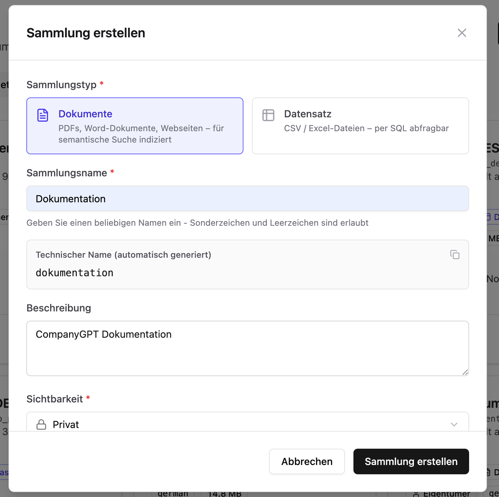
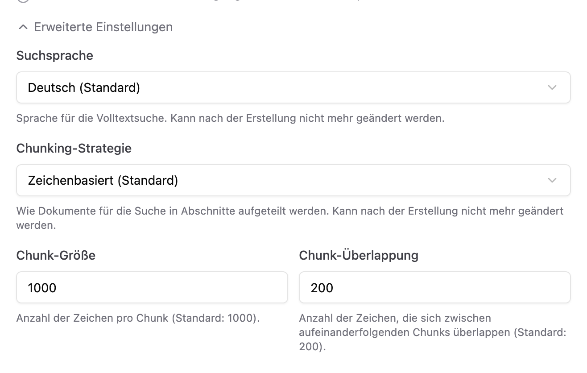
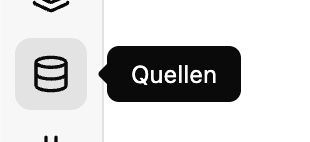
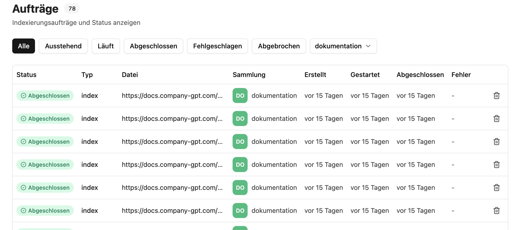

import CollectionPromptBuilder from '../../../../../components/CollectionPromptBuilder.astro'

In dieser Anleitung richten wir einen **Hilfe-Agenten** ein, der Fragen zu einer Dokumentationswebsite beantwortet. Dazu lassen wir die [Webcrawl-Quelle](/de/company-gpt/addons/companyrag/#webcrawl) von [CompanyRAG](/de/company-gpt/addons/companyrag/) die Sitemap der Website regelmäßig crawlen, alle Seiten in einer Sammlung indexieren und stellen diese anschließend über den MCP Server `ai-search` einem [Agenten](/de/company-gpt/agenten/) zur Verfügung.

Als Beispiel verwenden wir die öffentliche CompanyGPT-Dokumentation mit der Sitemap `https://docs.company-gpt.com/sitemap-0.xml`. Ersetzen Sie diese durch die Sitemap Ihrer eigenen Website.

Voraussetzung: Sie haben Zugriff auf CompanyRAG unter `https://FIRMA.company-gpt.com/companygpt/rag` (bei eigener Domain einfach `/companygpt/rag` anhängen) sowie das Recht, Agenten anzulegen.

## 1. Sammlung erstellen

Zuerst legen wir die Sammlung an, in der die gecrawlten Seiten indexiert werden. Navigieren Sie in CompanyRAG zu `Sammlungen` und erstellen Sie eine neue Sammlung. Als Typ wählen wir **Dokumente**, vergeben einen Namen, eine Beschreibung und wählen die Sichtbarkeit.

Notieren Sie sich den **technischen Namen** (im Beispiel `dokumentation`) – er wird später im Agenten-Prompt benötigt.

Bei der Sichtbarkeit können Sie zwischen **Privat** und **Öffentlich** unterscheiden. Ein Hilfe-Agent, der allen Mitarbeitenden zur Verfügung stehen soll, profitiert in der Regel von einer **öffentlichen** Sammlung. Die Sichtbarkeit kann jederzeit nachträglich angepasst werden.

### Erweiterte Einstellungen

In den erweiterten Einstellungen können Sie Suchsprache, Chunking-Strategie sowie Chunk-Größe und -Überlappung anpassen. Für den Einstieg können die Standardwerte belassen werden.

:::tip
Die Suchsprache sollte im Optimalfall der Sprache der Website entsprechen. Neben der semantischen wird auch eine Volltextsuche durchgeführt, die bei korrekter Spracheinstellung bessere Ergebnisse liefert.
:::

## 2. Webcrawl-Quelle anlegen

Damit die Seiten automatisch und wiederkehrend indexiert werden, legen wir eine Webcrawl-Quelle an. Wechseln Sie dazu in den Bereich **Quellen**.

Klicken Sie dort auf **„+ Web-Crawl"**, um eine neue Quelle zu erstellen. Wählen Sie im Dialog den Reiter **Sitemap** und füllen Sie die Felder aus:

- **Quellname**: Ein frei wählbarer Name zur Wiedererkennung, z. B. `CGPT Doku`.
- **Sammlung**: Die in Schritt 1 erstellte Sammlung (`dokumentation`).
- **Auto-Sync**: Das Intervall, in dem die Sitemap erneut gecrawlt wird, z. B. **Stündlich**, **Täglich** oder **Wöchentlich**. Die Quelle wird anschließend automatisch im gewählten Intervall synchronisiert.
- **Sitemap-URL**: `https://docs.company-gpt.com/sitemap-0.xml`
- **Pfadpräfix-Filter (optional)**: Schränkt ein, welche Seiten indexiert werden. `/docs/` würde beispielsweise nur URLs importieren, deren Pfad mit `/docs/` beginnt. Leer lassen, um die gesamte Sitemap zu crawlen.

Bestätigen Sie mit **Quelle erstellen**.

:::note
Bei Sitemap-Crawls wird beim ersten Lauf die gesamte Sitemap indexiert. Bei jedem weiteren Lauf wird nur die **Differenz** anhand des letzten Crawls und des Änderungsdatums der Seiten berücksichtigt – es werden also nur neue oder geänderte Seiten neu indexiert.
:::

:::tip
Statt einer Sitemap können Sie über den Reiter **URL-Liste** auch einzelne Seiten oder eine per CSV importierte Liste von URLs crawlen. Bei einzelnen Seiten wird bei jedem Lauf immer die gesamte Seite neu indexiert.

:::

## 3. Crawl starten und Status prüfen

Nach dem Anlegen erscheint die Quelle unter **Alle Quellen** als aktiv. Stoßen Sie den ersten Crawl bei Bedarf manuell über **Jetzt synchronisieren** an. Die gefundenen Seiten werden anschließend als Indexierungsaufträge angelegt.

Den Fortschritt verfolgen Sie im Bereich **Aufträge**. Dort sehen Sie pro Seite den Status (Ausstehend, Läuft, Abgeschlossen oder Fehlgeschlagen). Sobald alle Aufträge auf **Abgeschlossen** stehen, ist die Sammlung durchsuchbar.

Über die **Quellen-Aktionen** können Sie die Quelle jederzeit **Pausieren/Fortsetzen** oder **Löschen**. Beim Löschen bleiben bereits indexierte Seiten in der Sammlung erhalten.

## 4. Hilfe-Agent anlegen

Damit die indexierten Seiten über den Chat abgefragt werden können, legen wir einen [Agenten](/de/company-gpt/agenten/) an. Dieser benötigt den [MCP Server](/de/company-gpt/integrationen/mcp-server/) `ai-search` mit den aktivierten Tools `search_content`, `find_content_by_metadata` und `find_content_by_source`.

Als KI-Modell reicht in der Regel ein kleineres, z. B. **Claude Haiku** oder **Gemini Flash** – es funktioniert aber mit allen verfügbaren Modellen.

### Systemanweisung

Für die Systemanweisung können Sie bequem unsere Vorlage nutzen. Diese ist mit allen nötigen Anweisungen versehen, damit die Antworten einheitlich aufgebaut sind, immer eine Suche ausführen und nur auf den indexierten Inhalten basieren (kein Halluzinieren).

:::tip
Geben Sie den ausführlichen Prompt einem LLM und lassen Sie ihn nach Ihren Wünschen anpassen – z. B. mit dem Namen Ihrer Firma oder einem spezifischen Antwortstil.
:::

Tragen Sie den **technischen Namen** Ihrer Sammlung (im Beispiel `dokumentation`) ein – die Prompts werden automatisch befüllt:

<CollectionPromptBuilder />

## 5. Agent nutzen

Speichern Sie den Agenten. Wählen Sie ihn anschließend im Chat über die Modellauswahl aus und stellen Sie eine Frage zur Dokumentation. Der Agent führt eine Suche in der Sammlung aus und antwortet mit den gefundenen Inhalten inklusive Quellenangaben.

Da die Webcrawl-Quelle im gewählten Intervall automatisch erneut crawlt, bleibt der Agent ohne weiteres Zutun stets auf dem aktuellen Stand der Website.
