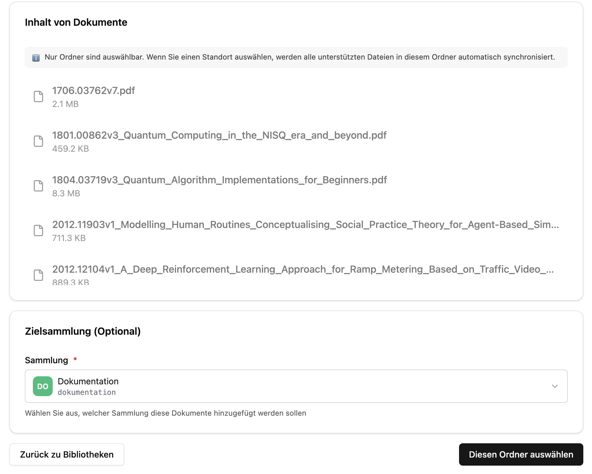
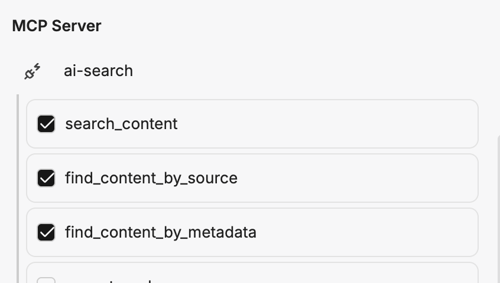

import CollectionPromptBuilder from '../../../../../components/CollectionPromptBuilder.astro'

Damit wir CompanyRAG in CompanyGPT nutzen können, müssen wir zuerst eine Dokumentensammlung anlegen. Dazu gehen wir auf `https://FIRMA.company-gpt.com/companygpt/rag` (Falls sie eine iegene Domain nutzen, einfach `/companygpt/rag`anhängen).

## Sammlung erstellen

Dann navigieren wir zu `Sammlungen` und erstellen eine neue Sammlung. Als Typ wählen wir **Dokumente**, vergeben einen Namen, eine Beschreibung und wählen die Sichtbarkeit.

Der **technische Name** ist später für den Prompt relevant.

.

Bei der Sichtbarkeit können wir zwischen **Privat** und **Öffentlich** unterscheiden. **Öffentliche** Sammlungen sind für alle User nutzbar, **private** Sammlungen nur für den Owner, diese können aber beliebig freigegeben werden. Die Sichtbarkeit kann nachträglich jederzeit verändert werden.

### Erweiterte Einstellungen

In den erweiterten Einstellungen können wir die Suchsprache, die Chunking Strategie sowie die Chunk-Größe und -Überlappung anpassen. Hier können wir aber die Standardwerte belassen.

:::tip
Die Suchsprache sollte im Optimalfall immer der Sprache der Dokumente in der Sammlung entsprechend. Es wird neben semantischer auch Volltextsuche durchgeführt und diese ist besser bei korrekter Spracheinstellung.
:::

## Dokumente indexieren

Sobald die Sammlung erstellt ist, können wir Dokumente hinzufügen.

### Manueller Upload

Dafür einfach die Sammlung sowie die Dokumente auswählen und hochladen. Beim manuellen Upload gibt es keine Berechtigungen auf Dateiebene und keine weiteren Metadaten als den Dateinamen.

### Sharepoint / NextCloud Sync

Unter Quellen kann eine neue Verbindung angelegt werden.

:::tip
Falls noch keine Quelle Verbunden ist, dann muss unter **Integrationen** die SharePoint Verbindung aktiviert werden.

:::

Unter Quellen kann dann eine neue Sharepoint Verbindung angelegt werden. Dafür muss der Sharepoint Ordner ausgewählt werden, der dafür genutzt werden soll. Es werden immer alle unterordner des ausgewählten Ordners mit einbezogen.

Sobald der gewünschte Ordner ausgewählt ist, muss die Sammlung ausgewählt werden und auf **Diesen Ordner Auswählen** geklickt werden.

Dann noch die zu indexierenden Dateitypen auswählen, und auf **Sharepoint verbinden** klicken.

:::note
Über Sharepoint indexierte Dokumente sind mit Berechtigungen auf Dokumentenebene versehen. Bei der Abfrage über das CompanyGPT werden die Berechtigungen immer geprüft, egal wie die Freigabe der Sammlungen gestaltet ist.
:::

## CompanyGPT Agent 

Über den [MCP Server](/de/company-gpt/integrationen/mcp-server/) `ai-search` lässt sich der RAG-Service mit CompanyGPT verbinden, um indexierte Dokumente über alle (dem Nutzer zur Verfügung stehenden) Sammlungen zu durchsuchen
(s. [Ähnlichkeitssuche](/de/prompt-engineering/prompt-techniken/rag/)).

### Prompt für den CompanyGPT

Damit die RAG Suche genutzt werden kann, muss ein [Agent](/de/company-gpt/agenten/) angelegt werden. Dieser benötigt den MCP Server `ai-search` mit den aktivierten Tools `search_content`, `find_content_by_metadata`, und `find_content_by_source`.

Bei dem KI Modell für den Agenten reicht in der Regel ein kleineres, z.B. **Claude Haiku** oder **Gemini Flash**, geht aber auch mit allen anderen.

Für die Systemanweisung können Sie bequem unsere Vorlage nutzen. Diese ist mit allen möglichen Anweisungen versehen damit die Antworten vom Aufbau identisch werden.

:::tip
Geben Sie den ausführlichen Prompt einem LLM und lassen Sie diesen nach Ihren Wünschen anpassen.
:::

Tragen Sie den **technischen Namen** Ihrer Sammlung ein – die Prompts werden automatisch befüllt:

<CollectionPromptBuilder />
