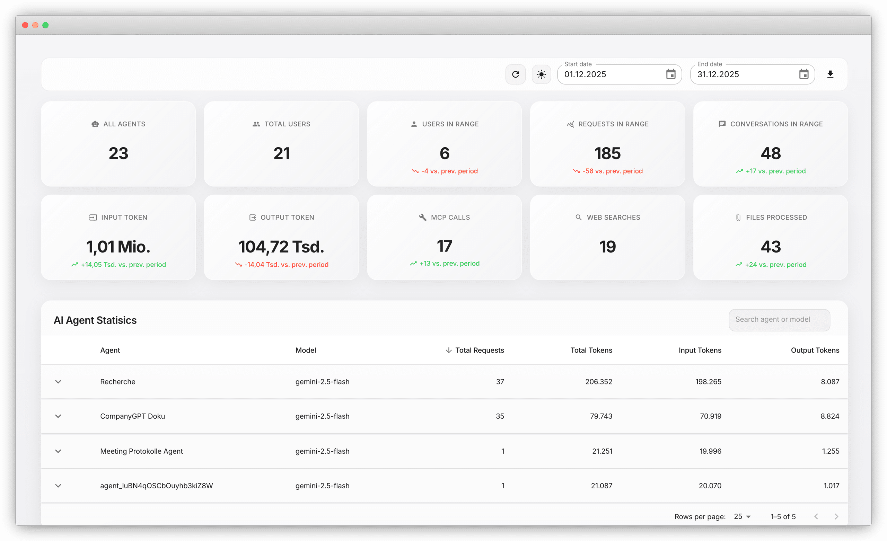

The companyDASHBOARD is an admin dashboard for analyzing CompanyGPT usage across your organization. It provides metrics on user activity, token consumption, agent performance, and tool calls, and supports data export for further processing.

## KPIs

The dashboard tracks ten metrics, each with a trend comparison to the previous period:

**System-wide metrics:**
- Number of configured agents
- Total registered users
- Active users in the selected time period
- Requests and conversations in the selected time period

**Token metrics:**
- Input tokens and output tokens (tracked separately, basis for cost calculation)

**Resource usage:**
- MCP tool calls
- Web searches by AI agents
- Processed files (PDF, Word, etc.)

## Agent Statistics

The agent table lists all AI agents with the following information:

- Number of requests and token consumption (input and output tracked separately)
- Model in use (e.g., GPT, Gemini, Claude)
- Drill-down to agent level for detailed analysis
- Search function to filter by agent or model

The table can be sorted by requests or token consumption.

## Time Period Filter and CSV Export

All metrics can be analyzed for any time period. Results can be exported as CSV and processed further.
