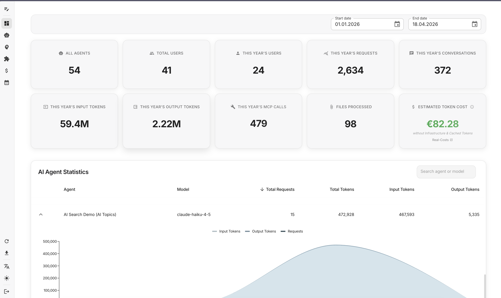
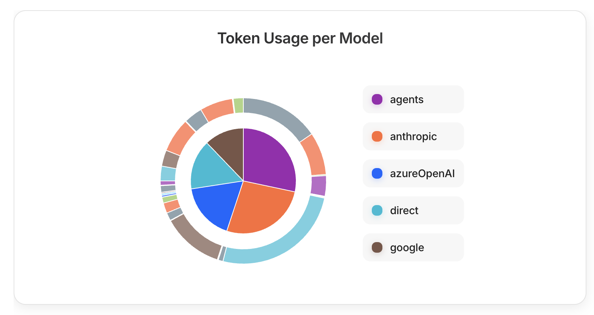
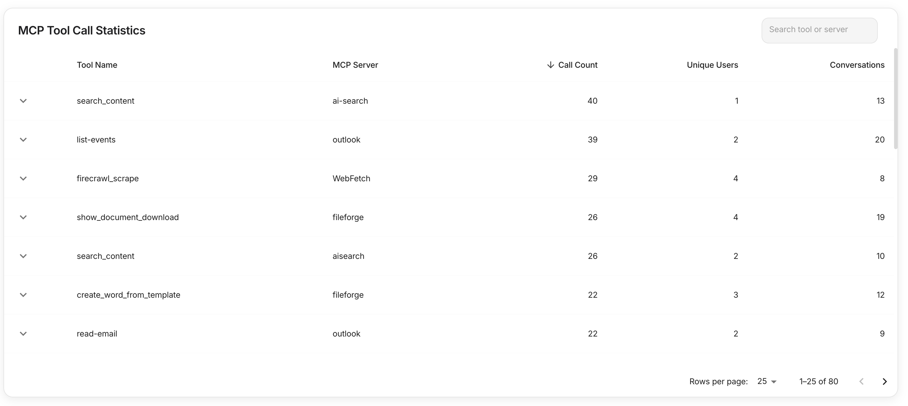

The companyDASHBOARD is an admin dashboard for analyzing CompanyGPT usage across your organization. It provides comprehensive metrics on user activity, token consumption, agent performance, and tool calls, and supports data export for further processing.

## KPIs

The dashboard displays ten key performance indicators, each with a trend comparison to the previous period. These metrics provide a complete overview of your CompanyGPT deployment:

**System-wide metrics:**
- **All Agents**: Total number of configured AI agents in your system
- **Total Users**: All registered users in your CompanyGPT instance
- **This Year's Users**: Number of active users within the selected time period
- **This Year's Requests**: Total API requests made to AI models
- **This Year's Conversations**: Number of conversation sessions initiated

**Token metrics:**
- **This Year's Input Tokens**: Tokens sent to AI models (user prompts, context, system messages)
- **This Year's Output Tokens**: Tokens generated by AI models (responses, completions)
- **Estimated Token Cost**: Calculated cost based on token usage (excludes infrastructure and cached tokens)

**Resource usage:**
- **This Year's MCP Calls**: Number of Model Context Protocol tool executions
- **Files Processed**: Documents processed through OCR, parsing, or analysis (PDF, Word, etc.)

Each KPI card shows the current value and a percentage change compared to the previous period, helping you track usage trends and growth patterns.

## Token Usage per Model

The token usage visualization provides a detailed breakdown of how different AI models and providers are being utilized in your organization:

The donut chart displays:
- **Inner ring**: Input token distribution across providers
- **Outer ring**: Output token distribution across providers
- **Color coding**: Each provider has a distinct color (agents in purple, Anthropic in orange, Azure OpenAI in blue, direct in cyan, Google in brown)

This visualization helps you:
- Identify which AI providers are most heavily used
- Compare input vs. output token patterns across different models
- Make informed decisions about provider allocation and cost optimization
- Monitor token distribution changes over time

## MCP Tool Call Statistics

The MCP (Model Context Protocol) statistics table provides detailed insights into tool usage across your CompanyGPT deployment:

The table includes the following columns:
- **Tool Name**: The specific MCP tool being called (e.g., search_content, list-events, firecrawl_scrape)
- **MCP Server**: The server providing the tool functionality (e.g., ai-search, outlook, WebFetch)
- **Call Count**: Total number of times the tool has been executed (sortable column)
- **Unique Users**: Number of different users who have used this tool
- **Conversations**: Number of conversation sessions where this tool was utilized

This data helps you:
- Understand which tools are most valuable to your users
- Identify underutilized MCP servers that might need promotion or configuration
- Track tool adoption across your user base
- Plan resource allocation for high-demand tools

## Agent Statistics

The agent statistics table provides detailed performance metrics for each AI agent in your system:

- **Request volume**: Number of requests handled by each agent
- **Token consumption**: Input and output tokens tracked separately for accurate cost calculation
- **Model information**: The specific AI model in use (e.g., GPT-4, Gemini Pro, Claude)
- **Performance analysis**: Drill-down capabilities for detailed agent-level insights
- **Search and filtering**: Find specific agents or filter by model type

The table supports sorting by requests or token consumption, making it easy to identify your most active agents and optimize resource allocation.

## Time Period Filter and CSV Export

The dashboard provides flexible time period analysis and data export capabilities:

**Time period selection:**
- Choose any custom date range for analysis
- All KPIs, charts, and tables automatically update to reflect the selected period
- Trend comparisons show changes relative to the equivalent previous period

**Data export:**
- Export all metrics and statistics as CSV files
- Includes detailed breakdowns for further analysis in external tools
- Supports bulk data processing for reporting and compliance requirements

This functionality enables comprehensive reporting and helps you track CompanyGPT usage patterns over time, supporting both operational monitoring and strategic planning.
