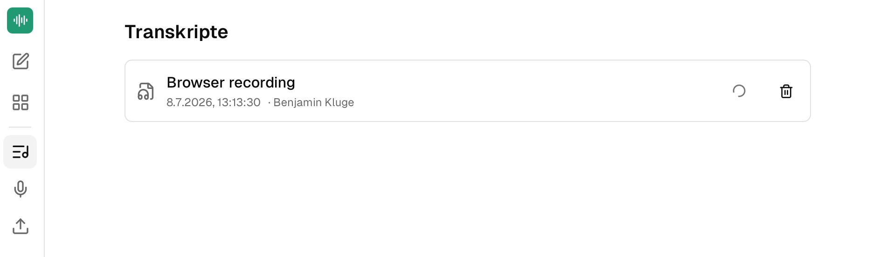

:::tip[Beta]
companyTRANSCRIBE is currently in beta. Individual features may still change or, in some cases, may not work as expected.
:::

companyTRANSCRIBE is a transcription application that, like CompanyGPT, runs entirely within the company's Microsoft tenant. It transcribes audio and video files as well as recordings made directly in the browser, automatically separating the individual speakers. Processing is handled by the Azure Speech service inside the tenant — no data is transferred to third parties outside the Microsoft cloud, meeting GDPR requirements.

## Access and authentication

Access is exclusively via Microsoft Single Sign-On (SSO) with the existing company account. No separate credentials are required.

## Transcribing files and recordings

companyTRANSCRIBE supports two ways to create a transcript:

- **File transcription**: Upload common audio and video formats (e.g. .mp3, .wav, .m4a, .mp4, .webm) up to 75 MB — for example to transcribe recorded meetings. For video files, the audio track is extracted automatically.
- **Browser recording**: Record directly via the device's microphone. The recording is streamed continuously to the tenant's storage, so even multi-hour sessions are captured reliably. Transcription starts automatically once the recording is finished.

Transcription runs as a background job; progress is visible in the application. The default language is German, and a different language can be selected when creating a transcription.

## Speaker diarization

Automatic speaker diarization distinguishes up to 35 voices in a recording and assigns each text passage to its speaker. Detected speakers can be renamed afterwards, so the finished transcript shows the actual names of the participants.

## Transcript history and export

All transcriptions are stored in a per-user history where they can be viewed, edited, or deleted. Finished transcripts can be downloaded as a speaker-labelled Markdown file (.md). All data remains within the company's Microsoft cloud.

## CompanyGPT integration

Via an MCP interface, your own transcripts are available directly in the CompanyGPT chat. The assistant can list, retrieve, and analyze transcripts — allowing you to turn a raw transcript into structured meeting minutes, summaries, or to-do lists in any format with a single prompt.
