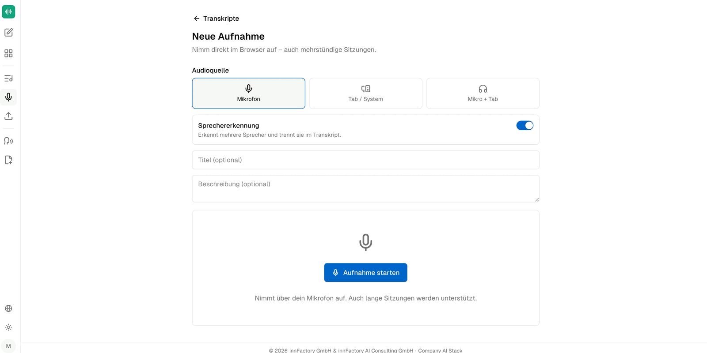

There are two ways to produce a transcript in companyTRANSCRIBE: upload an existing file, or record directly in the browser. Both start from the **Hochladen** (Upload) and **Aufnehmen** (Record) buttons in the **Transkripte** overview.

## Preparing a browser recording

The **Neue Aufnahme** (New recording) page carries the note "Nimm direkt im Browser auf – auch mehrstündige Sitzungen." — record directly in the browser, including multi-hour sessions. Before starting, you set the following options.

### Audio source (Audioquelle)

| Option | Records |
|---|---|
| **Mikrofon** (Microphone) | The device microphone only |
| **Tab / System** | The browser tab or system audio only |
| **Mikro + Tab** | Microphone and system audio together |

**Mikrofon** is preselected. **Tab / System** and **Mikro + Tab** suit online meetings where the other participants should be captured as well.

### Speaker diarization (Sprechererkennung)

The **Sprechererkennung** toggle decides whether the transcript is split by speaker. The application describes both states itself:

| State | Note in the interface | Suitable for |
|---|---|---|
| Off | "Fortlaufender Text ohne Sprecherzuordnung – passend für eigene Diktate." (Continuous text without speaker assignment — suited to your own dictation) | Your own dictation and longer recordings transcribed for yourself |
| On | "Erkennt mehrere Sprecher und trennt sie im Transkript." (Detects multiple speakers and separates them in the transcript) | Meetings with several participants, on site or online |

:::note
Speaker diarization can only be set before the recording starts. Whether it was active is shown later in the transcript metadata under **Sprechererkennung** (`Aktiv` or `Aus`).
:::

### Title and description

**Titel (optional)** and **Beschreibung (optional)** can be set before recording; both fields can still be changed later in the transcript detail view. Without a title, the application files the entry under a default name.

## Starting and stopping the recording

Clicking **Aufnahme starten** (Start recording) begins the capture — the note below the button reads "Nimmt über dein Mikrofon auf. Auch lange Sitzungen werden unterstützt." (Records via your microphone. Long sessions are supported too.)

While recording, the application shows a running timer and a **Stoppen** (Stop) button. The note "Aufnahme läuft – Audio wird während des Sprechens sicher übertragen." indicates that audio is transferred securely to the tenant's storage continuously while you speak, rather than only at the end of the session.

After **Stoppen**, the entry is created and transcribed in the background. You do not need to keep the page open.

:::note
The interface states no figure for the maximum length of a single recording, only "Auch lange Sitzungen werden unterstützt." The underlying training recording puts the limit at "just under three hours". Please verify the exact figure before communicating it externally.
:::

## Uploading a file

Use **Hochladen** to transcribe a recording you already have — for example a meeting captured with a room microphone, a voice recorder, or a phone. Common audio and video formats up to 75 MB are supported; for video files the audio track is extracted automatically.

:::note
The upload dialog itself does not appear in the underlying recording. This section therefore describes only the entry point via the **Hochladen** button and the known format limits, not the individual fields of the dialog.
:::

## What next?

Once transcription has finished, open the entry from the overview. [Editing transcripts](/en/company-gpt/addons/company-transcribe/transkripte/) describes how to correct the text, name the speakers, and export the result.
