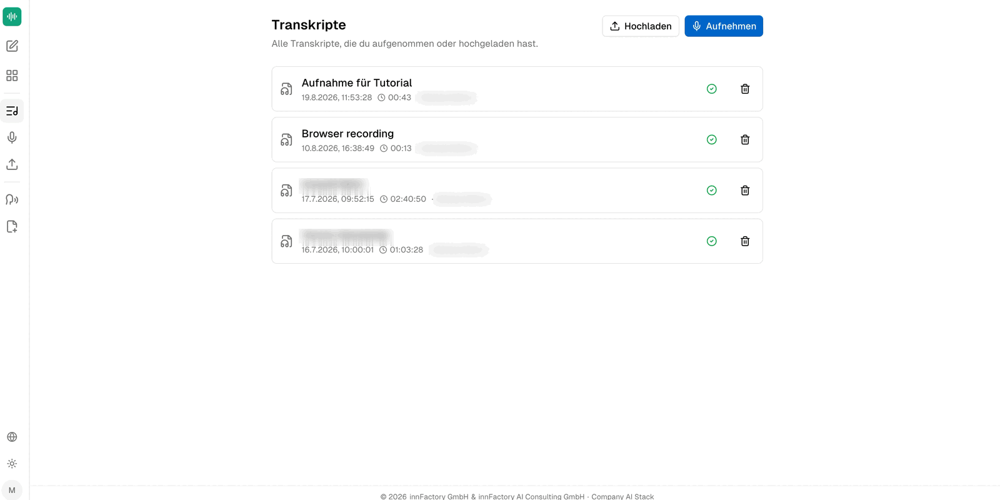

:::tip[Beta]
companyTRANSCRIBE is currently in beta. Individual features may still change or, in some cases, may not work as expected.
:::

companyTRANSCRIBE is a transcription application that, like CompanyGPT, runs entirely within the company's Microsoft tenant. It transcribes audio and video files as well as recordings made directly in the browser, automatically separating the individual speakers. It also works the other way round, turning text back into audio. Processing is handled by the Azure Speech service inside the tenant — no data is transferred to third parties outside the Microsoft cloud, meeting GDPR requirements.

You will find the application in the CompanyGPT sidebar under **Transkribieren** (Transcribe). The area is visible to all users with the appropriate permissions, provided it has been rolled out in the tenant.

## Access and authentication

Access is exclusively via Microsoft Single Sign-On (SSO) with the existing company account. No separate credentials are required.

## How the application is organised

The start page **Transkripte** (Transcripts) lists every recording you have made or uploaded yourself. The two buttons in the top right lead to the two ways a transcript comes about: **Hochladen** (Upload) for existing files and **Aufnehmen** (Record) for a recording made directly in the browser.

Each entry shows the title, creation time, audio length, and owner. The icons on the right open the transcript or delete the entry. The application's sidebar also leads to **Sprachausgaben** (Voiceovers), where the audio files generated from text are managed.

## The areas at a glance

- **[Recording and transcribing](/en/company-gpt/addons/company-transcribe/aufnehmen/)** — choose the audio source and speaker diarization, record in the browser, or upload a file.
- **[Editing transcripts](/en/company-gpt/addons/company-transcribe/transkripte/)** — metadata, text correction, speaker assignment, and Markdown export.
- **[Voiceovers](/en/company-gpt/addons/company-transcribe/sprachausgaben/)** — turn text into audio using an AI voice.
- **[Access from CompanyGPT](/en/company-gpt/addons/company-transcribe/mcp-integration/)** — use transcripts and voiceovers in the chat via the MCP server.

:::note
The application's user interface is German. The labels quoted in this documentation therefore appear in German, with an English translation on first use.
:::

## Supported formats and limits

| Aspect | Value |
|---|---|
| Audio and video formats on upload | e.g. `.mp3`, `.wav`, `.m4a`, `.mp4`, `.webm` |
| Maximum file size on upload | 75 MB |
| Speaker diarization | up to 35 voices per recording |
| Export | speaker-labelled Markdown file (`.md`) |

For video files, the audio track is extracted automatically. Transcription runs as a background job; progress is visible in the application.

## Data storage

All transcriptions are stored in a per-user history where they can be viewed, edited, or deleted. All data remains within the company's Microsoft cloud.
