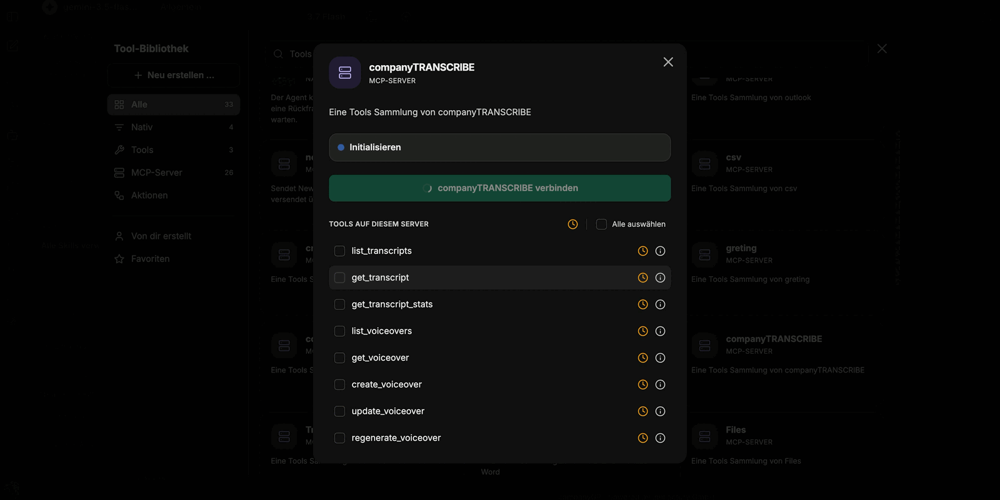

Transcripts do not have to be processed by hand. Through the **companyTRANSCRIBE** MCP server, an agent in CompanyGPT gains access to your own transcripts and voiceovers — it lists them, retrieves their content, summarises them, and generates new voiceovers on request.

## Setting up the agent

1. In CompanyGPT, create an agent via **Neuen Agenten erstellen** (Create new agent) and give it a name.
2. Choose an AI model and a category. A small, fast model is enough for listing and summarising; extensive instructions are not required.
3. Under **Tools**, click **Hinzufügen** (Add) and select **companyTRANSCRIBE** under **MCP-Server** in the **Tool-Bibliothek** (tool library).
4. Click **companyTRANSCRIBE verbinden** (Connect companyTRANSCRIBE) in the dialog. Once connected, the interface reports "MCP-Server ‚companyTRANSCRIBE’ erfolgreich initialisiert." (MCP server successfully initialised.)
5. Save the agent.

In the dialog you can enable the server's tools individually or take them all at once via **Alle auswählen** (Select all). After saving, the server appears in the agent's tool list with the number of tools included.

:::tip[Note]
Because the server brings only a handful of tools, you can switch off deferred tool loading ("lazy loading") for this agent. All tools are then immediately available to it.
:::

## Available tools

The server provides eight tools — three for transcripts, five for voiceovers:

| Tool | Purpose |
|---|---|
| `list_transcripts` | List existing transcripts |
| `get_transcript` | Retrieve the full content of a transcript |
| `get_transcript_stats` | Retrieve metrics for a transcript |
| `list_voiceovers` | List existing voiceovers |
| `get_voiceover` | Retrieve a single voiceover |
| `create_voiceover` | Generate a new voiceover |
| `update_voiceover` | Update an existing voiceover |
| `regenerate_voiceover` | Regenerate the audio of a voiceover |

## Typical uses

Once the agent is connected, a single instruction in the chat is enough:

- **Listing** — the agent names the available transcripts along with the number of speakers detected.
- **Summarising** — given a prompt such as "Summarise the recording *&lt;title&gt;*", the agent retrieves the transcript and summarises its full content.
- **Producing minutes** — a raw transcript becomes structured meeting minutes, summaries, or to-do lists in whatever format you ask for.
- **Generating a voiceover** — the agent creates a new voiceover via `create_voiceover` and returns a link from which the audio file can be downloaded. Depending on length, generation takes a moment; the voiceover then also appears in the **Sprachausgaben** overview.

:::note
Access is per user: through the MCP server, an agent only ever sees the transcripts and voiceovers of the signed-in user.
:::

## What next?

[Recording and transcribing](/en/company-gpt/addons/company-transcribe/aufnehmen/) and [Editing transcripts](/en/company-gpt/addons/company-transcribe/transkripte/) describe how transcripts come about and how to correct them before analysis. For general information on MCP servers in CompanyGPT, see [MCP Server](/en/company-gpt/integrationen/mcp-server/).
