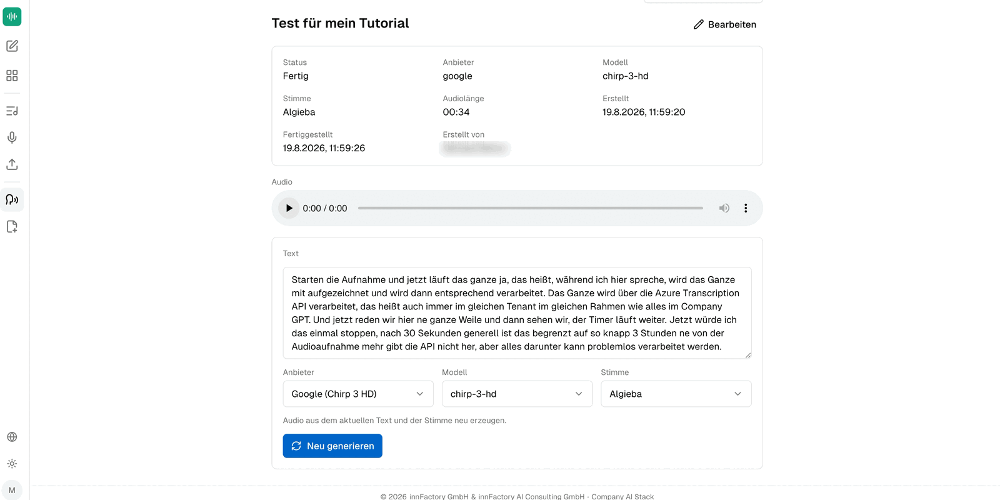

companyTRANSCRIBE also works in the opposite direction: alongside audio-to-text, it generates audio from text. The area sits in the sidebar under **Sprachausgaben** (Voiceovers) and manages every generated audio file.

## Creating a voiceover

The **Sprachausgabe erstellen** (Create voiceover) form is headed "Wandle Text mit einer KI-Stimme in Audio um." — turn text into audio using an AI voice.

| Field | Meaning |
|---|---|
| **Titel (optional)** | Name of the voiceover in the overview |
| **Beschreibung (optional)** | Free text for context |
| **Anbieter** (Provider) | The service that generates the voice |
| **Modell** (Model) | Voice model of the chosen provider |
| **Stimme** (Voice) | The specific voice of the chosen model |
| **Text** | The text to be read out |

The text field carries the placeholder "Text eingeben, der in Sprache umgewandelt werden soll…" and below it a character counter with an upper limit of **50,000 characters**. Clicking **Generieren** (Generate) starts generation; the button stays inactive until text has been entered.

## Providers, models, and voices

Two providers are available, each with its own model and voice list:

| Provider | Model | Example voice |
|---|---|---|
| **Azure Speech** | `neural` | `de-DE-KatjaNeural` |
| **Google (Chirp 3 HD)** | `chirp-3-hd` | `Charon`, `Algieba` |

Azure Speech voices follow the pattern `<language>-<region>-<name>Neural`, so the voice's language is readable from its name. Google Chirp 3 HD voices, by contrast, carry proper names with no language marker.

The list for Google Chirp 3 HD includes `Gacrux`, `Iapetus`, `Laomedeia`, `Pulcherrima`, `Rasalgethi`, `Sadachbia`, `Sadaltager`, `Schedar`, `Sulafat`, `Umbriel`, `Vindemiatrix`, and `Zubenelgenubi`, among others.

:::note
The voice list scrolls inside the selector; the names above are the visible portion and not necessarily the full set. With Google Chirp 3 HD the name does not reveal which language a voice belongs to — only listening to the result will tell.
:::

## Reviewing and regenerating

The finished voiceover shows status, provider, model, voice, audio length, and the creation and completion times in its header.

Below the audio player the text used remains editable, followed once more by the **Anbieter**, **Modell**, and **Stimme** selectors. The note "Audio aus dem aktuellen Text und der Stimme neu erzeugen." describes what **Neu generieren** (Regenerate) does: change the text or the voice and produce a new version from it without having to create the voiceover again.

The result can be played directly from the audio player, and the file can also be downloaded as an audio file.

:::tip[Note]
Earlier versions are retained after a **Neu generieren** and can still be played and downloaded — a new version does not discard the old one.
:::

## What next?

Voiceovers can also be produced without the interface: an agent in CompanyGPT can create, retrieve, and regenerate them through the MCP server. See [Access from CompanyGPT](/en/company-gpt/addons/company-transcribe/mcp-integration/).
