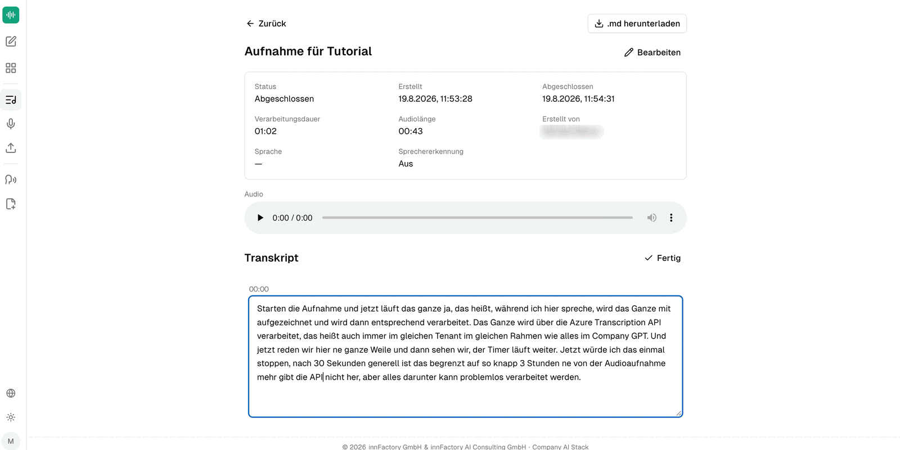
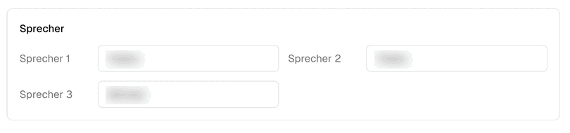

Clicking an entry in the **Transkripte** overview opens the detail view. There you see the recording's metadata, can play the audio, correct the recognised text, name the speakers, and export the result.

## Recording metadata

The header of the detail view lists the technical details of the transcription.

| Field | Content |
|---|---|
| **Status** | `In Bearbeitung` (in progress) while transcribing, then `Abgeschlossen` (completed) |
| **Erstellt** | When the recording was created |
| **Abgeschlossen** | When the transcript was finished |
| **Verarbeitungsdauer** | Duration of the transcription run |
| **Audiolänge** | Length of the recording |
| **Erstellt von** | The user who owns the transcript |
| **Sprache** | Language of the recording |
| **Sprechererkennung** | `Aktiv` or `Aus`, depending on the setting used when recording |

While transcription is running, the note "Wird transkribiert… Je nach Länge der Aufnahme kann dies einige Minuten dauern." (Transcribing… depending on the length of the recording this may take a few minutes) appears in place of the text. **Bearbeiten** (Edit) in the header changes the entry's title and description.

:::note
In the example above the **Sprache** field shows a dash, even though the recording was in German. Whether and when the language is populated — and whether it can be selected when creating a recording — is not visible in the underlying recording and should be verified before publication.
:::

## Playing the audio

An audio player sits under **Audio**, so the recording can be replayed at any time — useful for checking an unclear passage in the transcript against the original.

## Correcting the text

The **Transkript** section offers two actions:

- **Bearbeiten** (Edit) — switches the text into an editable field. The action then changes to **Fertig** (Done), which commits the change.
- **Synchronisieren** (Synchronise) — realigns text and audio.

Typically you correct proper nouns and technical terms the recognition misheard here — for example an "App" that should read "API". The correction also carries through to the export.

## Naming speakers

If the recording was made with speaker diarization active, a **Sprecher** (Speakers) block appears above the text with one input field per detected voice (`Sprecher 1`, `Sprecher 2`, `Sprecher 3`, …).

Enter the actual names there. The assignment then carries through the whole transcript: each contribution is headed with the name you gave and a timestamp. What was an anonymous numbering becomes a readable record of the conversation — and the names also appear in the exported file.

:::tip[Note]
Speaker diarization distinguishes up to 35 voices per recording. Name the speakers once centrally in this block rather than overwriting individual sections in the text.
:::

## Exporting as Markdown

The **.md herunterladen** button in the top right saves the complete transcript as a Markdown file. With multiple speakers, the file carries the names you assigned as headings, so it can be processed further right away — as the basis for minutes, for example, or for filing in a knowledge collection.

## What next?

Instead of processing the transcript by hand, you can have it analysed directly in the chat: [Access from CompanyGPT](/en/company-gpt/addons/company-transcribe/mcp-integration/).
