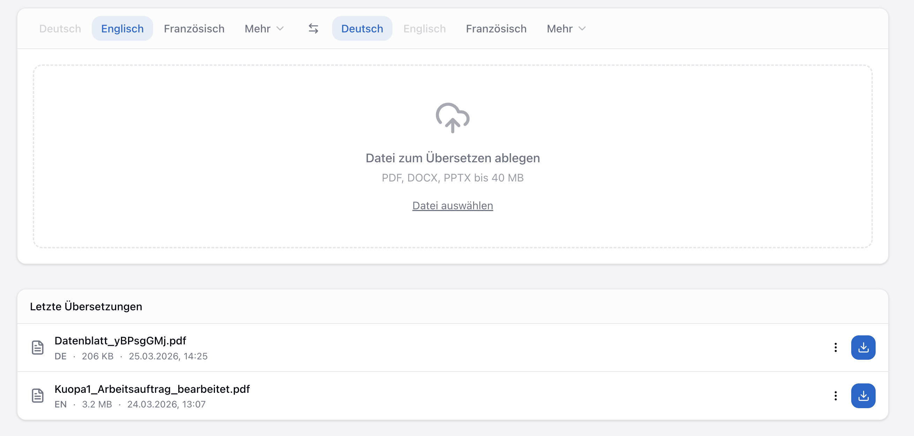
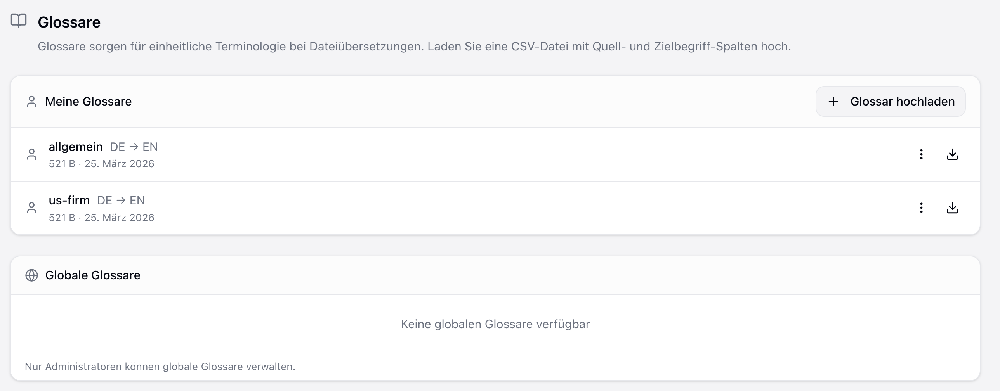

companyTRANSLATE is a translation application that, like CompanyGPT, runs entirely within the company's Microsoft tenant. It supports text and document translation as well as a two-level glossary system. Since no data is transmitted to external services, the application meets GDPR requirements.

## Access and Authentication

Access is exclusively via Microsoft Single Sign-On (SSO) using the existing company account. No separate credentials are required, and no data is transferred to third-party providers.

## Text and Document Translation

companyTRANSLATE supports two translation modes:

- **Text translation**: Up to 5,000 characters directly in the user interface
- **Document translation**: PDF, Word (.docx), and PowerPoint (.pptx) files up to 40 MB; formatting and layout are preserved

## Translation History and OneDrive Integration

All translations are automatically logged in a user-specific history. Translated documents can be saved directly to OneDrive. No local caching outside the Microsoft Cloud takes place.

## Two-Level Glossary System

The glossary system operates on two levels:

- **Global Glossary**: Centrally managed by administrators and defines binding terminology for the entire company
- **Personal Glossary**: Each user can create their own glossary for project-specific terms

Both glossaries can be populated via CSV import.

