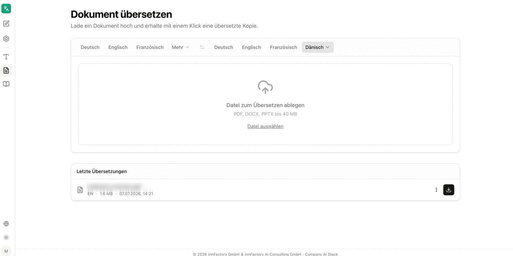
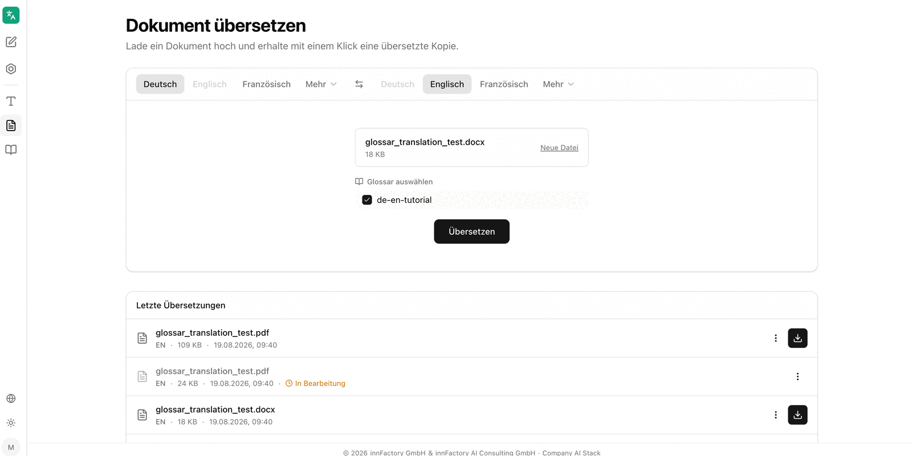
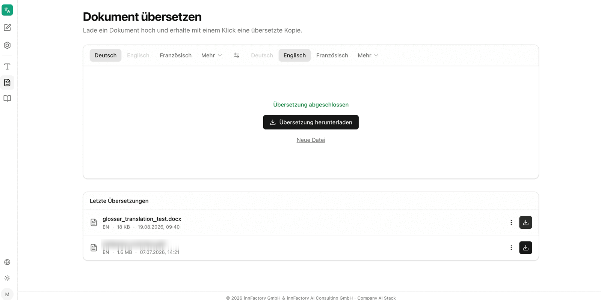

The **Dokument übersetzen** (translate document) area translates complete files and returns them in their original format. The application describes the area as "Lade ein Dokument hoch und erhalte mit einem Klick eine übersetzte Kopie" — upload a document and get a translated copy with one click.

## Supported Formats

The drop area names the permitted formats directly: **PDF, DOCX, PPTX bis 40 MB**. Files are added by drag and drop or loaded from the file system via **Datei auswählen** (select file).

:::note
Unlike [text translation](/en/company-gpt/addons/company-translate/text-uebersetzen/), there is no automatic language detection here. Source and target language must be set before translating.
:::

## Choosing Languages and a Glossary

After the upload, companyTRANSLATE shows the file with its name and size. **Neue Datei** (new file) selects a different file. Below the file, the glossary status for the chosen language combination appears — either the note **Kein Glossar für dieses Sprachpaar vorhanden** (no glossary available for this language pair) or the **Glossar auswählen** (select glossary) list with matching glossaries as checkboxes.

The **Übersetzen** (translate) button starts the process.

## Downloading the Result

Once finished, the application reports **Übersetzung abgeschlossen** (translation complete) and offers **Übersetzung herunterladen** (download translation). **Neue Datei** resets the area for the next job.

The translated copy retains the structure and formatting of the source file: headings, paragraphs, emphasis and page breaks are preserved, so source and target document can be compared side by side.

## Recent Translations

Below the drop area, **Letzte Übersetzungen** (recent translations) lists previous jobs with file name, target language, file size and timestamp. Each entry offers a context menu and a button to download it again.

Jobs still running are marked **In Bearbeitung** (in progress) and offer no download.

:::tip[Note]
Larger documents can take a moment to translate. The entry under **Letzte Übersetzungen** switches from **In Bearbeitung** to the download button as soon as the result is ready.
:::

## Related Topics

- [Glossaries](/en/company-gpt/addons/company-translate/glossare/) – consistent terminology for document translations
- [Translate text](/en/company-gpt/addons/company-translate/text-uebersetzen/) – translating short texts directly in the interface
