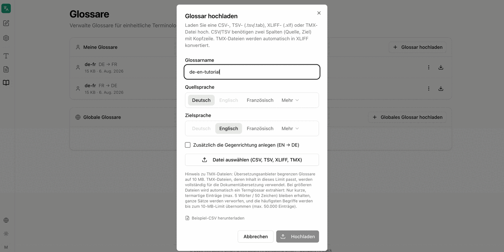

Glossaries define how individual terms are translated. They secure binding terminology — product names, role titles or fixed phrases — that would otherwise be translated differently depending on context. Glossaries apply to both [text translation](/en/company-gpt/addons/company-translate/text-uebersetzen/) and [document translation](/en/company-gpt/addons/company-translate/dokument-uebersetzen/).

## Personal and Global Glossaries

The overview separates two levels:

- **Meine Glossare** (my glossaries) – glossaries belonging to the signed-in user, created via **Glossar hochladen** (upload glossary). Any authorised user can add their own glossaries here
- **Globale Glossare** (global glossaries) – company-wide glossaries, created via **Globales Glossar hochladen**; with no entries, **Keine globalen Glossare verfügbar** is shown

:::note
Global glossaries can only be created and managed by administrators. Personal glossaries under **Meine Glossare** are open to all authorised users.
:::

Each entry shows the name, the language direction as a source/target pair, file size and creation date, plus a context menu and a download button.

## Structure of a Glossary File

A CSV or TSV file needs exactly two columns — source and target — with a header row containing the language codes. Every further row forms a term pair:

| de | en |
|---|---|
| Umsatz | Money Explosion |
| Geschäftsjahr | Year of the Potato |
| Vorstand | Council of Wizards |
| Besprechung | Nap Time |

:::note
The example values come from a training glossary and are deliberately exaggerated so that the effect of the glossary is immediately visible in the translation.
:::

**Beispiel-CSV herunterladen** (download sample CSV) in the upload dialog provides a template in the expected structure.

## Uploading a Glossary

**Glossar hochladen** opens a dialog with all details for the new glossary.

| Field | Meaning |
|---|---|
| **Glossarname** | Freely chosen name under which the glossary is later offered for selection |
| **Quellsprache** | Language of the left column |
| **Zielsprache** | Language of the right column |
| **Zusätzlich die Gegenrichtung anlegen** | Creates a second glossary for the reverse direction from the same file |
| **Datei auswählen (CSV, TSV, XLIFF, TMX)** | Selection of the glossary file |

The dialog names the permitted formats explicitly: a **CSV, TSV (`.tsv`/`.tab`), XLIFF (`.xlf`) or TMX** file. TMX files are converted to XLIFF automatically.

:::note
Glossaries always apply in one direction only. A German → English glossary does not apply to an English → German translation. **Zusätzlich die Gegenrichtung anlegen** creates both directions in one step; they then appear in the overview as two entries with the same name and different language directions.
:::

### Limits for TMX Files

The dialog points out a size restriction: translation providers limit glossaries to 10 MB. TMX files whose content fits within this limit are used in full for document translation. For larger files, a term glossary is extracted automatically — only short, term-like entries of at most 5 words or 50 characters are kept, whole sentences are discarded, and the most frequent terms are taken up to the 10 MB limit, with a maximum of 50,000 entries.

## Applying Glossaries

An uploaded glossary is available in both translation areas as soon as the chosen language combination matches the glossary's language direction:

- In [text translation](/en/company-gpt/addons/company-translate/text-uebersetzen/) via the selection field below the input and the **Glossar automatisch anwenden** checkbox
- In [document translation](/en/company-gpt/addons/company-translate/dokument-uebersetzen/) via **Glossar auswählen** before starting the translation

If no glossary matches the language combination, the interface reports **Kein Glossar für dieses Sprachpaar**. Applying a glossary is optional: even when one exists, you can translate without it.

:::danger
Glossaries are case-sensitive. An entry only applies on an identical spelling. Terms that should apply in several spellings must be present as separate entries in the glossary.
:::

## Related Topics

- [Translate text](/en/company-gpt/addons/company-translate/text-uebersetzen/) – glossaries in real-time translation
- [Translate document](/en/company-gpt/addons/company-translate/dokument-uebersetzen/) – glossaries for file translations
