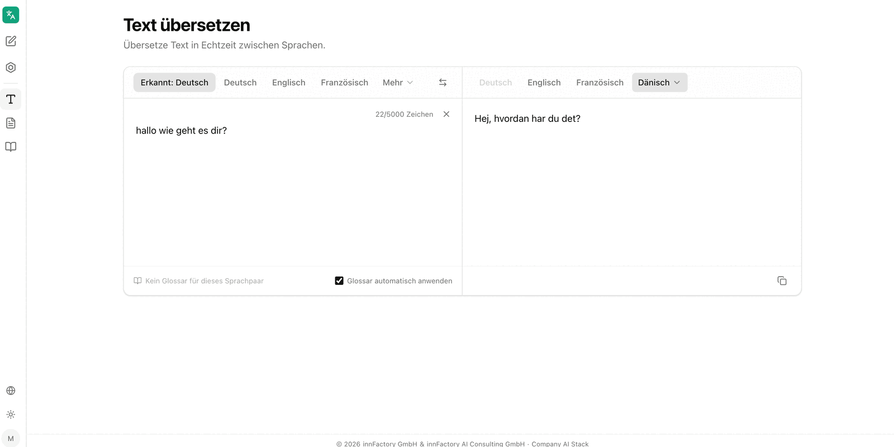

The **Text übersetzen** (translate text) area translates entered text immediately between two languages. The interface shows source and target text side by side, and the translation updates as you type. The application describes the area as "Übersetze Text in Echtzeit zwischen Sprachen" — translate text between languages in real time.

## Selecting Languages

Two language bars sit above the input: the source language on the left, the target language on the right. Both offer **Deutsch**, **Englisch** and **Französisch** directly; all other languages are behind **Mehr** (more). A language chosen from **Mehr** then moves into the bar as a button — **Dänisch** (Danish) in the example.

The left bar additionally offers **Sprache erkennen** (detect language). With this option active, the application determines the source language from the entered text and shows the result as **Erkannt: Deutsch** (detected: German). The button between the two bars swaps source and target language.

## Character Limit

Above the input field the application counts the characters used, for example `22/5000 Zeichen`. Each translation therefore allows 5,000 characters. A cross next to the counter clears the input field; below the result, a button copies the translation to the clipboard.

:::note
For longer content, use [Translate document](/en/company-gpt/addons/company-translate/dokument-uebersetzen/). A file size limit of 40 MB applies there instead of the character limit.
:::

## Applying a Glossary

At the bottom edge of the input field, companyTRANSLATE indicates which [glossary](/en/company-gpt/addons/company-translate/glossare/) applies to the current language combination. The text changes with the situation:

| Display | Meaning |
|---|---|
| **Ausgangssprache wählen, um ein Glossar zu nutzen** | No source language is set yet, for example while language detection is active |
| **Kein Glossar für dieses Sprachpaar** | No glossary exists for the selected combination |
| Glossary name with an **AUTO** marker | A glossary is selected and is being applied |

If a glossary is available, it can be set via the selection field. The **Glossar automatisch anwenden** (apply glossary automatically) checkbox applies the matching glossary without further action. The note **Glossar angewendet** (glossary applied) then appears above the result.

In the example, companyTRANSLATE translates "Besprechung" using the glossary entry **Nap Time** instead of the otherwise usual "Meeting".

## Related Topics

- [Glossaries](/en/company-gpt/addons/company-translate/glossare/) – creating, uploading and applying glossaries
- [Translate document](/en/company-gpt/addons/company-translate/dokument-uebersetzen/) – translating entire files with formatting preserved
