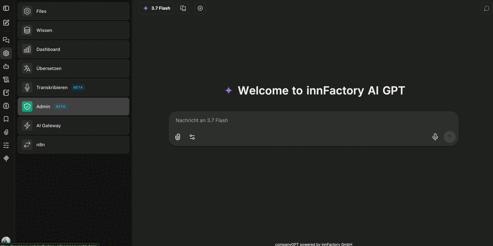

companyADMIN is the administration area of CompanyGPT. Here you define who may use which features, which models and agents are visible to which roles and groups, and how the content library – agents, prompts and skills – is synchronized with a Git repository.

You reach the area from the application menu under **Admin**. It requires the `access:admin` capability, granted through a [role](/en/company-gpt/addons/companyadmin/rollen-und-rechte/) or a [direct grant](/en/company-gpt/addons/companyadmin/direkte-berechtigungen/).

:::note
companyADMIN is in beta. Labels and the structure of individual pages may still change.
:::

## Dashboard

The start page groups the most common tasks as tiles, each leading straight to the matching page.

**Users & access**

| Tile | Purpose |
|---|---|
| Manage users | See all users, open one, and assign them a role |
| Create & manage groups | Create local groups or register Entra groups — the basis for sharing agents, prompts and skills |
| Roles & permissions | Create roles and define what their members may do in CompanyGPT |
| Manage admins | See who has admin access and why — and appoint further admins |

**Release AI features to roles**

| Tile | Purpose |
|---|---|
| Release AI models per role | Make providers and individual models visible only to specific roles |
| Release agents per group | Decide which groups can see and use which agents |
| Release MCP tools per role | Control which roles may use which tools and MCP servers |

## Areas at a glance

- [Roles and permissions](/en/company-gpt/addons/companyadmin/rollen-und-rechte/) – create roles and set feature permissions per role
- [Users and groups](/en/company-gpt/addons/companyadmin/benutzer-und-gruppen/) – assign roles, manage groups and Entra groups
- [Direct grants](/en/company-gpt/addons/companyadmin/direkte-berechtigungen/) – grant individual capabilities selectively
- [Audit log](/en/company-gpt/addons/companyadmin/audit-log/) – tamper-evident record of administration actions
- [Content and visibility](/en/company-gpt/addons/companyadmin/inhalte/) – release agents, prompts, skills and MCP tools
- [Categories](/en/company-gpt/addons/companyadmin/kategorien/) – maintain categories for the agent marketplace
- [Models and providers](/en/company-gpt/addons/companyadmin/modelle/) – model access per role and custom model labels
- [Agent capabilities](/en/company-gpt/addons/companyadmin/agent-capabilities/) – capabilities of the agent builder per role
- [Library Sync](/en/company-gpt/addons/companyadmin/library-sync/) – synchronize the content library with GitHub

## Roles, groups and visibility

Three concepts work together in the administration area:

- **Roles** bundle permissions and capabilities. A user has exactly **one** role; allowances from different roles are not added together.
- **Groups** bundle users. They are the basis for sharing content.
- **Visibility** decides per item who sees it – only the owner, all users of the environment, or selected groups.

:::tip[Note]
Because a user has exactly one role, a cohort that needs the allowances of two roles combined requires a role of its own.
:::
