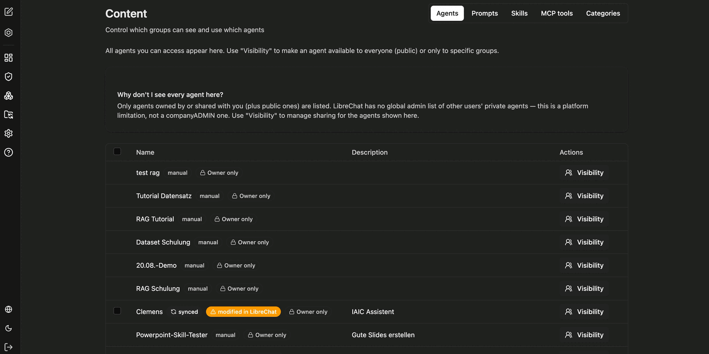
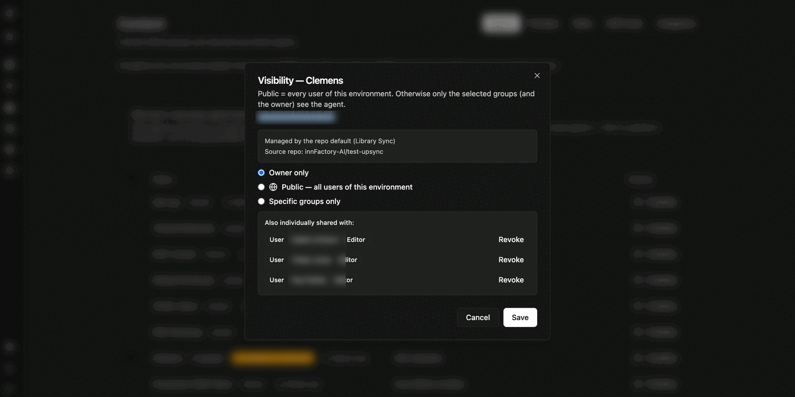
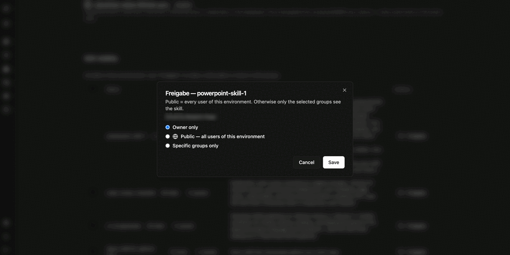

Under **Content** you control the visibility of content: agents, prompts, skills and MCP tools. The tabs separate the content types; **Categories** additionally maintains the [categories of the agent marketplace](/en/company-gpt/addons/companyadmin/kategorien/).

The list shows the name, description and current visibility status per entry. Additional badges indicate the origin:

| Badge | Meaning |
|---|---|
| `manual` | The item was created in CompanyGPT itself |
| `synced` | The item comes from a repository connected via [Library Sync](/en/company-gpt/addons/companyadmin/library-sync/) |
| `modified` | The synced item was changed in CompanyGPT afterwards and now differs from the repository |
| `Owner only` | Currently only the owner sees the item |

:::note
Only items you own, that were shared with you, or that are public are listed. A global list of all other users' private items does not exist at platform level. For the items shown here, you manage sharing in this place.
:::

## Setting visibility

Use **Visibility** to open the sharing settings of an entry.

Three levels are available:

- **Owner only** – only the owner sees the item.
- **Public — all users of this environment** – all users of the environment see the item, within the company.
- **Specific groups only** – only the selected [groups](/en/company-gpt/addons/companyadmin/benutzer-und-gruppen/) and the owner see the item.

The dialog also names the owner and – for synced items – the source repository and the default visibility set there. Existing individual shares with people are listed under **Also individually shared with** and can be revoked there one by one.

For skills the dialog works identically:

:::tip[Note]
Whether a role may share content at all, or release it publicly, is defined by the feature permissions under [Roles and permissions](/en/company-gpt/addons/companyadmin/rollen-und-rechte/). The visibility here only decides about the individual item.
:::

If the default visibility is maintained in the repository, a change here overrides the repo default for that item. See [Library Sync](/en/company-gpt/addons/companyadmin/library-sync/).
