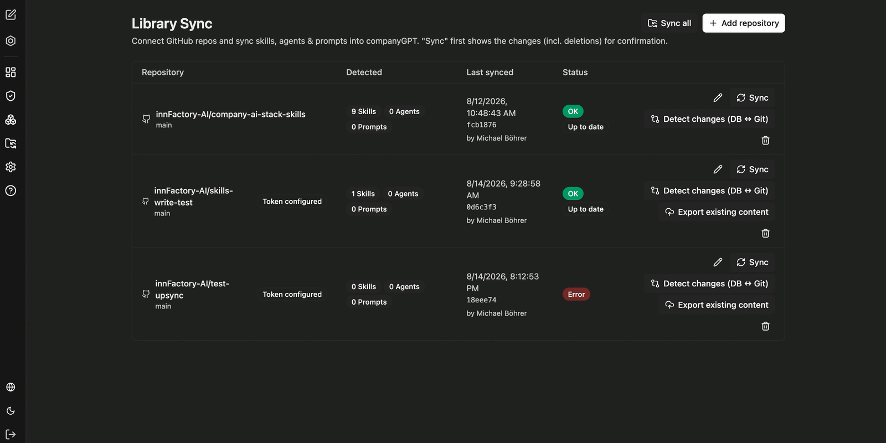
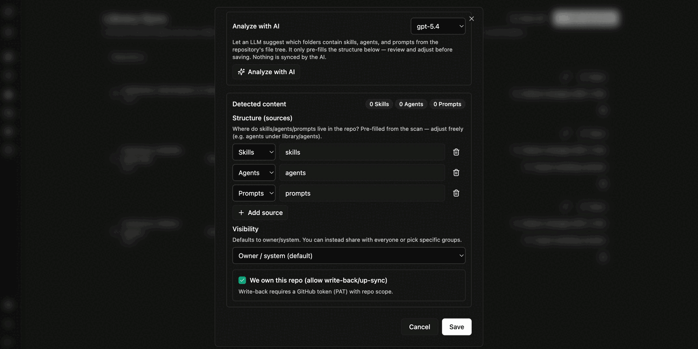
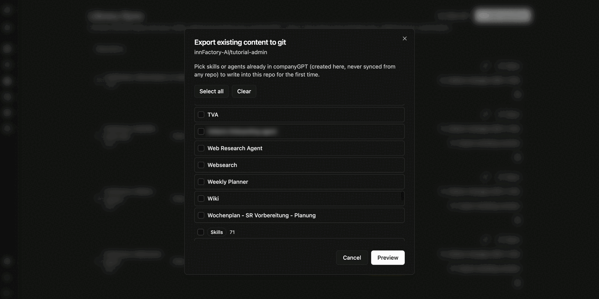

Library Sync connects CompanyGPT with GitHub repositories and synchronizes **skills, agents and prompts** in both directions. This lets you version the content library, review it as a team and move it between environments.

A synchronization run first shows the changes – including deletions – for confirmation.

The overview shows per repository:

| Column | Content |
|---|---|
| **Repository** | Repository and branch |
| **Detected** | Detected content as a count of skills, agents and prompts; also whether a token is configured |
| **Last synced** | Time, commit and triggering person of the last run |
| **Status** | `OK` with the note "Up to date", or `Error` |

Per repository the following are available: **Sync**, **Detect changes (DB ↔ Git)**, **Export existing content**, edit and delete. **Sync all** synchronizes all repositories one after another.

## Connecting a repository

Use **Add repository** to connect a repository. Besides repository, branch and authentication via a GitHub token, you define where the content lives inside the repository.

- **Analyze with AI** – a language model suggests, based on the file tree, which folders contain skills, agents and prompts. The suggestion only pre-fills the structure; nothing is synced by it.
- **Detected content** – the number of detected skills, agents and prompts.
- **Structure (sources)** – one content type and its path per entry, for example `skills`, `agents` and `prompts`. Use **Add source** to add further paths, such as `library/agents`.
- **Visibility** – default visibility of imported content. The default is `Owner / system`; alternatively you release it to everyone or to specific groups.
- **We own this repo (allow write-back/up-sync)** – allows writing back from CompanyGPT into the repository. This requires a GitHub token (PAT) with `repo` scope.

:::note
Without marking it as your own repository, synchronization is one-way: content flows from Git into CompanyGPT, and changes made in CompanyGPT are not written back.
:::

## Reviewing changes

**Detect changes (DB ↔ Git)** compares the state in CompanyGPT with the repository and summarizes the result: how many entries are newer in the repository, how many were changed in the app, and how many match. The status is reported per entry.

## Exporting content to Git

**Export existing content** writes content that was created in CompanyGPT and never synced from any repository into the repository for the first time.

You select the agents and skills individually or take all of them, and then get a **Preview** of the files to be written.

When writing back, CompanyGPT creates a commit with a descriptive message and lists the written files.

In the repository the content then lives as YAML files in the configured folders – an agent including its instructions, tools and artifact settings as one file per agent.

## Interplay with visibility

Synced content carries the `synced` badge under [Content and visibility](/en/company-gpt/addons/companyadmin/inhalte/). If such an item is edited in CompanyGPT, the list additionally marks it as modified – an indication that app and repository have diverged. Another run reconciles the two.

:::tip[Note]
Review the change preview before every run. It also contains deletions: content removed in the repository disappears from CompanyGPT on synchronization.
:::
