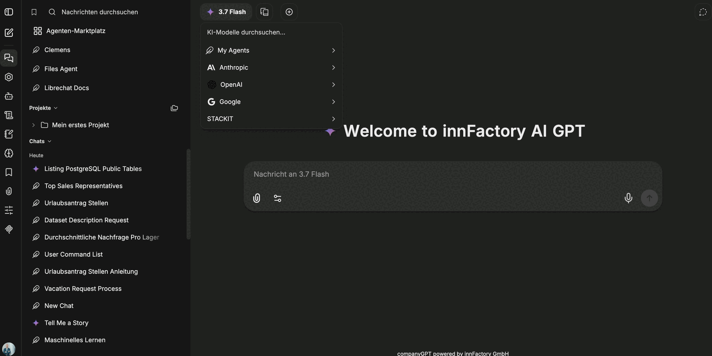

In the administration area you define which providers and which individual models a role may use – and under which name a model is shown to users.

## Model access per role

By default a provider is available to all users. With **Only specific roles may use …** you restrict it to selected roles and define the allowed models per role.

Because a user has exactly **one** role, exactly one of these rows applies to them. Allowances from several roles are not added together: a cohort that needs the models of two roles combined requires a role of its own.

Points to note:

- If the **ADMIN** role is not ticked, administrators lose this provider as well.
- **USER** is the default role for everyone whose login matched no role mapping. Without a tick, those users see nothing of the provider.
- A role you do not tick still sees the provider, but with an empty model list. Providers are switched on by the server environment and cannot be removed here, only emptied. Therefore leave at least one model active per role.

:::note
Changes to model access take effect within about a minute.
:::

## Custom model labels

With **Manage model labels from companyADMIN** you show a model under a name of your choosing – for example "Claude Sonnet 4.6" instead of the technical model ID.

Per entry you configure:

| Field | Meaning |
|---|---|
| **Label** | Displayed name of the model |
| **Provider** and **Model** | Technical mapping to the actual model |
| **Description** | Short hint on its purpose, for example "For simple tasks" |
| **Group** and **Group icon** | Grouping in the model picker, for example by provider |
| **Icon URL** | Optional custom icon |
| **Preselected for new chats** | The model is preselected in new conversations |

For OpenAI models, **Use the OpenAI Responses API** is available additionally. The arrows change the order of the entries in the picker.

## Result for users

In the model picker of a conversation, users then see only the providers and models released for their role – grouped and with the labels you assigned.

Which models are generally available in the [model selection](/en/company-gpt/modellauswahl/) additionally depends on the server configuration.
