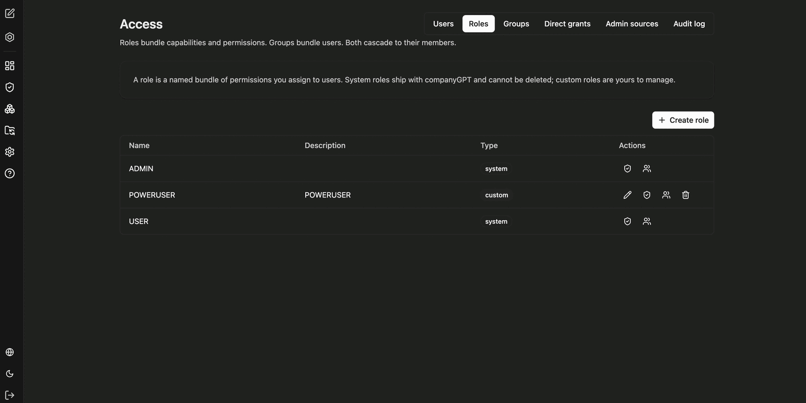
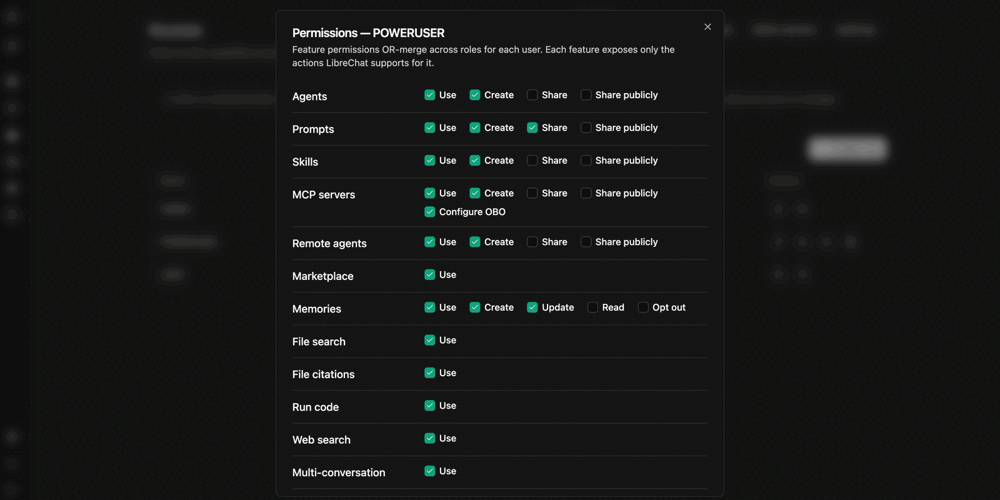

Roles bundle permissions and capabilities and are assigned to users. Groups, in contrast, bundle users; both cascade to their members. You manage roles under **Access** in the **Roles** tab.

A role is a named bundle of permissions. **System roles** ship with CompanyGPT and cannot be deleted; **custom roles** are yours to manage.

The overview shows the name, description and type (`system` or `custom`). Per role you can:

- **Edit permissions** – the feature permissions of the role (see below)
- **Members** – which users hold the role
- **Edit** and **Delete** – custom roles only

Use **Create role** to add a new role.

:::note
A user always has exactly one role. The `USER` role is a role like any other: it covers everyone whose login matched no role mapping.
:::

## Feature permissions per role

For every role you define which features its members may use. Per feature, only the actions the platform supports are offered.

| Feature | Available actions |
|---|---|
| Agents | Use, Create, Share, Share publicly |
| Prompts | Use, Create, Share, Share publicly |
| Skills | Use, Create, Share, Share publicly |
| MCP servers | Use, Create, Share, Share publicly, Configure OBO |
| Remote agents | Use, Create, Share, Share publicly |
| Marketplace | Use |
| Memories | Use, Create, Update, Read, Opt out |
| File search | Use |
| File citations | Use |
| Run code | Use |
| Web search | Use |
| Multi-conversation | Use |
| Temporary chat | Use |
| Bookmarks | Use |
| Shared links | Create, Share, Share publicly |
| People picker | View users, View groups, View roles |

Feature permissions from several roles are OR-merged per user. **Share publicly** decides whether members may release content to the entire environment rather than to individual groups only.

:::tip[Note]
**Configure OBO** for MCP servers allows configuring on-behalf-of access, where a tool accesses a third-party system in the name of the signed-in user. Grant this permission deliberately.
:::

Which capabilities the agent builder itself offers is controlled separately under [Agent capabilities](/en/company-gpt/addons/companyadmin/agent-capabilities/). Model access is governed under [Models and providers](/en/company-gpt/addons/companyadmin/modelle/).
