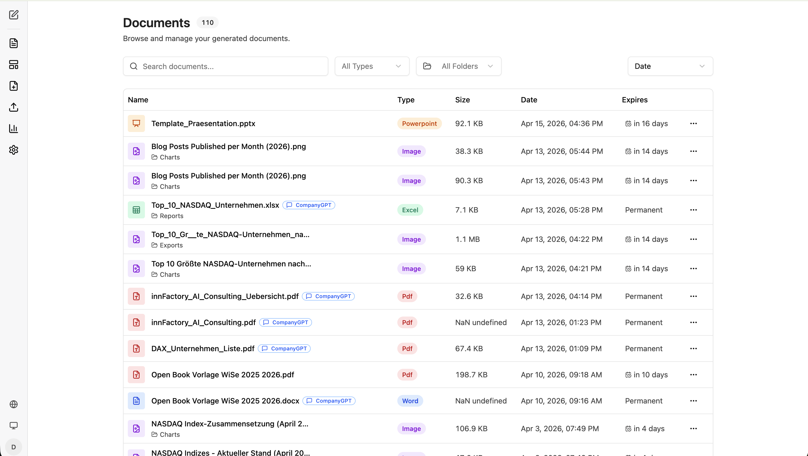
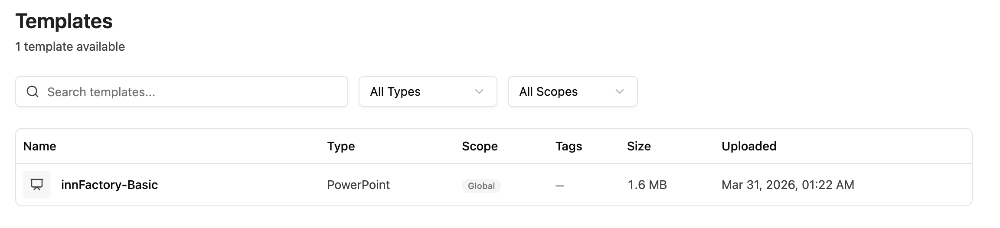
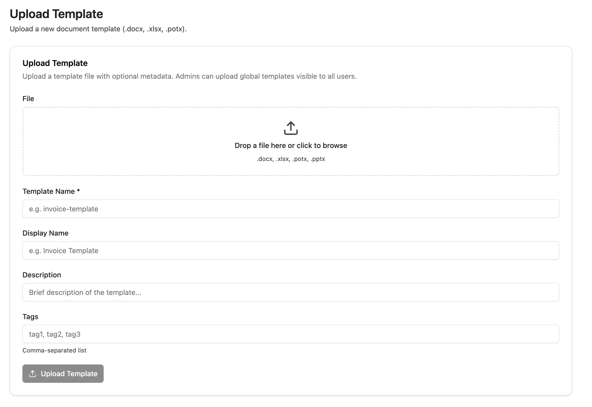
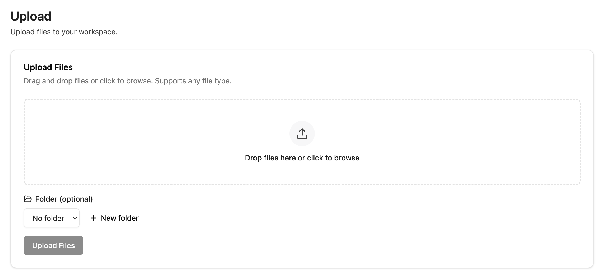
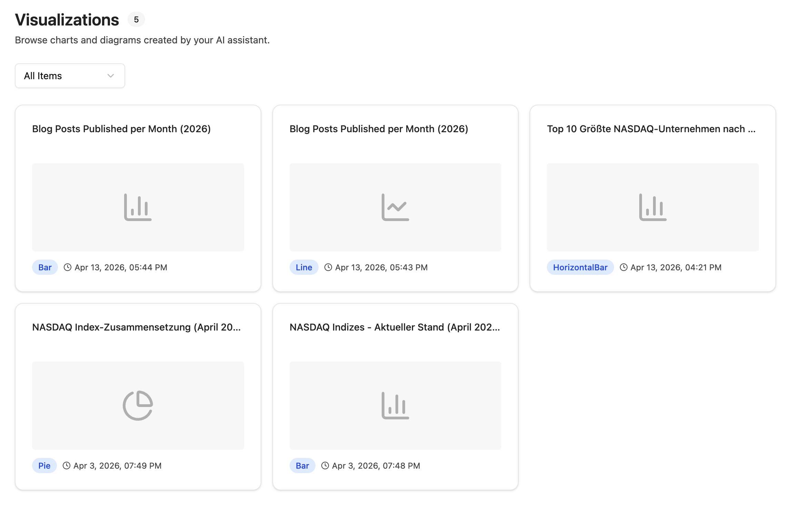
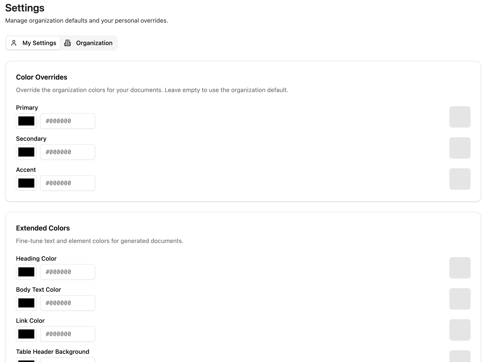

import sidebarImg from "./companyfiles-sidebar.png";

companyFILES is the document workspace for CompanyGPT. You can create, upload, organize, convert, and manage files in one interface, including templates, charts, and document settings.

## The companyFILES Interface

  
  

The sidebar gives you direct access to all core functions:

1. **Back to Chat** – Returns to the CompanyGPT Chat
2. **[Documents](#documents)** – Shows all generated and uploaded documents
3. **[Templates](#templates)** – Shows all available templates
4. **[Upload Template](#upload-template)** – Upload a new template
5. **[Upload](#upload)** – Upload files
6. **[Visualizations](#visualizations)** – Shows all created diagrams and charts
7. **[Settings](#settings)** – Document settings that are automatically applied
8. **Language** – Change interface language
9. **Toggle Design** – Toggle Dark/Light mode
10. **Account** – Account management

  

### Documents

Here you can browse and manage all generated and uploaded files. Use the **search bar** and the filters **All Types** and **All Folders** to find files quickly. Files with a **CompanyGPT** badge were generated directly from the chat. The **three-dot menu** (⋯) lets you download, preview, edit the expiration date, or delete documents. Documents can be organized into folders and have a configurable expiration date.

### Templates

Here you can see all available templates for document generation. Templates can be filtered by **Type** and **Scope** (e.g. Global or personal). Available templates can be used directly in the chat for document generation.

### Upload Template

Drag and drop a template file (`.docx`, `.xlsx`, `.potx`, `.pptx`) into the upload area. Fill in the **Template Name** (required) and optionally **Display Name**, **Description**, and **Tags**. Admins can upload global templates visible to all users. Click **"Upload Template"** to complete the upload.

### Upload

Drag and drop files into the upload area or click to browse. All file types are supported. Optionally select a **Folder** or create a new one via **"+ New folder"**. Click **"Upload Files"** to start the upload.

### Visualizations

All charts and diagrams created in the chat are collected here. Use the **"All Items"** filter to filter by chart type (e.g. diagrams or charts). Each card shows the title, a preview, the type, and the creation date.

### Settings

Use the **My Settings** and **Organization** tabs to define color values that are automatically applied to all generated documents. Under **Color Overrides**, adjust Primary, Secondary, and Accent colors. Under **Extended Colors**, control Heading, Body Text, Link, and Table Header colors. You can also set a **company logo** that will be used in generated documents. Leave fields empty to use the organization default.

## Creating Documents with CompanyGPT

Now that you know the interface, the next sections cover what you can create with companyFILES in CompanyGPT and how to use templates, conversions, visualizations, and file organization in practice.

:::tip
A video tutorial for using companyFILES with CompanyGPT can be found here:

- German video: [https://www.youtube.com/watch?v=CWYTURftXHI](https://www.youtube.com/watch?v=CWYTURftXHI)
- English video: [https://www.youtube.com/watch?v=DSJNlRxC9nI](https://www.youtube.com/watch?v=DSJNlRxC9nI)
  :::

## Comprehensive document creation

Native Word (.docx), Excel (.xlsx), PowerPoint (.pptx) and PDF files can be created.

- **Excel:** Tables can be generated from CSV, JSON and arrays or advanced templates including formulas can be used.
- **Word:** Markdown, HTML, JSON or templates are seamlessly converted into finished documents.
- **PowerPoint:** Presentations can be created directly from Markdown texts or templates.
- **PDF:** PDFs can be generated directly from Markdown or HTML.

**Example: JSON to Excel**

Chat:

Result:

## Data Processing & Code Export

Structured data such as JSON or CSV can be converted directly into clean Excel spreadsheets or Word documents. In addition, any text-based files and code scripts can be created (e.g. SQL, JSON, YAML, XML, HTML, Python or JS).

**Example: Meeting minutes in PDF document**

Chat:

Result:

## Visual Diagrams & Charts

Raw numbers can be visualized directly as meaningful graphics.

- **Interactive charts:** Bar, line, pie, scatter, bubble or radar charts including zoom function and image export can be created.
- **Mermaid diagrams:** Flowcharts, sequence diagrams, class diagrams and state machines can be generated via prompt.

**Example: Pie chart**

**Example: Mermaid Flowchart**

## File Conversion & Data Extraction

- **Conversion:** You can flexibly switch between formats (Excel ↔ CSV/JSON, Word ↔ PDF, Markdown ↔ HTML, etc.).
- **Extraction:** Data and texts can be read and extracted from existing Excel, Word and PDF files.
- **Image Editing:** The size of images can be changed and converted to other graphic formats.

## Intelligent Template Management

Templates enable reusable document generation with dynamic content. However, you cannot simply upload a finished document — it must be prepared with placeholders first.

### Preparing Templates

Templates use double curly brace syntax: `{placeholder}`. Open the document in its native application and insert placeholders like `{CompanyName}`, `{Date}`, `{Address}` wherever CompanyGPT should insert dynamic content. Placeholder names are freely choosable but should be descriptive.

- **Word (.docx):** Place `{placeholder}` directly in the document text. Example: "Dear `{Salutation}` `{LastName}`, ..." or a table cell with `{InvoiceAmount}`
- **Excel (.xlsx):** Place `{placeholder}` in individual cells. Example: Cell A1 with `{EmployeeName}`, Cell B1 with `{Department}`
- **PowerPoint (.pptx / .potx):** Place `{placeholder}` in text boxes on slides. Example: Title slide with `{ProjectName}`, content slide with `{Summary}`

:::tip
Use descriptive placeholder names like `{CustomerName}` instead of `{C1}`. This helps CompanyGPT understand the context and fill placeholders more reliably with the correct data.
:::

:::caution
A regular, fully completed document without placeholders cannot be used as a template. CompanyGPT requires the `{placeholder}` markers to identify which parts should be dynamically replaced.
:::

# Advanced Template Syntax

Besides simple `{placeholder}` markings, Word templates support advanced expression syntax for dynamic content such as loops to create rows in tables.

## Table Loops in Word

Loops in Word tables are controlled via dedicated rows. The `FOR` and `END-FOR` commands are placed in their own table rows respectively:

| Name | Since Joined |
|---|---|
| `{FOR person IN people}` | |
| `{= $person.name}` | `{= $person.joiningYear}` |
| `{END-FOR person}` | |

- The **FOR row** marks the loop start – it is removed during rendering.
- The **body row** is duplicated for each entry in the array.
- The **END-FOR row** closes the loop – it is also removed.

:::caution
The `FOR` and `END-FOR` rows must be **complete table rows** – place the command in the first cell, the remaining cells of the row stay empty. Commands within a cell of a regular row do not function as loop control.
:::

### Using Templates in Chat

Once uploaded, reference the template in the chat and provide the data for the placeholders. CompanyGPT replaces all `{placeholder}` markers with the provided values and generates the finished document.

Example prompt: "Create an invoice using the 'Invoice Template'. Customer name: Sample Inc., Invoice amount: $1,500, Date: April 15, 2026"

## File Management & Organization

- **Data Transfer:** Files can be uploaded and generated documents can be downloaded directly.
- **Structuring:** Files can be clearly organized into folders; in addition, ZIP archives can be created for the bundled download of several documents.
- **Administration:** The overview of the document organization is maintained, while system settings and stored company information can be checked directly in the addon.
