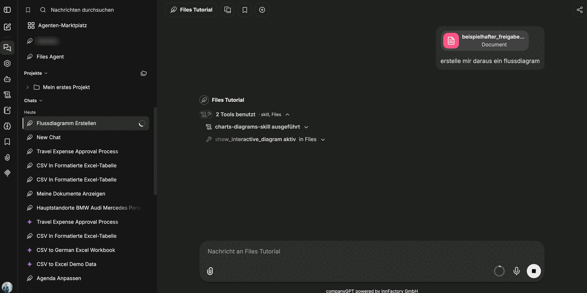
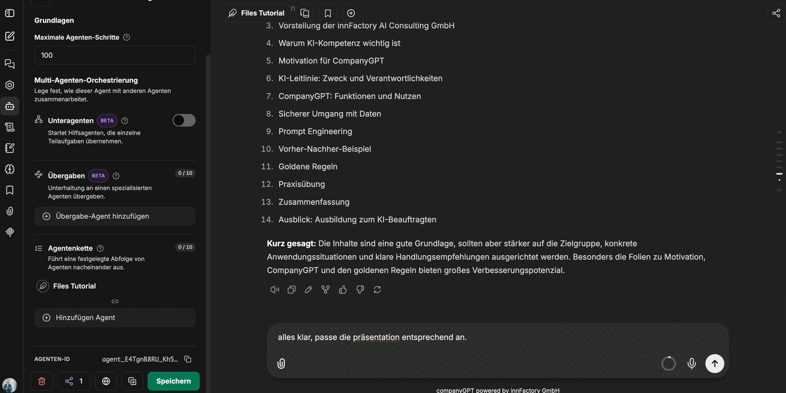

The companyFILES tools are available in every chat. For anything beyond a single file it is still worth having a dedicated agent: it already carries the **Files** tool and the matching skills, so the prompt only has to state the goal. It is created like any other agent under **Agents → Create new agent**.

:::note
The screenshots on this page show the German interface, because that is the language of the recording they were taken from. The product interface is localized – in an English session the labels appear in English.
:::

## Basic settings

| Field | Recommendation |
|---|---|
| Name | a descriptive name, for example the purpose of the agent |
| What this agent does | short description; optional |
| AI model | a small, fast model is sufficient — the work consists mostly of tool calls |
| Category | `General`, unless a dedicated category exists |
| Instructions | keep them short; the rules come from the skills |

A companyFILES agent does not need long system instructions. What works well are two context variables, inserted via the plus icon next to the **Instructions** field and filled in at call time:

| Variable | Purpose |
|---|---|
| `{{current_user}}` | who is requesting the document – ends up in the sender field of a letter, for instance |
| `{{current_datetime}}` | date and time for document headers, minutes and file names |

## The Files tool

The **Files** tool is added under **Tools → Add**. It is an MCP server and brings **56 tools** with it; the counter in the sidebar shows them as `Files · 56`. The dialog shows the connection state (**Connected**) and below it the list of tools on this server, in which individual tools can be deselected – or all of them at once.

Every row has a clock icon next to the name. It marks lazy loading: the tool is only pulled into the context when it is needed. That saves context and makes sense for nearly every tool. The exception is `help` – it stays permanently active so the agent can look up the remaining tools in the first place.

:::note
The clock icon is shown without a label or tooltip in the recording. What is described here is the effect explained in the recording, not the wording of the interface.
:::

### The 56 tools at a glance

**Excel:** `create_excel`, `create_excel_from_csv`, `create_excel_from_json`, `create_excel_advanced`, `modify_excel`, `read_excel`, `read_excel_detailed`, `create_excel_from_template`, `fill_excel_template`

**Word and OpenDocument:** `create_word`, `create_word_from_html`, `create_word_from_json`, `read_word`, `read_word_content`, `append_to_word`, `replace_word_content`, `create_word_from_template`, `create_word_from_template_with_images`, `create_odt`, `create_odt_from_html`, `create_odt_from_template`

**PDF:** `create_pdf`, `create_pdf_from_html`, `read_pdf`, `list_pdf_form_templates`, `fill_pdf_form`, `fill_and_flatten_pdf_form`, `read_pdf_form_fields`, `fill_pdf_form_fields`

**PowerPoint:** `create_powerpoint`, `read_powerpoint_slides`, `append_slides_to_powerpoint`, `update_powerpoint_slide`, `create_powerpoint_from_template`, `describe_pptx_template`, `create_powerpoint_from_layouts`, `add_slides_from_layouts`, `set_powerpoint_slide_fields`

**Text, conversion, archives:** `create_text_file`, `convert_document`, `get_supported_conversions`, `create_zip_from_stored_files`

**File management:** `upload_file`, `download_stored_file`, `list_documents`, `search_documents`, `list_templates`, `list_my_files`, `get_settings`, `open_companyfiles_ui`

**Visualization:** `create_chart_document`, `embed_chart_in_document`, `show_interactive_chart`, `show_interactive_diagram`, `show_interactive_map`

**Help:** `help`

## Skills

companyFILES comes with a set of bundled skills. They contain no content, only the rules for working with the tools – which tool is responsible for which format, in what order to work, and how to check a result. They are selected under **Skills → Add**.

| Skill | Responsible for |
|---|---|
| [`excel-skill`](/en/tutorials/skills/files/excel-skill/) | Excel spreadsheets, formulas and formatting |
| [`word-odt-skill`](/en/tutorials/skills/files/word-odt-skill/) | Word and OpenDocument documents |
| [`pdf-skill`](/en/tutorials/skills/files/pdf-skill/) | PDF creation and PDF forms |
| [`powerpoint-skill`](/en/tutorials/skills/files/powerpoint-skill/) | creating and reworking presentations |
| [`templates-skill`](/en/tutorials/skills/files/templates-skill/) | producing documents from templates |
| [`charts-diagrams-skill`](/en/tutorials/skills/files/charts-diagram-skill/) | charts, diagrams and maps |
| [`convert-skill`](/en/tutorials/skills/files/convert-skill/) | conversion between formats |
| [`file-management-skill`](/en/tutorials/skills/files/file-management-skill/) | storing, searching and downloading files |
| [`settings-ui-skill`](/en/tutorials/skills/files/settings-ui-skill/) | reading the settings and applying them to documents |

The **Use all skills** switch above the list gives the agent access to every skill in the organization. For a document agent, picking the companyFILES skills explicitly is enough.

:::tip[Note]
Every skill is documented individually in this documentation – the table links straight there. Anyone building their own agent can read up on which skill prescribes which way of working.
:::

Both are visible in the chat: above the answer it says how many tools were used and where they came from – for example *"2 tools used · skill, Files"* – followed by the skill that ran and the active tool.

## Maximum agent steps

Under **Advanced → Basics** you find the field for the **maximum agent steps**. It limits how many tool calls an agent may make in one pass. For single documents the default is sufficient; for larger rebuilds – reworking a whole presentation, for instance – it is not, because dozens of calls add up quickly.

:::note
Before starting an extensive change, raise the value – to **100** in the recording. If the agent hits the limit mid-way, the document is left half-finished.
:::

Below it sits the **multi-agent orchestration** section with **sub-agents** (Beta), **handoffs** (Beta) and the **agent chain**. None of them is required for companyFILES.

## Combining other tools

companyFILES can be combined with other tools on the same agent. In the map example a **web search** is added: first the agent researches the locations, then it plots them via `show_interactive_map`. Without web search it only knows the places named in the prompt.

Next: [Creating documents](/en/company-gpt/addons/companyfiles/dokumente-erstellen/).
