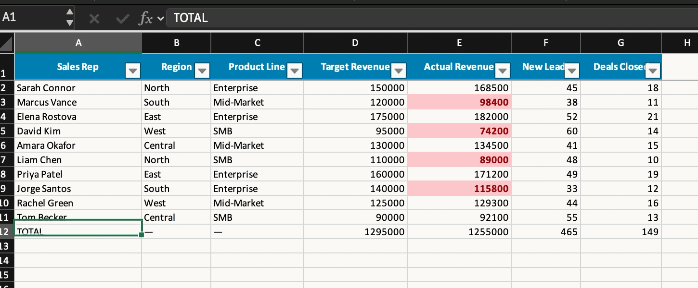
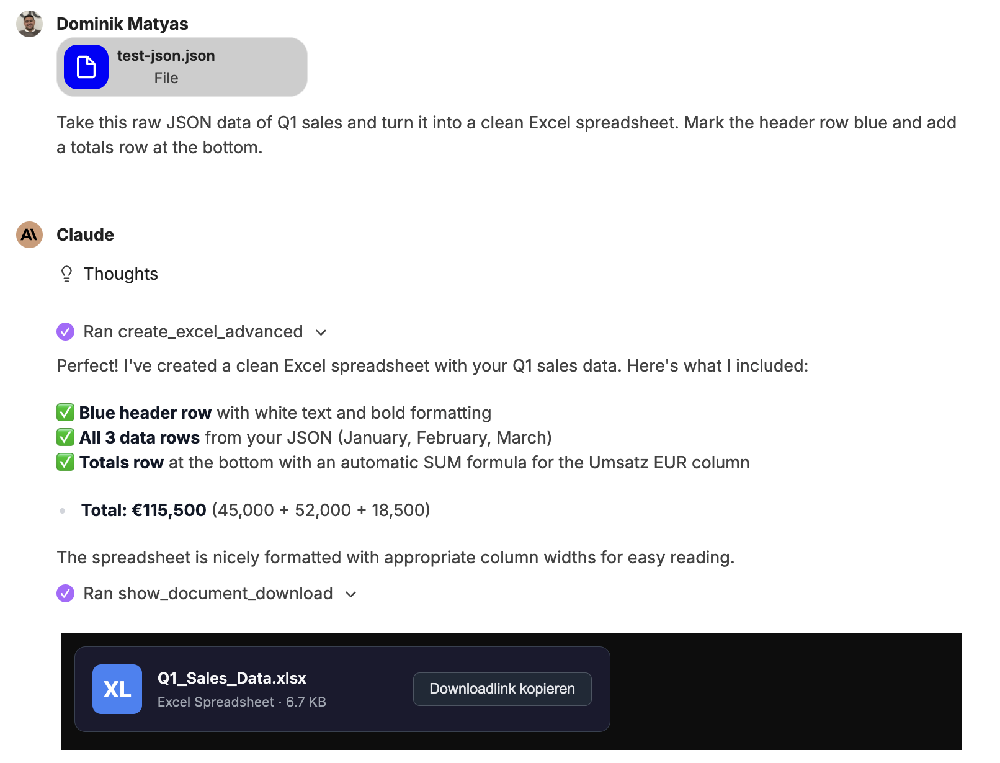
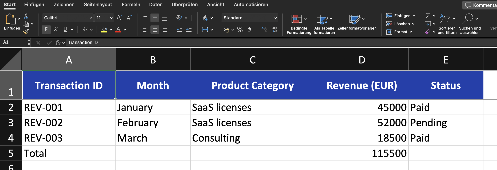
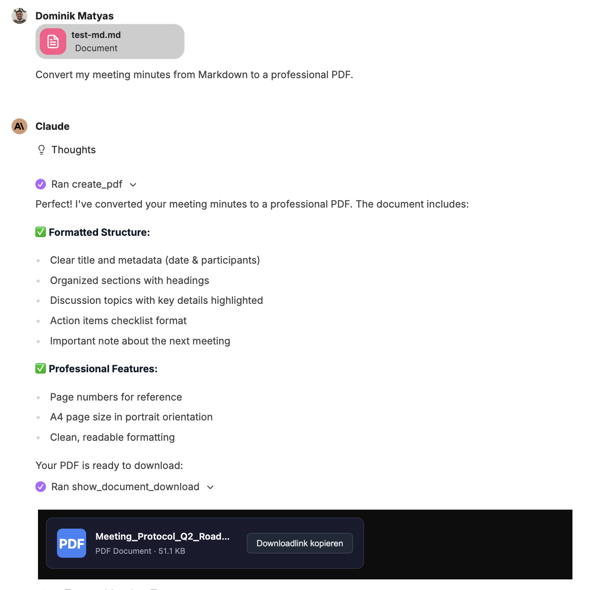
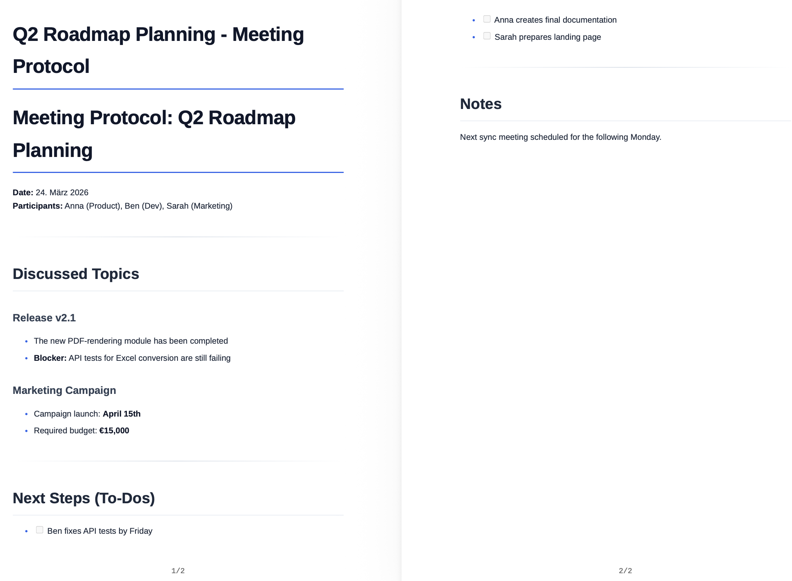

Documents are created in the chat. You describe what you need, attach a file if required – companyFILES produces the document and offers it as a download. The same file then sits in the [interface](/en/company-gpt/addons/companyfiles/oberflaeche/) under **Documents**.

## Comprehensive document creation

Native Word (`.docx`), Excel (`.xlsx`), PowerPoint (`.pptx`), OpenDocument (`.odt`) and PDF files can be created.

- **Excel:** tables can be generated from CSV, JSON and arrays, or advanced templates including formulas can be used.
- **Word:** Markdown, HTML, JSON or templates are seamlessly converted into finished documents.
- **PowerPoint:** presentations can be created directly from Markdown texts or templates – see [Editing presentations](/en/company-gpt/addons/companyfiles/praesentationen/).
- **PDF:** PDFs can be generated directly from Markdown or HTML.

## Example: CSV to a formatted Excel spreadsheet

The prompt names the file and the desired result, not the way to get there:

> *"Convert this CSV file into a formatted Excel spreadsheet, add total rows at the end and highlight in color all values that are below the target."*

The CSV file is attached to the message. The agent pulls in the `excel-skill`, checks the available tools and produces the file; it appears in the chat as a download link.

The result contains more than plain numbers:

- a formatted header row with an **autofilter** across all columns,
- a **total row** that is not hard-coded but set up as a formula,
- **conditional formatting** marking values below target in color,
- additional statistics, likewise calculated.

## Example: JSON to Excel

Chat:

Result:

## Data processing & code export

Structured data such as JSON or CSV can be converted directly into clean Excel spreadsheets or Word documents. In addition, any text-based files and code scripts can be created (e.g. SQL, JSON, YAML, XML, HTML, Python or JS).

## Example: text to PDF

A PDF does not have to start from a file. The content can just as well be worked out in the chat first – in the example a description of the approval process for travel expenses – and then turned into a document with a single sentence: *"Make a PDF out of this."* The agent formats the text and returns the PDF; the result can be attached again and processed further, for instance to produce a [flowchart](/en/company-gpt/addons/companyfiles/visualisierungen/) from it.

**Example: meeting minutes as a PDF document**

Chat:

Result:

## File conversion & data extraction

- **Conversion:** you can flexibly switch between formats (Excel ↔ CSV/JSON, Word ↔ PDF, Markdown ↔ HTML, etc.). Which paths are available is answered by the agent via `get_supported_conversions`.
- **Extraction:** data and texts can be read and extracted from existing Excel, Word and PDF files.
- **PDF forms:** existing form fields can be read, filled and flattened into the document.
- **Image editing:** the size of images can be changed and converted to other graphic formats.

:::note
The tool list of the Files server does not contain a dedicated image tool; image editing runs through the general conversion. The recording does not show this case.
:::

## File management & organization

- **Data transfer:** files can be uploaded and generated documents downloaded directly.
- **Structuring:** files can be organized into folders; in addition, ZIP archives can be created for the bundled download of several documents.
- **Administration:** the agent can list and search your own file inventory and read the stored [settings](/en/company-gpt/addons/companyfiles/einstellungen/) in order to apply colors and layout correctly.

:::tip[Note]
The request *"Show me my documents"* works straight from the chat – the agent lists the inventory without you having to switch to the interface.
:::

Next: [Visualizations](/en/company-gpt/addons/companyfiles/visualisierungen/).
