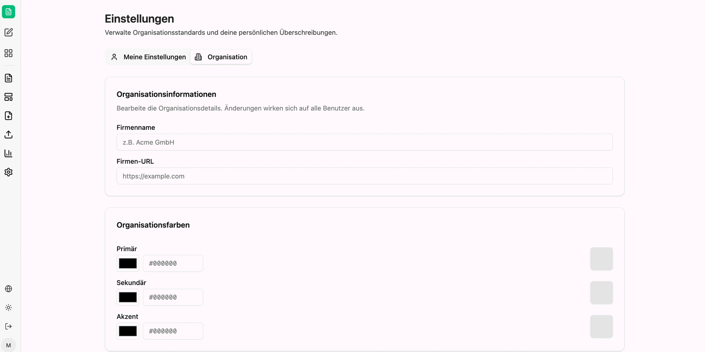
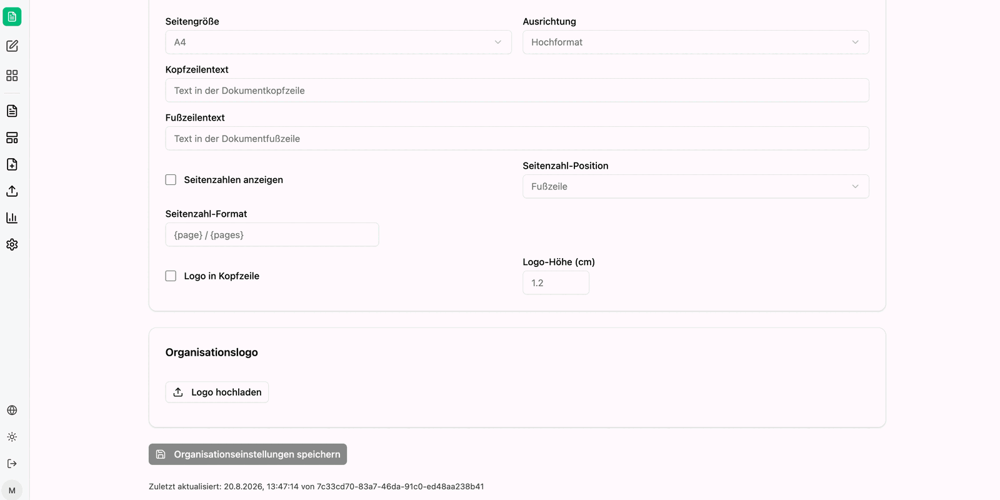

The settings define what generated documents look like when **no template** is used. You set them once, and they are applied to every newly created document, chart and presentation.

The area is split in two, shown by the tabs above the cards:

| Tab | Effect |
|---|---|
| **My Settings** | personal overrides; empty fields fall back to the organization default |
| **Organization** | default for all users; editable with administrator rights only |

:::note
The screenshots on this page show the German interface, because that is the language of the recording they were taken from. The product interface is localized – in an English session the labels appear in English.
:::

## Organization

**Organization Information** holds the **company name** and the **company URL**. The dialog notes that changes here affect all users.

Under **Organization Colors** you set the three base colors **Primary**, **Secondary** and **Accent** – each via a color picker or as a hex value. These colors then show up not only in documents but also in the charts produced in the chat.

## My Settings

**Color Overrides** takes the same three colors for your own documents: leave a field empty to use the organization default. An **Org** badge next to the field name indicates that the current value comes from the organization default.

**Extended Colors** fine-tunes text and element colors – heading, body text, link and table header colors.

## Typography

Fonts and font sizes for generated documents:

| Field | Placeholder in the field |
|---|---|
| Heading font | e.g. Segoe UI |
| Body font | e.g. Segoe UI |
| Code font | e.g. Consolas |
| Body size (pt) | 11 |
| H1 size (pt) | 24 |
| H2 size (pt) | 18 |
| H3 size (pt) | 14 |
| H4 size (pt) | 12 |
| Code size (pt) | 10 |

## Document standards

Default page layout and header/footer settings for new documents:

| Field | Meaning |
|---|---|
| Page size | paper format, for example A4 |
| Orientation | portrait or landscape |
| Header text | text in the document header |
| Footer text | text in the document footer |
| Show page numbers | switches page numbering on |
| Page number position | for example footer |
| Page number format | pattern of the page number, for example `{page} / {pages}` |
| Logo in header | places the organization logo in the header |
| Logo height (cm) | height of the logo, for example 1.2 |

Under **Organization Logo** you upload the image file used in generated documents.

Saving is done via the save button for the organization settings. Below it, the interface shows when and by whom the state was last changed.

:::tip[Note]
The colors are worth doing first: as soon as the primary and secondary color are set, charts created in the chat come out in the corporate colors – without you having to mention it in the prompt.
:::

Next: [Setting up the agent](/en/company-gpt/addons/companyfiles/agent/).
