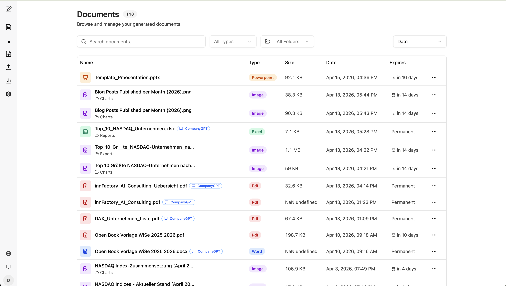
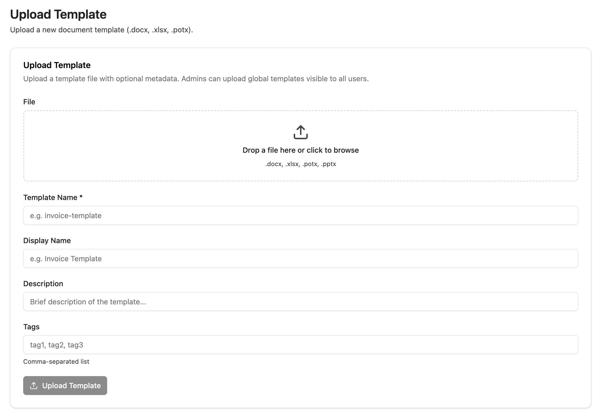
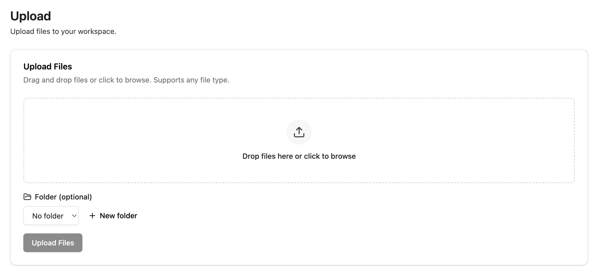
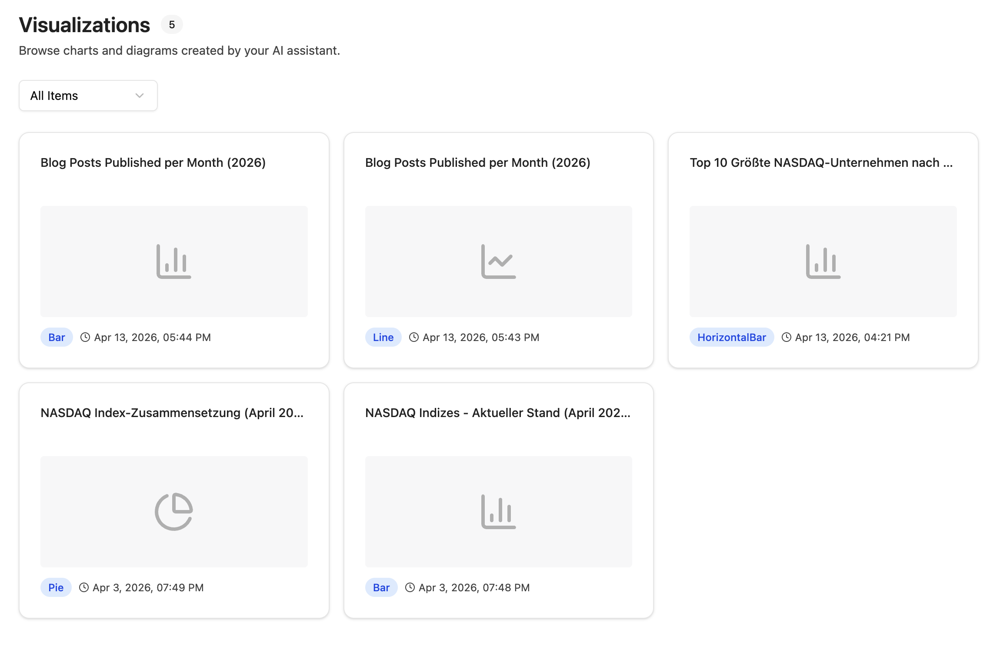

import sidebarImg from "./companyfiles-sidebar.png";

The companyFILES interface is clearly split into navigation items and working areas. The sidebar on the left switches between all core functions. You reach it in CompanyGPT via **Apps → Files**.

  
  

From top to bottom the sidebar contains these areas:

1. **Back to Chat** – Returns to the CompanyGPT Chat
2. **Back to Tools** – Returns to the overview of available tools
3. **[Documents](#documents)** – Shows all generated and uploaded documents
4. **[Templates](#templates)** – Shows all available templates
5. **[Upload Template](#upload-template)** – Upload a new template
6. **[Upload](#upload)** – Upload files
7. **[Visualizations](#visualizations)** – Shows all created diagrams and charts
8. **Settings** – Document settings that are automatically applied
9. **Language** – Change interface language
10. **Toggle Design** – Toggle Dark/Light mode
11. **Account** – Account management

  

The settings are covered separately under [Settings](/en/company-gpt/addons/companyfiles/einstellungen/).

## Documents

This is where all generated and uploaded files live in one place.

Use the **search bar** and the filters **All Types** and **All Folders** to find files quickly. The table shows name, type, size, date and expiration. The type appears as a colored badge in the row – for example Excel, Word, Pdf, Powerpoint or Image. Files with a **CompanyGPT** badge were generated directly from the chat. The **three-dot menu** (⋯) lets you download, preview, edit the expiration date, or delete documents.

Documents can be organized into folders; the folder is shown underneath the file name. The **expiration** column either shows the remaining time or **Permanent** – the latter for files that are kept indefinitely.

## Templates

Here you can see all available templates for document generation.

Templates can be filtered by **All Types** and **All Scopes**. The table shows name, type, scope, tags, size and upload date. The **scope** determines visibility:

| Scope | Meaning |
|---|---|
| **User** | usable only by yourself |
| **Global** | usable by every user in the organization |

Available templates can be used directly in the chat for document generation – see [Templates](/en/company-gpt/addons/companyfiles/vorlagen/).

## Upload Template

This is where new document templates are uploaded.

Drag and drop a template file (`.docx`, `.xlsx`, `.potx`, `.pptx`) into the upload area. Fill in the **Template Name** (required) and optionally **Display Name**, **Description**, and **Tags**. Admins can upload global templates visible to all users. Click **"Upload Template"** to complete the upload.

## Upload

This is where you upload arbitrary files into your workspace.

Drag and drop files into the upload area or click to browse. All file types are supported. Optionally select a **Folder** or create a new one via **"+ New folder"**. Click **"Upload Files"** to start the upload.

## Visualizations

Here you see all diagrams and charts produced by CompanyGPT.

All visualizations created in the chat are collected here. Use the **"All Items"** filter to filter by chart type (e.g. diagrams or charts). Each card shows the title, a preview, the type, and the creation date. Clicking a card brings the visualization back up.

How visualizations are produced is described under [Visualizations](/en/company-gpt/addons/companyfiles/visualisierungen/).

Next: [Settings](/en/company-gpt/addons/companyfiles/einstellungen/).
