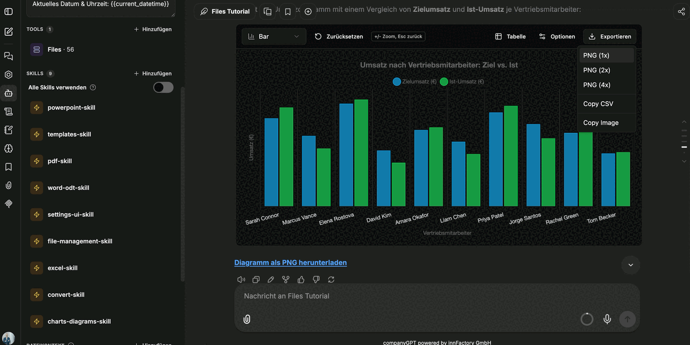
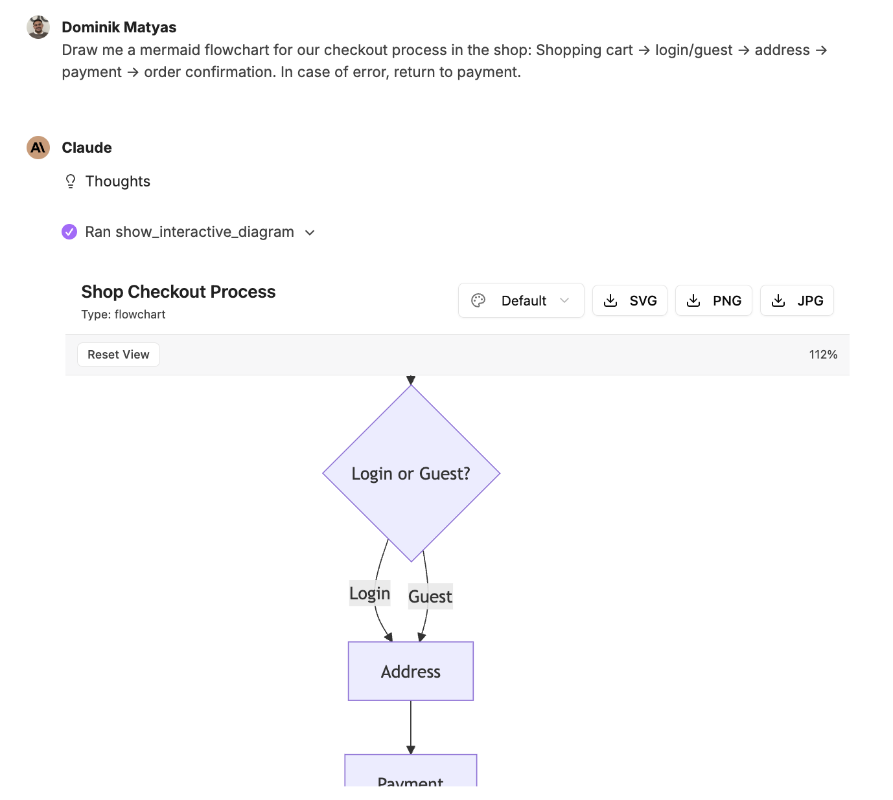
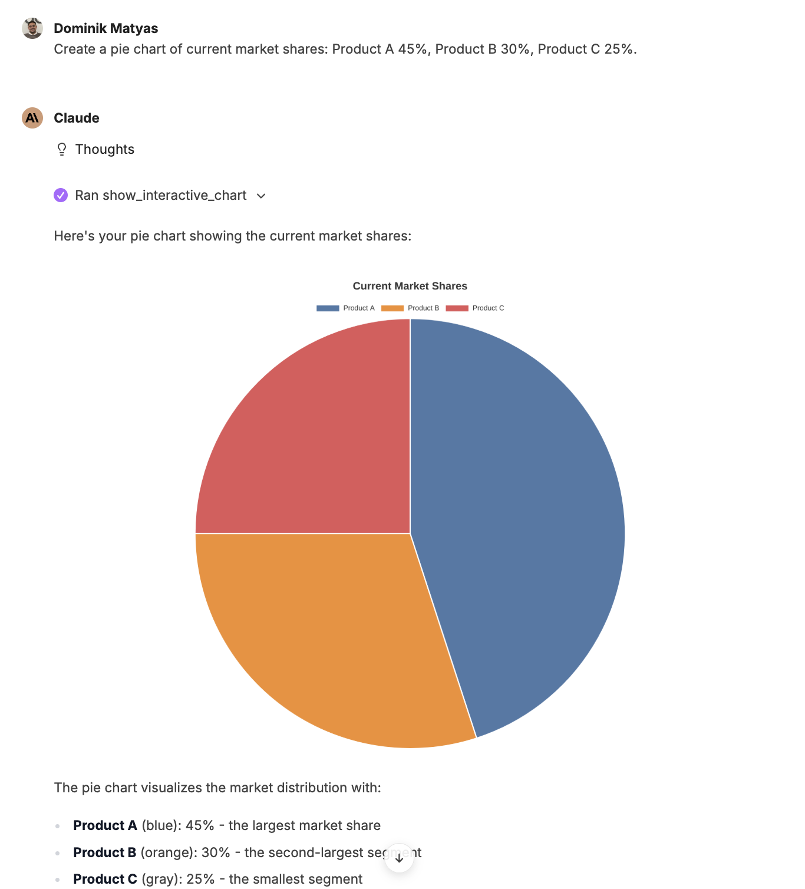

Raw numbers can be visualized directly as meaningful graphics. companyFILES knows three representations that are interactive in the chat: **charts** for number series, **diagrams** for processes and structures, and **maps** for locations. Everything created this way is collected in the interface under [Visualizations](/en/company-gpt/addons/companyfiles/oberflaeche/#visualizations).

:::note
The screenshots on this page show the German interface, because that is the language of the recording they were taken from. The product interface is localized – in an English session the labels appear in English.
:::

## Interactive charts

Bar, line, pie, scatter, bubble or radar charts can be produced from data in the chat – for example directly from a spreadsheet created earlier: *"Show me the revenue as a chart."*

The toolbar above the chart controls the presentation:

| Control | Effect |
|---|---|
| chart type (e.g. **Bar**) | switches the form of presentation |
| **Reset** | restores the initial view |
| **+/- Zoom, Esc to go back** | zoom into the data range; `Esc` returns |
| **Table** | toggles between the chart and the underlying table |
| **Options** | fine-tuning of the presentation, for example grid lines or stacked bars |
| **Export** | **PNG (1x)**, **PNG (2x)**, **PNG (4x)**, **Copy CSV**, **Copy Image** |

Below the chart there is an additional link for downloading the chart as a PNG.

:::tip[Note]
The colors of the chart come from the [settings](/en/company-gpt/addons/companyfiles/einstellungen/). If the primary and secondary color of the organization are set, new charts automatically appear in the corporate colors.
:::

## Mermaid diagrams

Flowcharts, sequence diagrams, class diagrams and state machines can be generated via prompt. A described process is enough as input – including one from a document produced earlier: you attach the PDF and ask for a flowchart.

The diagram view in the chat can be zoomed and reset to the initial view; the current magnification is shown as a percentage next to it. A download option saves the diagram as a PNG image.

**Example: pie chart**

## Maps

Locations can be shown on an interactive map. The prompt only names the places or the organizations – in the example: *"Show the main locations of BMW, Audi, Mercedes-Benz and Porsche on a map."*

Every marker carries a label, the legend maps the colors to the entries, and the controls govern the view:

| Control | Effect |
|---|---|
| **Cluster** | groups markers that sit close together |
| **Open externally** | opens the map as a page of its own |
| **Export** | saves the map as an image |

Below the map the agent lists the locations it found once more as text.

:::note
For locations that are not part of the prompt the agent additionally needs a **web search** – see [Setting up the agent](/en/company-gpt/addons/companyfiles/agent/#combining-other-tools). Only then does it find not just the town but the location actually designated as headquarters.
:::

## Embedding visualizations in documents

A chart does not have to sit next to the document as an image. Asking for the chart to be taken over into a Word document yields a document in which text and graphic stand together – title, explanation and the embedded chart.

Next: [Editing presentations](/en/company-gpt/addons/companyfiles/praesentationen/).
