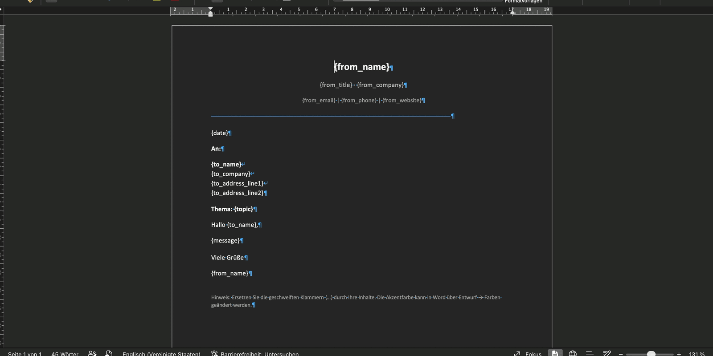
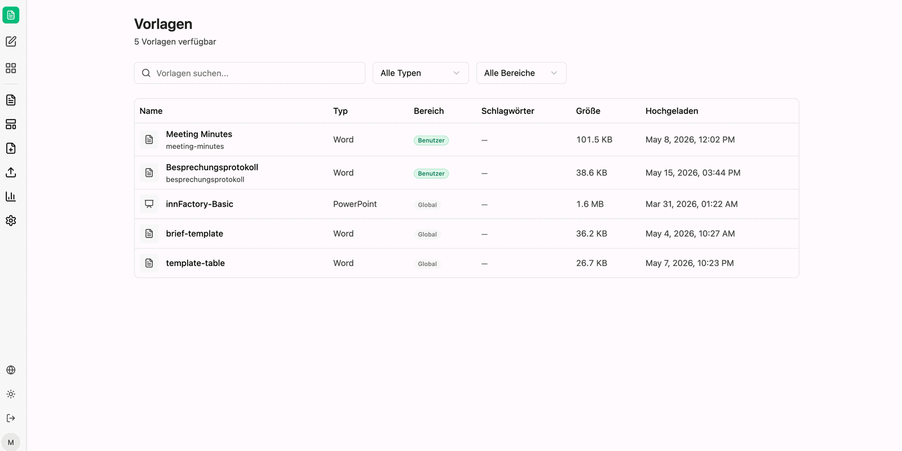

Templates enable reusable document generation with a standardized structure: the format is defined once, after which only the content is filled in. This pays off wherever documents share the same layout – letters, cover letters, meeting minutes, quotation templates.

However, you cannot simply upload a finished document — it must be prepared with placeholders first.

## Preparing templates

Placeholders are **curly braces with a word inside**: `{placeholder}`. Open the document in its native application (Word, Excel, PowerPoint) and insert placeholders such as `{CompanyName}`, `{Date}` or `{Address}` wherever CompanyGPT should insert dynamic content. Placeholder names are freely choosable but should be descriptive.

- **Word (`.docx`):** Place `{placeholder}` directly in the document text. Example: "Dear `{Salutation}` `{LastName}`, ..." or a table cell with `{InvoiceAmount}`
- **Excel (`.xlsx`):** Place `{placeholder}` in individual cells. Example: Cell A1 with `{EmployeeName}`, Cell B1 with `{Department}`
- **PowerPoint (`.pptx` / `.potx`):** Place `{placeholder}` in text boxes on slides. Example: Title slide with `{ProjectName}`, content slide with `{Summary}`

In the example template the placeholders cover the sender (`{from_name}`, `{from_title}`, `{from_company}`, `{from_email}`, `{from_phone}`, `{from_website}`), the recipient (`{to_name}`, `{to_company}`, `{to_address_line1}`, `{to_address_line2}`) as well as `{date}`, `{topic}` and `{message}`.

:::tip[Note]
Use descriptive placeholder names like `{CustomerName}` instead of `{C1}`. This helps CompanyGPT understand the context and fill placeholders more reliably with the correct data.
:::

:::caution
A regular, fully completed document without placeholders cannot be used as a template. CompanyGPT requires the `{placeholder}` markers to identify which parts should be dynamically replaced.
:::

## Uploading and sharing templates

Templates are uploaded in the interface under [Upload Template](/en/company-gpt/addons/companyfiles/oberflaeche/#upload-template). The **scope** then determines visibility: **User** means only you can use the template; **Global** releases it to every user in the organization.

## Advanced template syntax

Besides simple `{placeholder}` markings, Word templates support advanced expression syntax for dynamic content such as loops to create rows in tables.

### Table loops in Word

Loops in Word tables are controlled via dedicated rows. The `FOR` and `END-FOR` commands are placed in their own table rows respectively:

| Name | Since Joined |
|---|---|
| `{FOR person IN people}` | |
| `{= $person.name}` | `{= $person.joiningYear}` |
| `{END-FOR person}` | |

- The **FOR row** marks the loop start – it is removed during rendering.
- The **body row** is duplicated for each entry in the array.
- The **END-FOR row** closes the loop – it is also removed.

:::caution
The `FOR` and `END-FOR` rows must be **complete table rows** – place the command in the first cell, the remaining cells of the row stay empty. Commands within a cell of a regular row do not function as loop control.
:::

## Using templates in chat

Once uploaded, reference the template in the chat and provide the data for the placeholders. If information is missing the agent asks for it – it lists the open placeholders and in part already suggests values.

You enter the details straight into the message: your own message can be edited and re-sent via **Update & rerun**, while **Save** keeps the change without a new run. Fields you do not need can be answered explicitly as *not applicable*.

companyFILES then produces the document: structure, typeface and accent color come unchanged from the template, and the provided content stands where the placeholders were.

Example prompt: *"Create an invoice using the 'Invoice Template'. Customer name: Sample Inc., Invoice amount: $1,500, Date: April 15, 2026"*

:::tip[Note]
If the same template is always in play, put it into the instructions of a dedicated [agent](/en/company-gpt/addons/companyfiles/agent/). You then no longer have to state which template is meant – the agent works more precisely and handling becomes considerably simpler.
:::

## Documents without a template

If no template is used, the [settings](/en/company-gpt/addons/companyfiles/einstellungen/) take effect: colors, typography, page layout and logo then come from the organization default or from your personal overrides.
