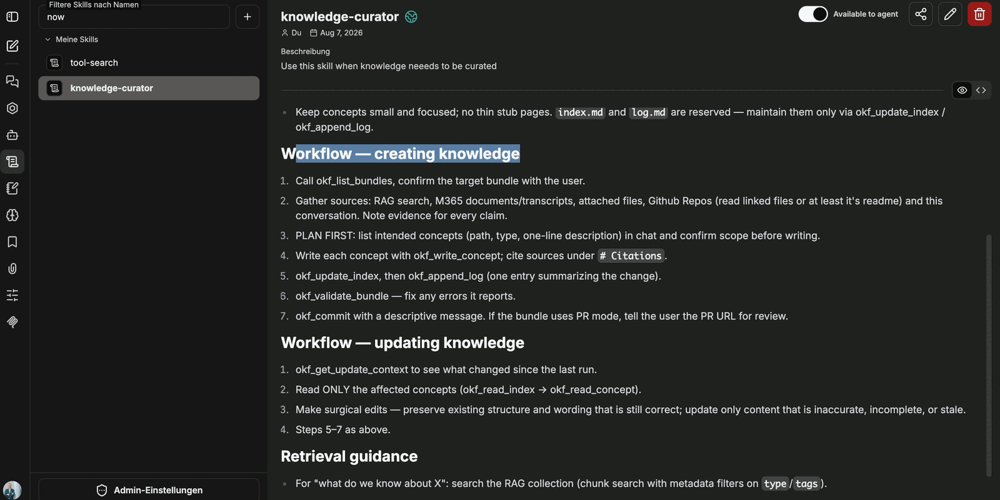

A bundle is not filled in by hand but by an agent. For that the agent needs three things: access to search, the Knowledge connection with write access, and a skill that lays down the rules of the format. It is created like any other agent under **Agents → Create new agent**.

## Basic settings

| Field | Recommendation |
|---|---|
| Name | a descriptive name, for example the name of the bundle |
| AI model | a small, fast model is sufficient — the work consists mostly of tool calls and text formatting |
| Category | `General`, unless a dedicated category exists |
| Instructions | a short system instruction pointing to the skill and the target collection |

Keep the instructions brief. What works well is the direction to always use the skill for documenting, combined with naming the target collection — in the example: *"Always use the skill for documenting. ALWAYS run a search. The collection is ALWAYS: tutorial_wiki."*

The plus icon next to the **Instructions** field inserts context variables that are filled in at call time:

| Variable | Purpose |
|---|---|
| Current date | date for the `timestamp` field of a concept file |
| Current user | who triggered the change |
| UTC ISO date/time | timestamp in machine-readable form |

## Tools

The tools are added under **Tools → Add**:

- **ai-search**: semantic search across the collections, together with the tools for reading content. Without it the agent cannot check what has already been documented.
- **Knowledge**: the connection to the OKF bundles — reading **and** writing. This is the tool used to write concepts, index and log.
- **WebFetch**: optional, for content from outside. See [Creating and maintaining knowledge](/en/company-gpt/addons/companyknowledge/wissen-erzeugen/).

The Knowledge connection brings ten tools. The ones used in the workflow are:

| Tool | Purpose |
|---|---|
| `okf_list_bundles` | list the available bundles |
| `okf_read_index` | read a bundle's index |
| `okf_read_concept` | read a single concept |
| `okf_write_concept` | write a concept |
| `okf_update_index` | update the index |
| `okf_append_log` | add an entry to the change log |
| `okf_validate_bundle` | check the bundle for errors |
| `okf_commit` | write the changes back |
| `okf_get_update_context` | determine what has changed since the last run |

:::note
The recording this page is based on does not show the full tool list of the Knowledge connection in detail. The table names the tools that actually appear in the workflow — the connection reports ten.
:::

## A skill for the rules

The agent additionally receives a skill describing **how** to handle the format. The skill holds no content, only rules and workflows. In the example it is called `knowledge-curator`; it was created in-house and is not a shipped part of the product.

The following parts have proven useful:

**Rules.** Keep concepts small and focused, no thin stub pages. `index.md` and `log.md` are reserved and are maintained exclusively via `okf_update_index` and `okf_append_log`.

**Workflow for creating knowledge.**

1. Call `okf_list_bundles` and confirm the target bundle with the user.
2. Gather sources — RAG search, M365 documents and transcripts, attached files, GitHub repositories — and note the evidence for every claim.
3. Plan first: list the intended concepts with path, type and a one-line description in the chat, and have the scope confirmed.
4. Write each concept with `okf_write_concept` and cite the sources in the references section.
5. `okf_update_index`, then `okf_append_log` with one entry summarising the change.
6. `okf_validate_bundle` — fix any errors it reports.
7. `okf_commit` with a descriptive message. If the bundle runs in *pull request* commit mode, report the PR URL for review.

**Workflow for updating knowledge.** `okf_get_update_context` determines what has changed; **only** the affected concepts are read (`okf_read_index` → `okf_read_concept`). Edits are surgical: existing structure and wording that is still correct stays, and only content that is inaccurate, incomplete or stale is replaced. Steps 5 to 7 then follow as above.

**Retrieval guidance.** For questions of the kind "What do we know about X?" the agent searches the RAG collection using metadata filters on `type` and `tags`.

:::tip[Note]
The rule to agree on the plan in the chat before writing is the most effective part of the skill: it prevents an agent from creating twenty half-finished concepts in one pass that somebody then has to clean up.
:::

## First check

Whether the setup works shows in a simple chat question about the contents of the bundle. The agent reads the index and answers with the actual state — for a freshly created bundle that means the note that it is still empty, plus the listing of `index.md`, `README.md` and `log.md` together with the date of the log entry.

Next: [Creating and maintaining knowledge](/en/company-gpt/addons/companyknowledge/wissen-erzeugen/).
