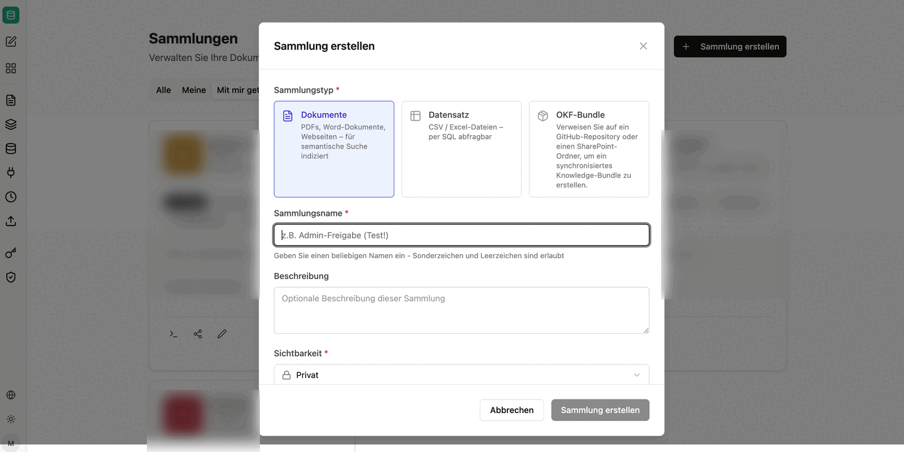

companyKNOWLEDGE describes how to work with knowledge in the **Open Knowledge Format (OKF)**: a body of knowledge does not live in a database but as a set of Markdown files in a GitHub repository or a SharePoint folder. Each file describes exactly one concept, a small block of front matter at the top of the file supplies type, tags and source, and two reserved files keep the table of contents and the change log up to date.

The practical benefit lies in the division of labour: maintaining the knowledge base — creating concepts, updating the index, recording changes — is handled by an agent in CompanyGPT, while the content itself stays where it can be versioned and reviewed. Because the bundle is at the same time connected as a collection in companyRAG, everything the agent writes is immediately searchable.

:::note
OKF bundles and the associated agent tools are currently **experimental**. Structure, labels and behaviour may still change.
:::

## Structure of a bundle

A bundle is a folder. It holds concept files plus two reserved files:

| File | Role |
|---|---|
| `index.md` | index pointing to the existing concepts |
| `log.md` | change log; records what was written and when |
| `README.md` | overview of the bundle; created with a placeholder text when the bundle is set up |
| Concept files | one Markdown file per concept, in subfolders of any depth |

`index.md` and `log.md` are never edited by hand; they are maintained exclusively through the tools of the Knowledge connection. Subfolders are allowed and each receives its own index.

## Structure of a concept file

Every concept file starts with a header block (front matter), followed by free-form Markdown content:

| Field | Content |
|---|---|
| `title` | title of the concept |
| `type` | kind of concept, for example `Produktübersicht` (product overview) or `Architektur` (architecture) |
| `description` | one or two sentences on what it covers |
| `resource` | the source the concept refers to — a URL or a document from an internal system |
| `tags` | keywords for search |
| `timestamp` | date of the current state |

## Creating a bundle

An OKF bundle is created in the knowledge area as a collection: **companyRAG → Collections → Create collection**, choosing **OKF bundle** as the **collection type**.

The dialog describes the option as: *"Point to a GitHub repository or a SharePoint folder to create a synchronised knowledge bundle."* The wizard that follows walks through details, source, location and confirmation in four steps — those steps are documented under [OKF bundles](/en/company-gpt/addons/companyrag/okf-bundles/).

With **SharePoint** as the source, the location is selected in three stages: first **website or team**, then the **library**, then the target folder via **browse folders**. In the final step the wizard shows a summary with name, visibility, source, site, library and path.

The option **create OKF scaffold if empty** is enabled there by default. In an empty location it creates the base structure so the bundle does not stay empty:

Immediately after creation the matching collection is set up and a first synchronisation starts.

:::tip[Note]
For OKF bundles the **Markdown-based** chunking strategy is recommended, since the content is structured by headings. See [chunking strategies](/en/company-gpt/addons/companyrag/sammlungen/#chunking-strategies).
:::

## What next?

- [Setting up the agent](/en/company-gpt/addons/companyknowledge/agent/) – the tools and the skill an agent needs in order to write a bundle.
- [Creating and maintaining knowledge](/en/company-gpt/addons/companyknowledge/wissen-erzeugen/) – from source to written concept, including indexing in companyRAG.
