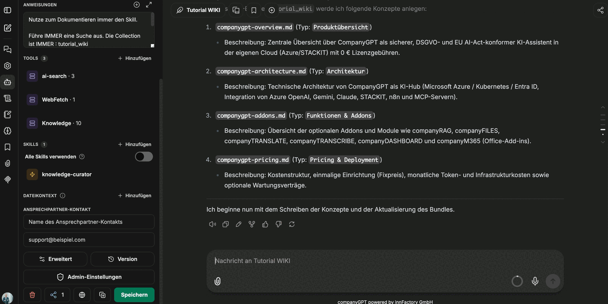

Once the bundle exists and the agent is set up, the actual work amounts to two sentences in the chat: name the source, approve the plan. Everything else — writing files, updating the index, appending to the log, validating and committing — is handled by the agent.

## Sources

Anything the agent has access to works as a source: collections in companyRAG, documents and transcripts from M365, attached files, GitHub repositories. For content from the web the **WebFetch** tool is added; in the example, naming a product page along with the instruction to turn it into documentation is enough. PDFs and other document types work the same way.

:::note
WebFetch is an MCP server. Its individual functions carry the names of the underlying service (`firecrawl_scrape`, `firecrawl_map`, `firecrawl_search`, `firecrawl_crawl`, `firecrawl_check_crawl_status`, `firecrawl_extract`); for simply reading a page, `firecrawl_scrape` is sufficient.
:::

## The plan comes first

Before anything is written, the agent replies with a list of the intended concepts — file name, type and one line of description per entry:

This intermediate step is the right moment for objections: one concept too many, a wrongly chosen type, a file that belongs in a subfolder — here the correction costs one sentence, after writing it costs a clean-up run.

## Write, validate, commit

After confirmation the agent works through the plan and makes the steps visible in the chat:

1. The concepts are written.
2. The index is updated.
3. The change log is appended to.
4. The bundle is validated.
5. The changes are written back.

For a bundle in *pull request* commit mode the run ends with a proposed change for review instead of a direct commit. That lets the knowledge base be treated exactly like source code: the agent proposes, a human approves. See [OKF bundles](/en/company-gpt/addons/companyrag/okf-bundles/).

## The result

Every generated file has the same shape: a header block with `type`, `tags`, `resource`, `title`, `description` and `timestamp`, below it the content with headings, and a references section at the end.

The content stays short and points to the related concepts instead of repeating them — which keeps the files individually readable and individually updatable.

## Automatic indexing

Because the bundle is connected as a collection in companyRAG, the new files appear under **Files** with the status `Indexed` without any further action:

As soon as a file is written it is indexed; when it changes, the index is updated. That closes the loop: the agent writes the knowledge, and the same knowledge is immediately findable through search — for users in CompanyGPT and for other agents through their tools.

:::tip[Note]
`index.md`, `log.md` and `README.md` are indexed as well. To match only the actual concepts in search, filter on the `type` and `tags` metadata.
:::

## What next?

- [Files](/en/company-gpt/addons/companyrag/dateien/) – check the state of individual files and re-index them.
- [Using it in CompanyGPT](/en/company-gpt/addons/companyrag/in-companygpt/) – put the collection to work in chats and agents.
