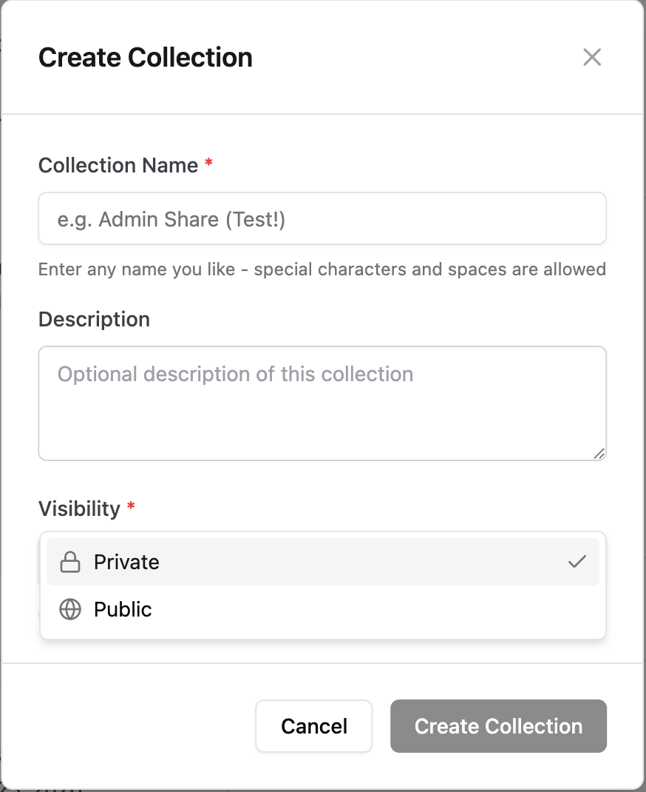
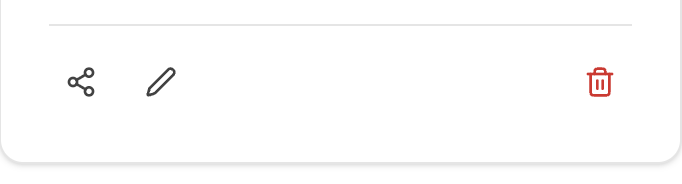
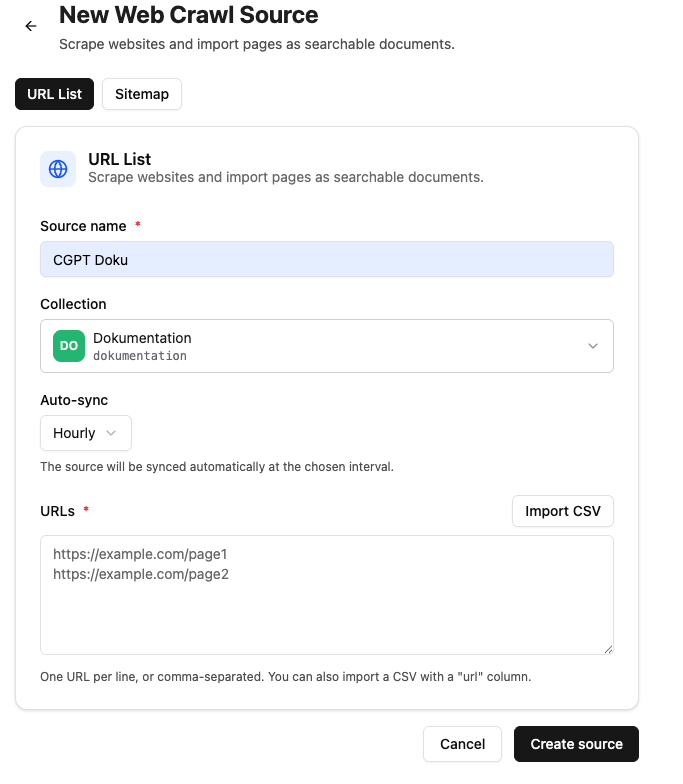
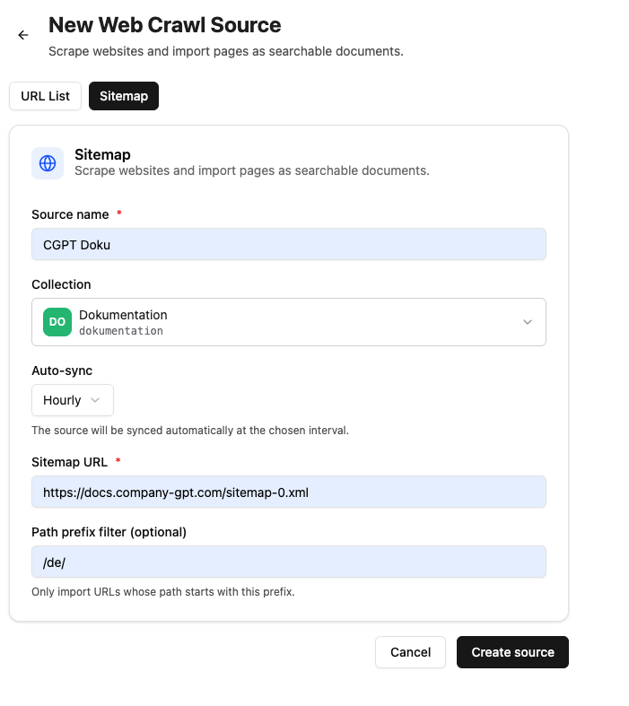
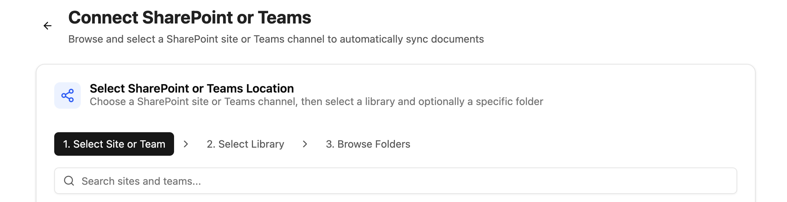

With the CompanyRAG addon, you can make large volumes of documents available to your agents via the MCP interface. Documents can be indexed from different sources and integrated using the [RAG - Retrieval Augmented Generation](/en/prompt-engineering/prompt-techniken/rag) methodology. There is no limit on the length of individual documents or their total number.

Indexing can be implemented as a one-time or recurring process, depending on your use case.

## CompanyRAG user interface

The user interface allows you to add single or multiple files, or entire data sources, for indexing.
The interface is divided into:

import sidebarImg from "./rag-sidebar.png";

  
  

  

1. [Files](#files)
2. [Collections](#collections)
3. [Sources](#sources)
4. [Integrations](#integrations)
5. [Jobs](#jobs)
6. [Upload](#upload)
7. [API keys](#api-keys-administrators-only)
8. [Audit log](#audit-log-administrators-only)

  

### Files

An overview of all files that have been added to the service.
The overview contains:

- **Name**: Document name (partially truncated - mouseover shows the full name)
- **Collection**: The collection the file has been assigned to
- **Size**: File size
- **Status**: Status of the associated job
  - Completed: The document was indexed successfully
  - Pending: The indexing job is still pending
  - Failed: Indexing was not successful
- **Last indexed**: Date and time of the last completed indexing job
- **Actions**:
  - Re-index: Creates a new indexing job
  - Delete: Deletes the file from the service, including associated jobs and its indexed form

### Collections

Collections are storage locations and allow you to organize documents and permissions.

#### Creating collections

In addition to name and description, the visibility can also be set:

- Private: Only you can access this collection and the documents linked to it. You can, however, add further shares later.
- Public: Everyone can see the collection and view files from it.

All collections you own appear under the `Mine` tab. Collections shared specifically with you (role Admin or Viewer) are shown under `Shared with me`. All publicly visible collections are shown under `Public`.

#### Collection actions

  Share  Edit                       Delete

- **Share:**
  - **Type**: Share with individual users, an Entra group, or the whole organization.
  - **Role**: Viewer (collection and associated documents can be viewed) or Admin (collection and associated documents can be edited)
    After confirming via `Add Share`, the share is granted and added to the `Current Shares` list.
- **Edit**: Change the name and description of the collection.
- **Delete**: Delete the collection.

:::danger
Deleting a collection irrevocably deletes all documents and jobs linked to the collection!
:::

### Sources

Different sources for automatically synchronizing data into companyRAG.

#### Web crawl

Individual web pages, lists (in CSV files), and entire website sitemaps can be crawled and indexed. You can configure how often the crawl should be repeated. For individual pages, the entire page is always re-indexed. For sitemap crawls, only the difference based on the last crawl and the modification date is taken into account.

For sitemap crawls, the `Path Prefix` determines which pages are indexed. For example, `/news/` would only index pages that contain `/news` in their path.

#### Connecting SharePoint

The "+ Connect SharePoint" button starts the selection.

1. **Select website or team**: Choose the SharePoint site or team
2. **Select library**: Libraries of the selected site/team
3. **Browse folders**: Select the folder and the file types to synchronize. Specify the collection into which the files should be synchronized.

:::note
Only folders can be selected. All supported files in this folder and in hierarchical levels below it (subfolders) are synchronized automatically.
:::

After connecting, the folder appears under "All sources" as Active. Synchronization must be triggered once via the "Sync now" button. The connected documents are then added as synchronization jobs, and future contents of the folder are synchronized automatically.

#### Source actions

- **Sync now**: Start the initial/manual synchronization
- **Pause/Resume**: Deactivate or reactivate selected sources
- **Delete**: Remove the data source - files already synchronized remain in the collection

### Integrations

An overview of all connected third-party systems (such as SharePoint, Firecrawl, or custom APIs) that serve as automatic data sources.
The overview contains:

- **Name**: The name you chose for the configured integration.
- **Type**: The kind of interface (e.g. *SharePoint* for file folders, *Firecrawl* for website content, or *Custom*).
- **Status**: The connection status to the external system:
  - Active: The connection is up and operational.
  - Faulty / Expired: The connection is interrupted or the login needs to be renewed.
- **Actions**:
  - Test connection / Re-authorize: Checks reachability or renews expired access rights (e.g. by logging in again).
  - Delete: Permanently disconnects the third-party system. *(Files already imported remain in the collections but are no longer updated automatically.)*

### Jobs

View indexing jobs and their status

Status:

- Pending: The document will be indexed shortly
- Running: The document is currently being indexed
- Completed: The document has been indexed
- Failed: The document could not be indexed. Further information can be found in the "Error" column.

Actions:

- Delete: Removes the job from the queue or the history. Status Completed → the indexed file remains. Status Pending → the file will not be indexed. Running processes cannot be deleted.
- Retry

### Upload

Manually upload single or multiple files for indexing.

Supported formats: PDF, DOCX, DOC, TXT, MD, RTF, HTML, HTM, XML, CSV, JSON, EML, XLSX, XLS, PPTX, PPT

### API keys *(administrators only)*

Here, administrators can create and manage API keys to securely connect other programs and custom tools to the RAG service.

The overview shows:

- **Name**: The freely chosen name of the key (e.g. "Intranet search") for later identification.
- **Key**: The truncated API key (e.g. `sk-...1a2b`) for identification.
- **Created / Last used**: Shows when the key was created and when it was last used for a query.
- **Actions**:
  - **Create**: Generates a new key. *(Note: The key is displayed in full only once, directly after creation. Copy it to a secure location immediately!)*
  - **Delete (revoke)**: Blocks the key immediately and irrevocably. All programs linked to it lose access instantly.

### Audit log *(administrators only)*

The audit log is a complete record (logbook) of all important changes and activities in the RAG service. It provides administrators with security, traceability, and fast troubleshooting.

The overview shows:

- **Timestamp**: The exact date and time of the activity.
- **Actor (user)**: Who performed the action (e.g. a specific administrator or an automated API key).
- **Action**: What exactly was done (e.g. "File deleted", "Integration created", "Collection shared", or "API key revoked").
- **Details**: Additional information about the event (e.g. the name of the affected file or the ID of the modified collection).
- **Search & filters**: Allows searching the log for specific time periods, users, or specific actions.

## CompanyRAG in CompanyGPT

Via the [MCP Server](/en/company-gpt/integrationen/mcp-server/) `ai-search`, the RAG service can be connected to CompanyGPT to search indexed documents across all collections available to the user
(see [similarity search](/en/prompt-engineering/prompt-techniken/rag/#rag-workflow-für-die-dateiverarbeitung)).

The following specialized search tools for the RAG collection – from semantic search and document retrieval to metadata filtering – are available:

1. **search_content**:
   Semantic similarity search for general queries. The default choice for most user questions.
   Required parameters: `query` (search text), `source` (technical name of the collection)
   Optional: `topK` (number of results: default 5, max. 20)

2. **find_content_by_source**:
   Retrieve all content from a specific document. Use for questions about individual documents (e.g. "What does Dokumentation.md say?").
   Required parameters: `source` (document name), `collection` (technical name of the collection)

3. **find_content_by_metadata**:
   Filter content by metadata attributes. Use for filtered results (e.g. "All urgent tasks from 2026").
   Required parameters: `filter` (JSON object with operators `$and`, `$or`, `$not`), `collection` (technical name of the collection)

For easier use, the MCP server can be added to an [agent](/en/company-gpt/agenten/).

A step-by-step guide to setting up a search agent with a suitable instruction can be found in the tutorial **[Using CompanyRAG in CompanyGPT](/en/tutorials/addons/companyrag-in-companygpt/).**

## Downloads

- [companyRAG Windows Syncer 2.6.2](/downloads/companyRAG-syncer-windows-v2.6.2.zip)
