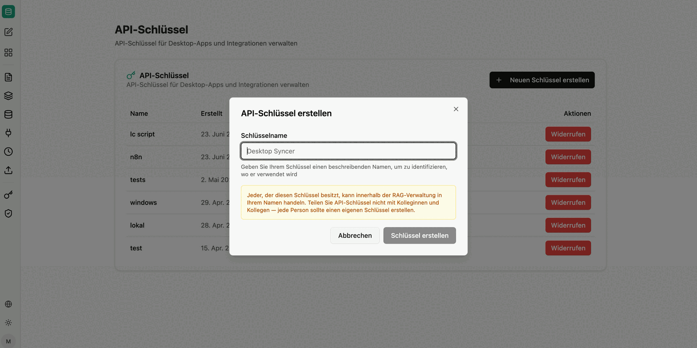

Here, administrators can create and manage API keys to securely connect other programs and custom tools to the RAG service – for example the [Windows Syncer](/en/company-gpt/addons/companyrag/#downloads), a script, or the ingestion endpoint of a [dataset collection](/en/company-gpt/addons/companyrag/datensaetze/).

The overview shows:

- **Name**: The freely chosen name of the key (e.g. "Intranet search") for later identification.
- **Key**: The truncated API key (e.g. `sk-...1a2b`) for identification.
- **Created / Last used**: Shows when the key was created and when it was last used for a query.
- **Actions**:
  - **Create**: Generates a new key. *(Note: The key is displayed in full only once, directly after creation. Copy it to a secure location immediately.)*
  - **Revoke**: Blocks the key immediately and irrevocably. All programs linked to it lose access instantly.

## User-scoped access

An API key is bound to the person who created it and acts on their behalf within the RAG administration. All calls therefore operate with exactly that person's collections and permissions.

:::danger
Do not share API keys with colleagues – every person and every system should create its own key. Otherwise, content may become accessible through the interface that the recipient would not be allowed to see themselves.
:::

All creations and revocations are recorded in the [audit log](/en/company-gpt/addons/companyrag/audit-protokoll/). The available endpoints are described in the [companyRAG API reference](/en/api/company-rag-api/).
