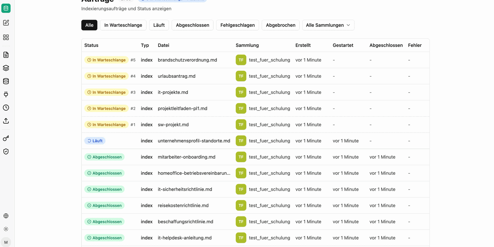

Under **Jobs** you can see all indexing and synchronization runs with their current status. Every upload and every synchronization run of a [source](/en/company-gpt/addons/companyrag/quellen/) creates jobs – one job per file.

The list can be filtered by status and by collection. For each job it shows the type, file, collection and the times of creation, start and completion; failed jobs state the cause in the **Error** column.

Status:

- **Queued**: The document will be indexed shortly
- **Running**: The document is currently being indexed
- **Completed**: The document has been indexed
- **Cancelled**: The job was cancelled
- **Failed**: The document could not be indexed. Further information can be found in the "Error" column.

Actions:

- **Delete**: Removes the job from the queue or the history. Status Completed → the indexed file remains. Status Queued → the file will not be indexed. Running processes cannot be deleted.
- **Retry**: Creates the job again, for example after a resolved error.

:::tip[Note]
Large files and enabled [image description](/en/company-gpt/addons/companyrag/sammlungen/#describing-images) increase the runtime considerably, because every page is additionally sent to a vision model. Plain text files, in contrast, are indexed within seconds.
:::
