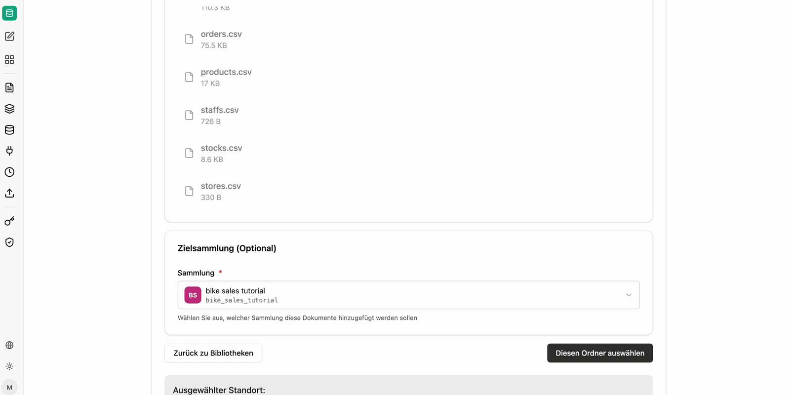

Dataset collections contain tables rather than documents. They are suited to everything that is already tabular – sales figures, orders, master data – and answer questions about sums, quantities and rankings that a semantic search cannot answer.

When creating one, you choose the data source:

- **Imported files**: Upload CSV, Excel or Parquet files for querying.
- **Live (defined schema)**: Define tables yourself and feed rows in via an ingestion endpoint.

## Imported files

The data should always be in tabular form. Single tables are possible as well as several related tables – an Excel workbook can, for example, contain multiple sheets that are imported together and queried using joins.

The import can also be set up as a [source](/en/company-gpt/addons/companyrag/quellen/), for example from a SharePoint folder. Updated files are then pulled in automatically. During synchronization the files are only checked for validity, which makes them available very quickly.

## Live defined schema

You define tables and columns with data types (`text`, `integer`, `numeric`, `boolean`, `timestamp`, `date`). Names must consist of lowercase letters, digits and underscores and start with a letter. Every row automatically receives `_id` (UUID) and `_ingested_at` (timestamp).

Optionally, mark a column as a **key** to enforce uniqueness on ingest, and connect a column to the key of another table to record a relationship. That relationship is used as a join hint for queries.

### Feeding in rows

Once created, an endpoint is available per table. The call expects an object with a `rows` array; each object inside it corresponds to one row. Any number of rows can be passed per call, so a third-party system can fill the table continuously.

The exact endpoint URL is shown in the collection. Details on paths, parameters and responses can be found in the [companyRAG API reference](/en/api/company-rag-api/).

An [API key](/en/company-gpt/addons/companyrag/api-schluessel/) is required for access.

:::danger
An API key always acts on behalf of the person who created it. If it is passed on, the recipient can access content through the interface that they would not be allowed to see themselves. Every person and every system should have its own key.
:::

## Querying

Dataset collections are not queried via content search but via the SQL tools of the `ai-search` MCP server. An agent can read the schema, describe tables and run queries across several tables using joins.

Which tools to enable and which prompt has proven effective is described in [Using companyRAG in CompanyGPT](/en/company-gpt/addons/companyrag/in-companygpt/).
