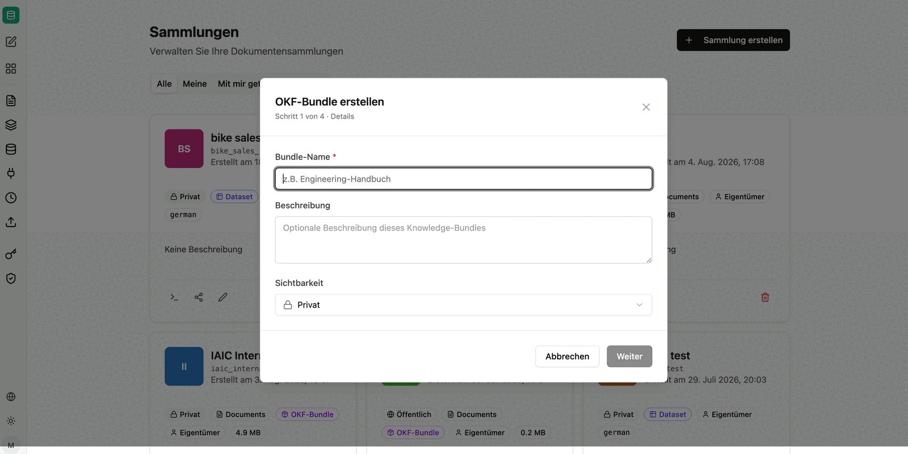
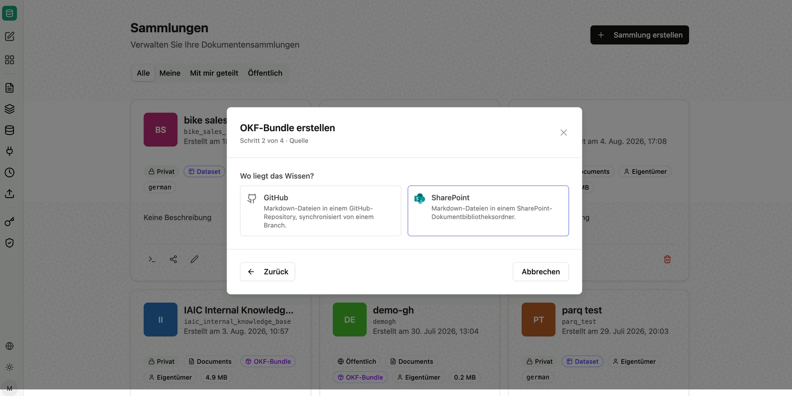

OKF bundles are knowledge collections in the **Open Knowledge Format** – a published, open-source format that describes knowledge as Markdown files with a defined folder structure. The knowledge stays where it can be versioned and reviewed: in a GitHub repository or a SharePoint folder.

Because the bundle is connected as a collection, its content is searchable in companyRAG automatically.

:::note
OKF bundles are currently experimental. Their structure and handling may still change.
:::

## Creating a bundle

Creation takes four steps.

**Step 1 – Details:** bundle name, optional description and visibility.

**Step 2 – Source:** select where the knowledge is stored.

- **GitHub**: Markdown files in a GitHub repository, synchronized from a branch.
- **SharePoint**: Markdown files in a SharePoint document library folder.

**Step 3 – Storage location:** For GitHub, enter the repository in `owner/name` format, the branch and optionally a path. The OKF structure, including an index and a log file, is created inside an empty repository or the specified subpath.

The **commit mode** determines how changes are written back:

- **Pull request**: Changes are proposed via a pull request for review.
- **Direct commit**: Changes are committed directly to the branch.

For SharePoint you select the target folder instead; the OKF bundle including its subfolders is stored there.

**Step 4 – Confirmation:** In the final step you confirm your entries; the bundle is then created and connected as a collection.

## Maintaining bundles

CompanyGPT provides an agent that can create and extend OKF bundles and the Markdown files they contain. Combined with the *pull request* commit mode, this creates a reviewable workflow: the agent proposes changes to the knowledge base, and a human approves them.

How such an agent is set up, which tools it needs and what the workflow looks like from the structure of the format through to indexing is described under [companyKNOWLEDGE](/en/company-gpt/addons/companyknowledge/).

:::tip[Note]
For OKF bundles the **Markdown-based** chunking strategy is recommended, since the content is structured by headings. See [Chunking strategies](/en/company-gpt/addons/companyrag/sammlungen/#chunking-strategies).
:::

A connected [GitHub or SharePoint integration](/en/company-gpt/addons/companyrag/integrationen/) is required.
