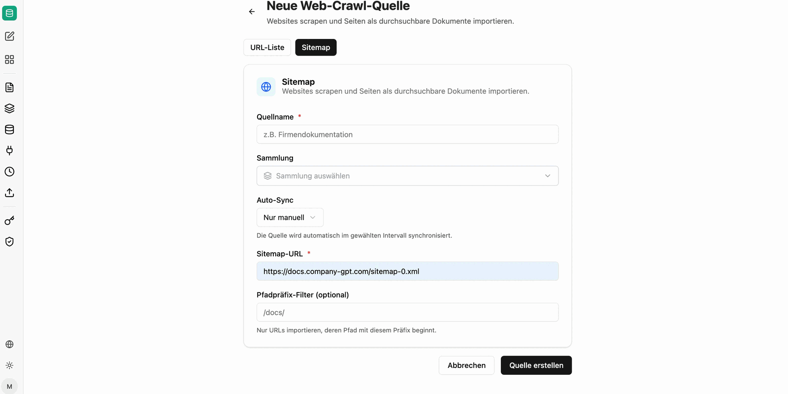

Sources connect companyRAG permanently to a third-party system and synchronize documents automatically into a [collection](/en/company-gpt/addons/companyrag/sammlungen/). New and changed files are pulled in without you having to upload them again.

A connected [integration](/en/company-gpt/addons/companyrag/integrationen/) is required.

The overview can be filtered by system and shows, for each source, its configuration, the target collection, the time of the last synchronization and the person who created it.

## Web crawl

Individual web pages, lists (in CSV files), and entire website sitemaps can be crawled and indexed. You can configure how often the crawl should be repeated. For individual pages, the entire page is always re-indexed. For sitemap crawls, only the difference based on the last crawl and the modification date is taken into account.

For entire websites, switch to the `Sitemap` tab. The **path prefix filter** determines which pages are indexed: `/tutorials/` for example imports only URLs whose path starts with `/tutorials/`.

## Connecting SharePoint

The "+ Connect SharePoint" button starts the selection.

1. **Select website or team**: Choose the SharePoint site or team
2. **Select library**: Libraries of the selected site/team
3. **Browse folders**: Select the folder and the file types to synchronize. Specify the collection into which the files should be synchronized.

:::note
Only folders can be selected. All supported files in this folder and in hierarchical levels below it (subfolders) are synchronized automatically.
:::

After connecting, the folder appears under "All sources" as Active. Synchronization must be triggered once via the "Sync now" button. The connected documents are then added as synchronization jobs, and future contents of the folder are synchronized automatically.

:::tip[Permissions]
Synchronization carries over the permissions of the source system. A user therefore never sees more content through companyRAG than they would see through the SharePoint interface.
:::

## Nextcloud, Google Drive and GitHub

Nextcloud, Google Drive and GitHub follow the same principle: connect the integration, create a source, browse the folder or repository, and define the file types to be indexed as well as the target collection.

## Synchronization interval

For each source you define how often it is synchronized: **manual only**, **hourly**, **daily** or **weekly**.

Every run transfers only the difference – content with a newer modification date that has not been synchronized yet. Unchanged documents are not re-indexed.

## Excluding folders

For SharePoint sources you can exclude individual areas under **Edit**, for example drafts or archives. The permitted syntax is described directly in the dialog.

## Source actions

- **Sync now**: Start the initial/manual synchronization
- **Edit**: Adjust the name, synchronization interval and excluded folders
- **Pause/Resume**: Deactivate or reactivate selected sources
- **Delete**: Remove the data source – files already synchronized remain in the collection

You can follow the progress of the runs under [Jobs](/en/company-gpt/addons/companyrag/auftraege/).
