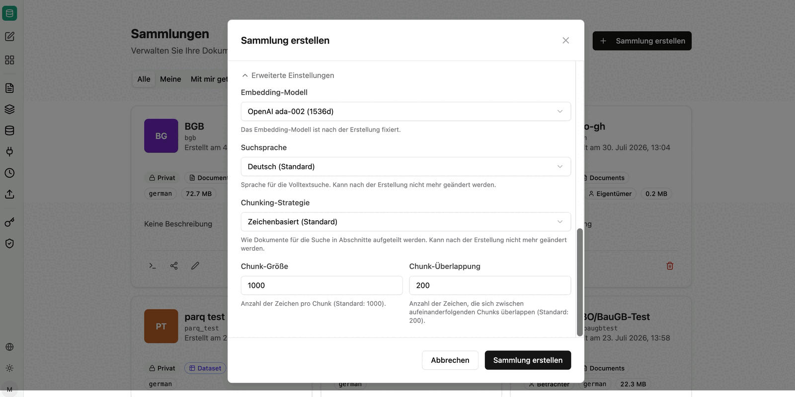
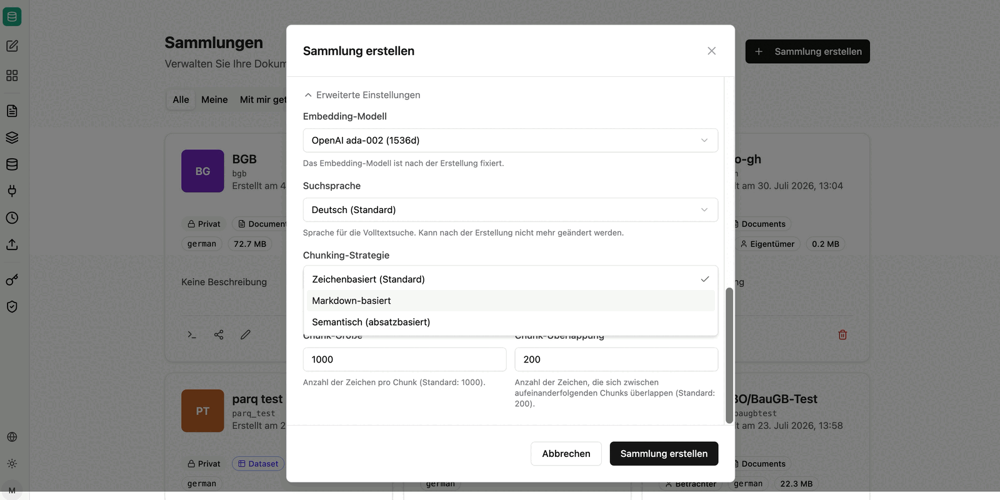

Collections are storage locations and allow you to organize documents and permissions. Every collection is searchable independently, and every share is granted at collection level.

All collections you own appear under the `Mine` tab. Collections shared specifically with you (role Admin or Viewer) are shown under `Shared with me`. All publicly visible collections are shown under `Public`.

## Creating a collection

When creating a collection you define its name, description and visibility. The technical name is generated automatically from the name – it is later used in agent prompts and in the MCP tools as `collection` or `source`.

Two visibility options are available:

- **Private**: Only you can access this collection and the documents linked to it. You can share the collection at any time later.
- **Public**: All users in your organization can see the collection and view files from it – strictly within the company.

In addition, two processing options can be enabled:

- **Extract structured data** *(BETA)*: In addition to semantic search, typed fields are extracted from every document into a schema you define, and become queryable via SQL. See [Structured data from documents](/en/company-gpt/addons/companyrag/strukturierte-daten/).
- **Describe images** *(BETA)*: Image content is turned into text using a vision model (see below).

## Advanced settings

| Setting | Meaning |
|---|---|
| **Embedding model** | Model used to vectorize the content, e.g. `OpenAI ada-002 (1536d)`. |
| **Search language** | Language for the full-text search that runs in addition to the AI search. It should match the language of your content so that stop words are removed and word forms are reduced correctly. |
| **Chunking strategy** | How documents are split into sections for search (see below). |
| **Chunk size** | Number of characters per chunk. Default: 1000. |
| **Chunk overlap** | Number of characters that overlap between consecutive chunks. Default: 200. |

:::note
The embedding model, search language and chunking strategy are fixed once the collection has been created and cannot be changed afterwards. Review these settings before creating a collection – especially for large volumes that would otherwise have to be re-indexed.
:::

### Chunking strategies

- **Character-based (default)**: Fixed chunk size with overlap, by default 1000 characters with 200 characters of overlap. Suitable for mixed content without reliable structure.
- **Markdown-based**: Everything between two headings forms one chunk. Recommended for wikis, documentation and [OKF bundles](/en/company-gpt/addons/companyrag/okf-bundles/).
- **Semantic (paragraph-based)**: Every paragraph forms one chunk. Suitable for texts with clearly separated paragraphs.

## Describing images

All documents – for example scans uploaded as PDF – pass through an OCR pipeline. When OCR finds no text, or when figures carry relevant information, companyRAG can send each image to a vision model and insert a short text description at the matching position in the document. This makes image content searchable.

- **Only pages without extractable text (fallback for scans)**: The most economical option. Runs only on scanned or pure image pages where OCR found no text, and restores their content. Recommended for scanned documents.
- **All images**: Describes every image on every page, including figures and diagrams in text documents. More thorough, but sends considerably more vision requests.

:::note
Image description requires a vision model configured on the server.
:::

## Collection actions

- **Share:**
  - **Type**: Share with individual users, an Entra group, or the whole organization.
  - **Role**: Viewer (collection and associated documents can be viewed and searched) or Admin (collection and associated documents can be edited, including uploading and deleting files). The Owner role has full control over the collection.
    After confirming via `Add Share`, the share is granted and added to the `Current Shares` list.
- **Edit**: Change the name and description of the collection.
- **Delete**: Delete the collection.

:::note
Collections shared with the whole organization are always granted read access only, so that not every user can change content. Individual shares, in contrast, can be given the Admin role.
:::

:::danger
Deleting a collection irrevocably deletes all documents and jobs linked to the collection!
:::

## Next steps

- Add content: [Upload](/en/company-gpt/addons/companyrag/hochladen/) or [Sources](/en/company-gpt/addons/companyrag/quellen/)
- Query a collection: [Using companyRAG in CompanyGPT](/en/company-gpt/addons/companyrag/in-companygpt/)
