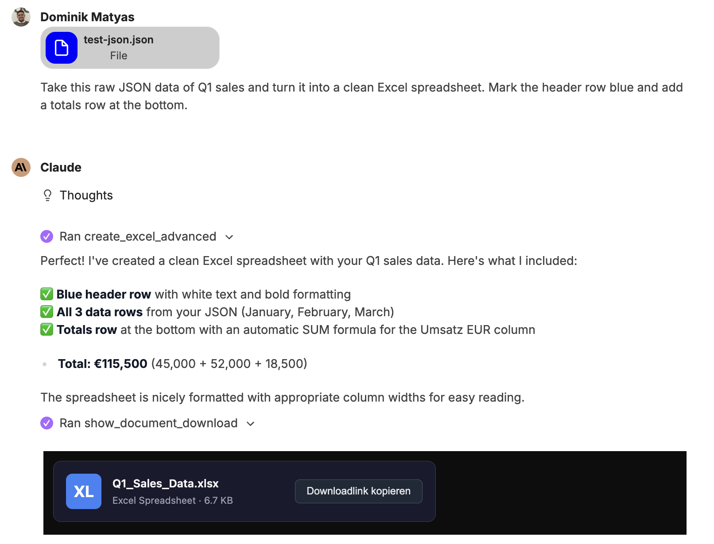
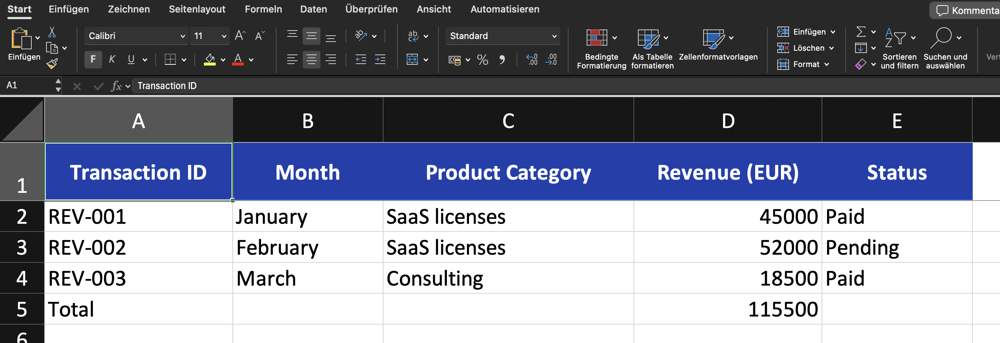
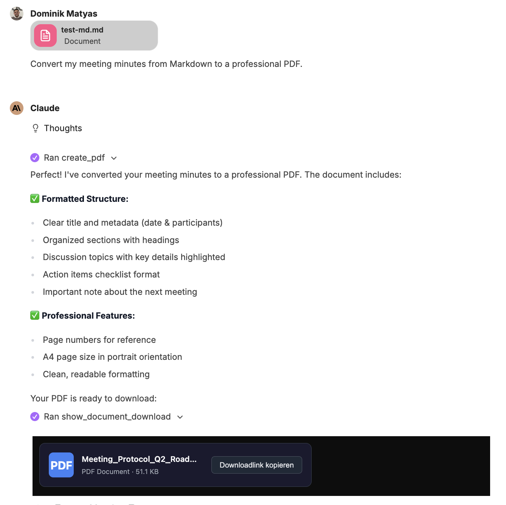
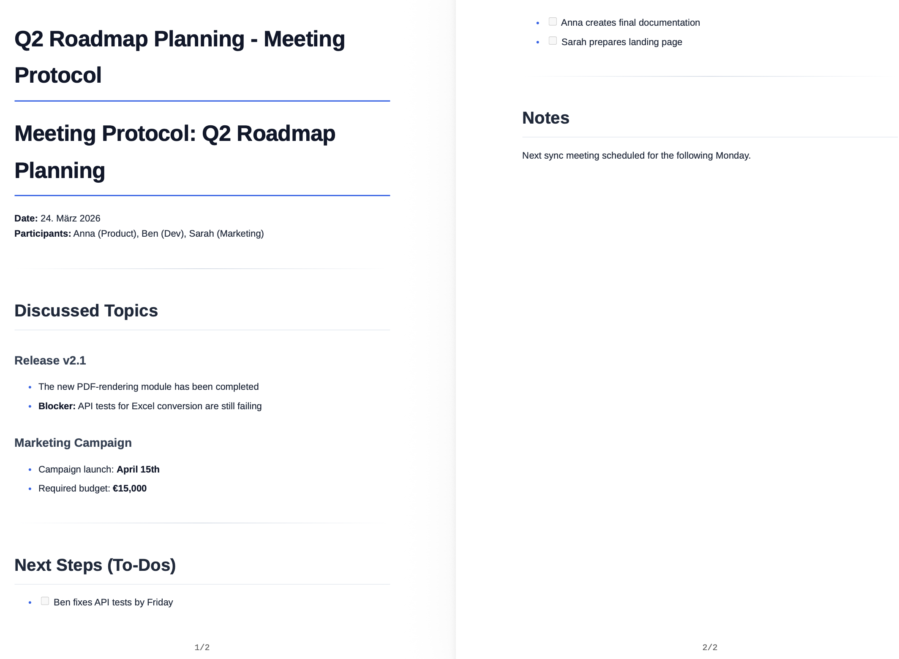
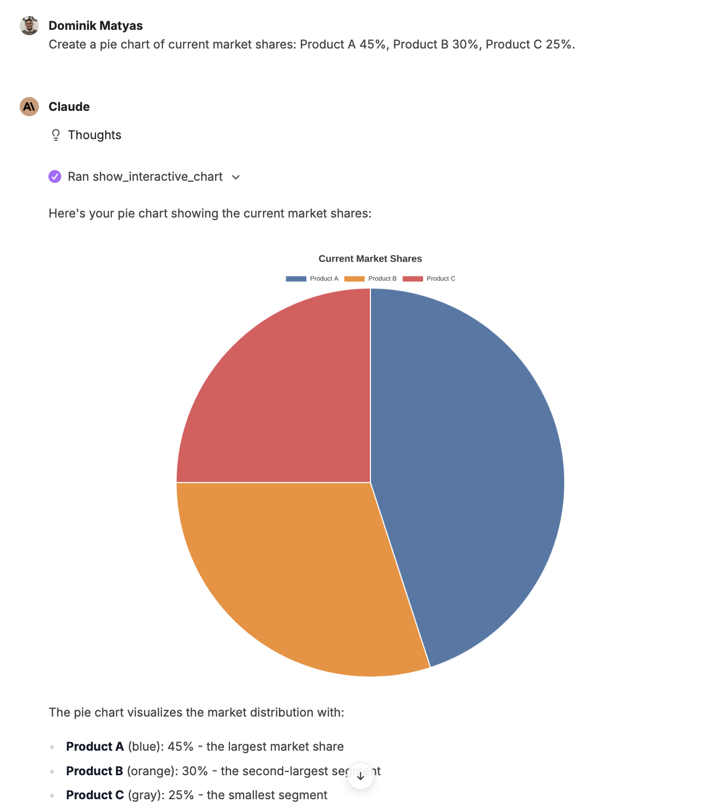
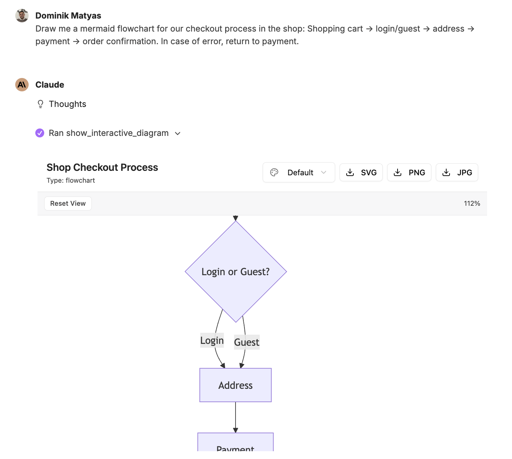
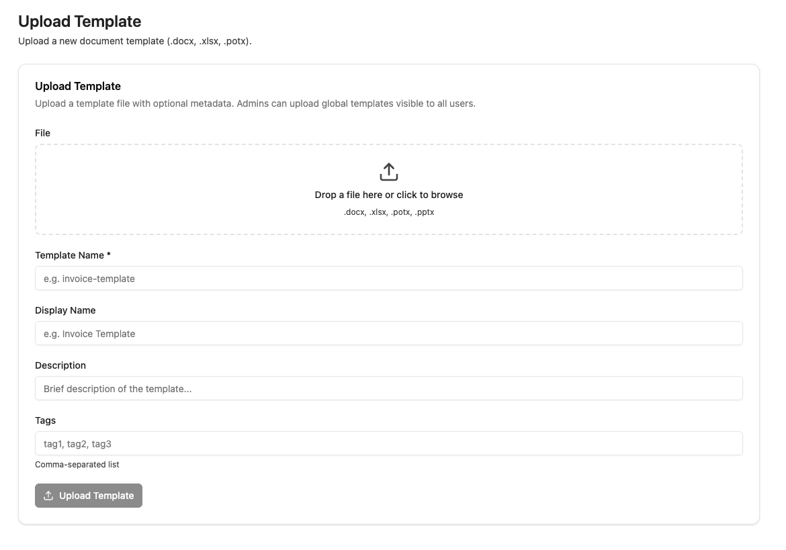

With the companyFILES addon, complex files can be generated, converted and comprehensively managed from simple prompts and raw data.

## Comprehensive document creation

Native Word (.docx), Excel (.xlsx), PowerPoint (.pptx) and PDF files can be created.

- **Excel:** Tables can be generated from CSV, JSON and arrays or advanced templates including formulas can be used.
- **Word:** Markdown, HTML, JSON or templates are seamlessly converted into finished documents.
- **PowerPoint:** Presentations can be created directly from Markdown texts or templates.
- **PDF:** PDFs can be generated directly from Markdown or HTML.

**Example: JSON to Excel**

Chat:

Result:

## Data Processing & Code Export

Structured data such as JSON or CSV can be converted directly into clean Excel spreadsheets or Word documents. In addition, any text-based files and code scripts can be created (e.g. SQL, JSON, YAML, XML, HTML, Python or JS).

**Example: Meeting minutes in PDF document**

Chat:

Result:

## Visual Diagrams & Charts

Raw numbers can be visualized directly as meaningful graphics.

- **Interactive charts:** Bar, line, pie, scatter, bubble or radar charts including zoom function and image export can be created.
- **Mermaid diagrams:** Flowcharts, sequence diagrams, class diagrams and state machines can be generated via prompt.

**Example: Pie chart**

**Example: Mermaid Flowchart**

## File Conversion & Data Extraction

- **Conversion:** You can flexibly switch between formats (Excel ↔ CSV/JSON, Word ↔ PDF, Markdown ↔ HTML, etc.).
- **Extraction:** Data and texts can be read and extracted from existing Excel, Word and PDF files.
- **Image Editing:** The size of images can be changed and converted to other graphic formats.

## Intelligent Template Management

Templates enable reusable document generation with dynamic content. However, you cannot simply upload a finished document — it must be prepared with placeholders first.

### Preparing Templates

Templates use double curly brace syntax: `{{placeholder}}`. Open the document in its native application and insert placeholders like `{{CompanyName}}`, `{{Date}}`, `{{Address}}` wherever CompanyGPT should insert dynamic content. Placeholder names are freely choosable but should be descriptive.

- **Word (.docx):** Place `{{placeholder}}` directly in the document text. Example: "Dear {{Salutation}} {{LastName}}, ..." or a table cell with `{{InvoiceAmount}}`
- **Excel (.xlsx):** Place `{{placeholder}}` in individual cells. Example: Cell A1 with `{{EmployeeName}}`, Cell B1 with `{{Department}}`
- **PowerPoint (.pptx / .potx):** Place `{{placeholder}}` in text boxes on slides. Example: Title slide with `{{ProjectName}}`, content slide with `{{Summary}}`

:::tip
Use descriptive placeholder names like `{{CustomerName}}` instead of `{{C1}}`. This helps CompanyGPT understand the context and fill placeholders more reliably with the correct data.
:::

:::caution
A regular, fully completed document without placeholders cannot be used as a template. CompanyGPT requires the `{{placeholder}}` markers to identify which parts should be dynamically replaced.
:::

### Uploading Templates

Templates can be viewed in the **Templates** tab and uploaded in the **Upload Template** tab. Supported formats: `.docx`, `.xlsx`, `.potx`, `.pptx`

Upload fields:
- **Template Name** (required): Unique technical name (e.g. `invoice-template`)
- **Display Name**: User-friendly name (e.g. `Invoice Template`)
- **Description**: Brief description of the template's purpose
- **Tags**: Comma-separated tags for better discoverability

:::note
Admins can upload global templates that are visible to all users.
:::

### Using Templates in Chat

Once uploaded, reference the template in the chat and provide the data for the placeholders. CompanyGPT replaces all `{{placeholder}}` markers with the provided values and generates the finished document.

Example prompt: "Create an invoice using the 'Invoice Template'. Customer name: Sample Inc., Invoice amount: $1,500, Date: April 15, 2026"

## File Management & Organization

- **Data Transfer:** Files can be uploaded and generated documents can be downloaded directly.
- **Structuring:** Files can be clearly organized into folders; in addition, ZIP archives can be created for the bundled download of several documents.
- **Administration:** The overview of the document organization is maintained, while system settings and stored company information can be checked directly in the addon.
