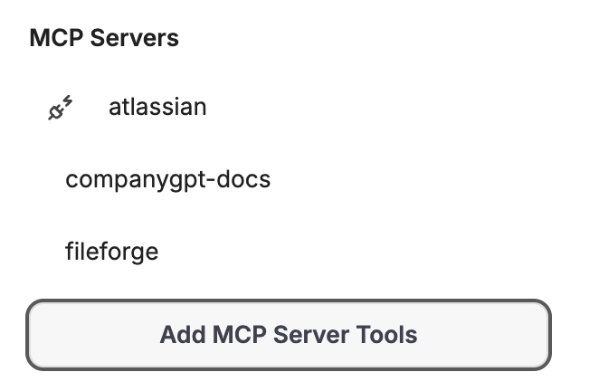
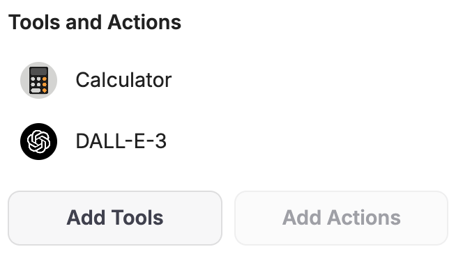
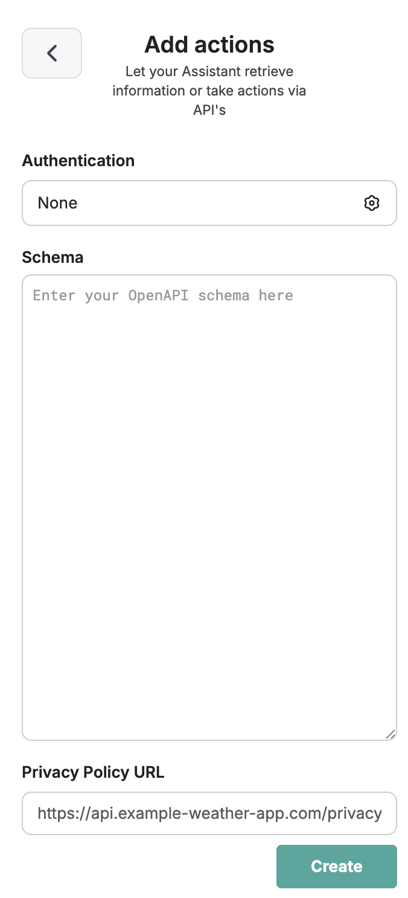
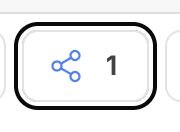
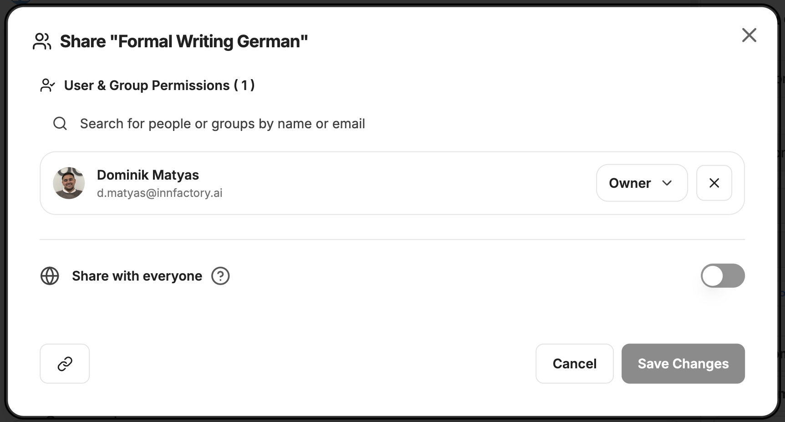
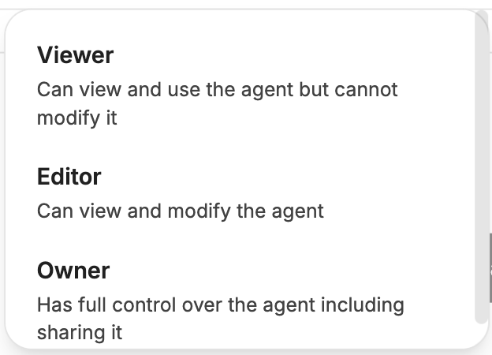
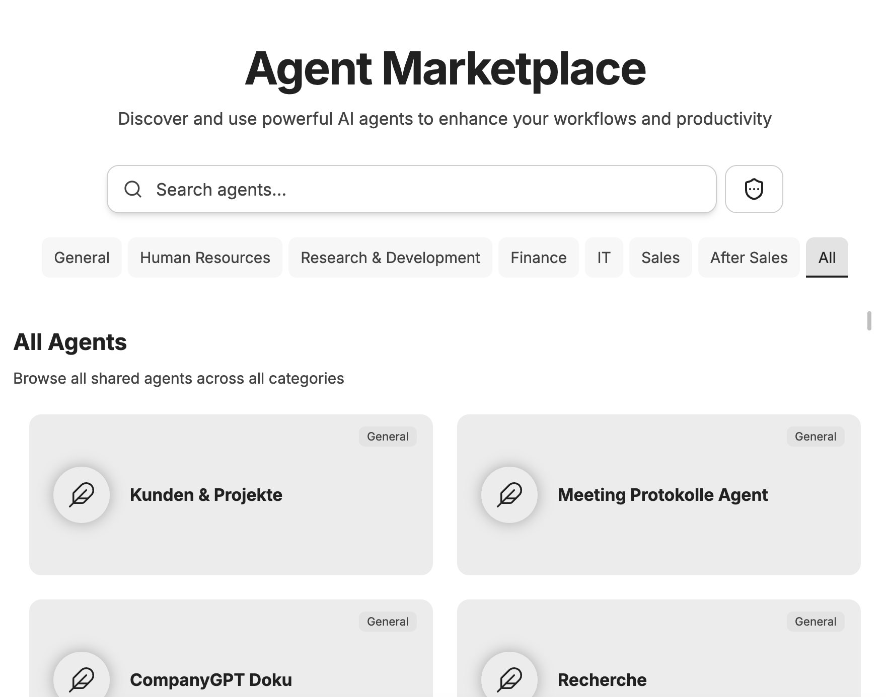

Agents in CompanyGPT are advanced systems designed to do more than just generate text. They analyze the user's request, create a plan for completion, use tools to obtain information, and respond to the request.

Capabilities:

- **Reasoning**: Can break down complex problems into smaller units and process them
- **Tool Usage**: Can decide which tools to use for which tasks
- **Action**: Can execute tools to obtain information

## Components of agents

### Name and description

Agents should always have a name, as they can be selected by name in the model selection. In addition, a description can be stored that provides additional information.

### Category

Each agent can be assigned to a category. If agents are shared between users within the company and the Agent Marketplace is used, they can be filtered by category there.

### Instructions

The instructions are the actual prompt for the agent. This describes what the agent has to do, how it should behave, etc. Information on effective prompting for agents can be found here: [Prompt Engineering](/en/prompt-engineering/uebersicht). Especially with agents, it is advisable to use structured and cleanly formatted prompts.

Variables such as the current date, time, or current user can also be passed on.

### AI model

The AI model is the brain of every agent, as it analyzes requests, selects tools, and evaluates, summarizes, and returns results. Here, the creator can choose between all available models.

In addition to the model, the AI parameters can be adjusted. A detailed description can be found here: [AI settings](/en/company-gpt/ki-einstellungen)

### Capabilities

Each agent has built-in capabilities that can be activated as needed.

#### Web Search

:::note
The "Web Search" checkbox under agent capabilities is deprecated and currently non-functional. It will be removed in an upcoming version.
:::

Web search is activated via the model parameters of the selected AI model. Click on the AI model and open its settings. There you will find the **"Web Search"** toggle. For Google Gemini models, this is called **"Grounding with Google Search"**.

Additionally, you can add the **WebFetch** tool via an **MCP Server**. This uses a headless browser to crawl specific URLs – comparable to directly visiting a website in your browser.

For more information about web search, see: [Web Search](/en/company-gpt/integrationen/websuche).

#### File Context (OCR)

Files uploaded as “context” are processed with OCR to extract text, which is then added to the agent's instructions. Ideal for documents, images with text, or PDFs when you need the full text content of a file.

:::tip
Context documents are always complete in the context of the agent/conversation. Here, you should limit yourself to the essentials, e.g., instructions on tone or past examples. For very long documents, **file search** might be more suitable.
:::

#### Artifacts

Enables the use of code artifacts for this agent. By default, additional special instructions for using artifacts are added unless “Custom Prompt Mode” is enabled.

More information about artifacts can be found here: [Artifacts](/en/company-gpt/integrationen/artefakte).

#### File Search

When enabled, the agent is informed of the exact file names listed below and can thus retrieve relevant information from these files. Retrieval works as **RAG (Retrieval Augmented Generation)** using similarity searches between queries and content. Only relevant text passages are used. This contrasts with **file context**, where the entire content is always in context.

For more information, see [Prompt Engineering / RAG](/en/prompt-engineering/prompt-techniken/rag)

#### MCP Server

MCP Server tools can be specified per agent, including which tools from the MCP Server the agent can use.

#### Tools and Actions

Tools are built-in tools that can be used by the agent. These can of course be combined with MCP tools.

Actions are external API interfaces that can be connected directly via [OpenAPI-compatible schemas](https://spec.openapis.org/oas/latest.html).

:::tip
This functionality is very advanced, but also outdated; it is better to connect API endpoints via your own MCP servers.
:::

#### Contact Information

Each agent can be assigned contact information for the creator, which is useful for feedback on shared agents.

### Advanced Settings

#### Maximum Agent Steps

Limits how many steps the agent can take in a run before giving a final answer. The default value is 25 steps. A step is either an AI API request or a tool usage round. For example, a simple tool interaction involves 3 steps: the initial request, the tool usage, and the follow-up request.

#### Agent chains

Allows you to create agent sequences. Each agent can access the outputs of previous agents in the chain. Based on the “mixture-of-agents” architecture, where agents use previous outputs as additional information.

### Version

Each time changes to an agent are saved, a version is created. These versions can be viewed and revoked via the version display. This is useful if you want to undo changes.

## Admin Settings

An admin user can set which rights apply to **admins** and **users**:

- Allow sharing of agents: `YES` or `NO`
- Allow creation of agents: `YES` or `NO`
- Allow use of agents: `YES` or `NO`

## Sharing Agents

If the user has the appropriate rights, they can share agents. To do this, click on the Share button next to the Save button.

You can choose whether the agent should be shared globally, with specific users, or with user groups.

You can select the rights with which other users can access the agent.

## Our agents

At [**Agents**](/en/tutorials) you will find a selection of agents that we have developed for various use cases. You can use these directly or as a template for your own agents.

## Agent Marketplace

Shared agents as well as your own agents can be viewed via the Agent Marketplace.

