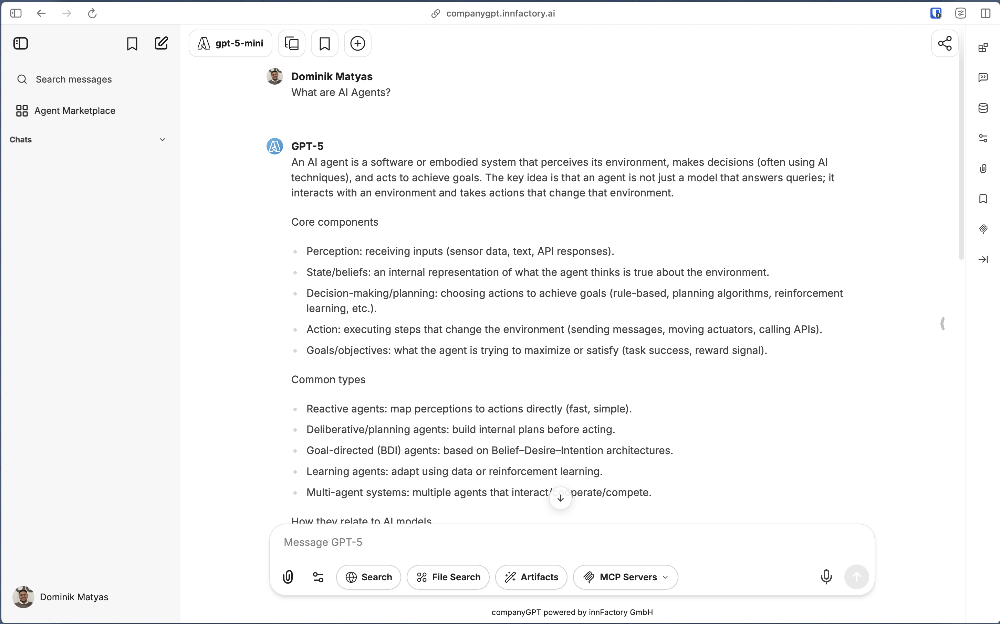
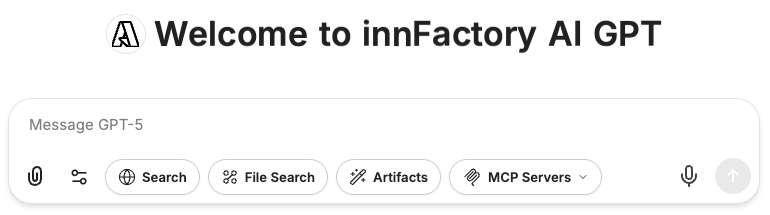
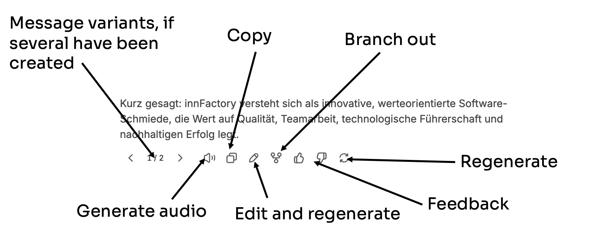
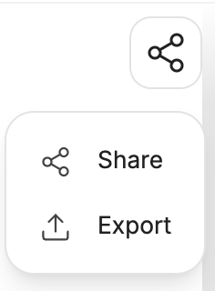
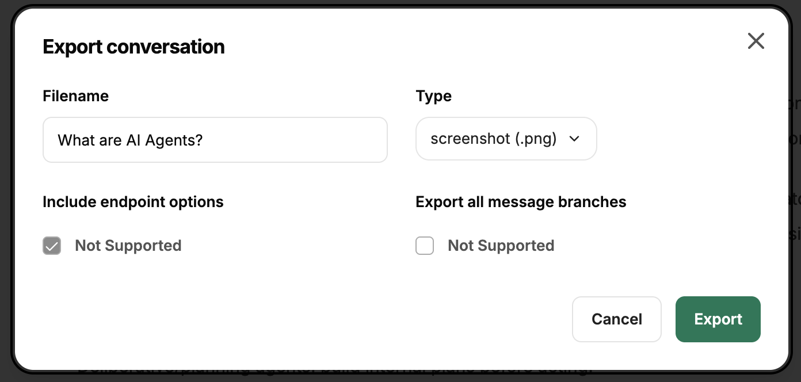

The chat is the main interface for communicating with the various language models and agents.

:::caution[Always keep in mind]
All messages and files in the current chat are always part of the context. It is therefore a good idea to use a separate chat for each topic.
:::

## Prompt input

Chat messages or prompts are entered via the input field.

:::tip
Information on prompt engineering and prompt instructions can be found here: [Prompt Engineering](/en/prompt-engineering/uebersicht)
:::

## Integrations

In addition to the actual prompt input, the context can be further expanded by:
- [Websuche](/en/company-gpt/integrationen/websuche)
- [Dateisuche](/en/company-gpt/integrationen/dateisuche)
- [Artefakte](/en/company-gpt/integrationen/artefakte)
- [MCP Server](/en/company-gpt/integrationen/mcp-server)

These can be enabled or disabled for individual messages in the respective chat.

## Messages

The message history develops over time within the conversation between the user and the AI model(s). After each message, the user can use a different model or agent, which of course always receives the entire previous context.

### Message options

Messages in the chat have quick actions:

- **Regenerate** and **Message Variants**: Using `Regenerate`, several response variants can be generated, between which you can switch.
- **Read Aloud**: Using [Text-to-Speech](/en/company-gpt/einstellungen/#text-to-speech), the message can be read aloud using the set engine.
- **Copy**: Copies the entire content of the message to the clipboard.
- **Edit and regenerate**: The message can be edited afterwards and either saved or regenerated with changes. This is useful if you want to add or change information in the context.
- **Branch**: Allows you to branch off at a certain point with all previous messages. This is helpful if, for example, you want to think in different directions.
- **Feedback**: Feedback on messages is only retained in context, but this allows the user to signal whether a message was good or not.

## Sharing and exporting

Message histories can be shared publicly or exported to different file formats. 

### Sharing 

Message histories can be shared via links. To do this, an anonymized, publicly available link is generated that can be accessed by anyone. A QR code can also be created. 

:::caution
“Public” here means the same visibility as CompanyGPT. If CompanyGPT is only accessible from the company network, “public” also means only within the company network.
:::

### Export

Message histories can also be exported. This has the advantage that they can be saved as files in different formats. Histories in JSON format can also be [imported](/en/company-gpt/einstellungen/#konversationen-importieren) again.

To export, you must select a file name and format.

In addition, depending on the file format, the following settings can be made:
- **Include endpoint options**: The model names are also saved in the information.
- **Export all message branches**: If there are branches, they can also be exported.
- **Sequential or recursive** (JSON only): Display of messages within the JSON object, either as a flat list of messages or as a recursive list with nested messages.