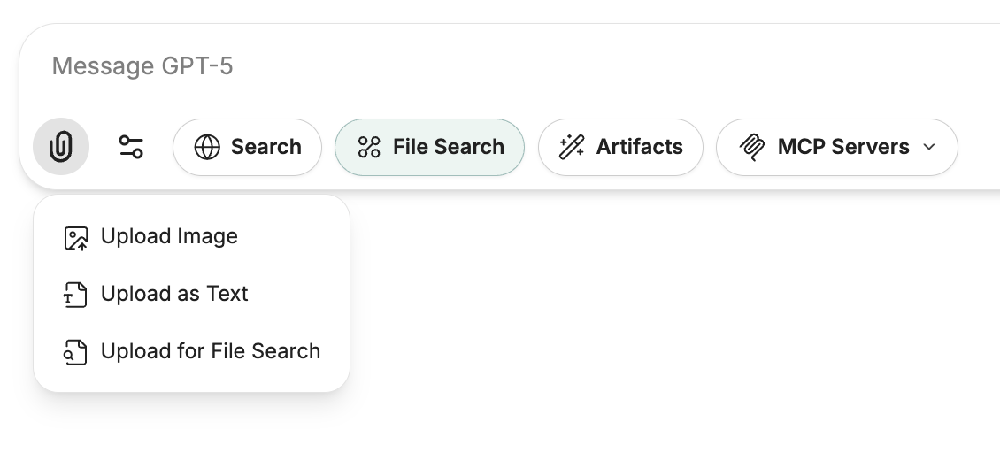
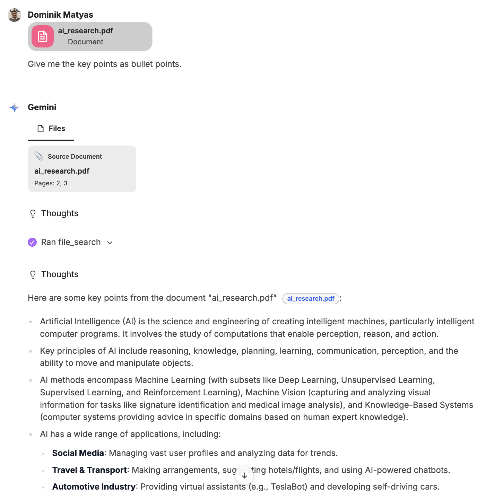

Files can be processed in different ways in CompanyGPT. Depending on the type, the file contents are then available in different ways.

:::tip[Quick overview]
- Upload to AI provider: The files are sent to the AI along with a prompt (depending on the capabilities of the AI and file type). The content can be interpreted, for example, images or text including graphics.
- Upload as text: Processing as text via OCR (Optical Character Recognition). Available in its entirety.
- Upload for file search: Process as text, break down into sections, and convert as embeddings using an embedding model. Similarity search during query.
:::

## Upload to AI provider

The files are sent in their entirety to the AI model together with a prompt. This allows the content to be read and processed. Additional instructions can be given via the prompt. For example, images can be analyzed, texts including graphics can be processed and interpreted, or handwritten scans/photos can be processed. 

**Limitation**: The AI model determines which information and file types can be processed.

## Upload as text

Here, files, such as PDFs, are uploaded and all text is extracted using OCR (Optical Character Recognition) by an AI model and attached to the message in its entirety. This is useful if, for example, you want to summarize texts or extract important points. 

**Limitation**: No images in the texts are processed. Azure's `Document API`, based on Mistral OCR, only allows documents with a maximum length of 30 pages and a file size of 50 MB. 

## File search

Documents can also be uploaded for file search. The contents are indexed and stored in the database. These can then be searched by the AI models as needed and the answers can be enriched by the results. Information on how this works can be found here: [RAG - Retrieval Augmented Generation](/en/prompt-engineering/prompt-techniken/rag/#rag-workflow-for-file-processing)

**Limitation**: The documents are only accessible to the respective user. To make documents accessible to multiple users or the entire organization in the file search, they can be integrated via [agents](/en/company-gpt/agenten) or via the [AI search](/en/company-gpt/addons/ki-suche).

## SharePoint integration

The same file processing options are available via SharePoint integration. The files do not have to be uploaded manually, but can be added directly from all SharePoint locations accessible to the user, either as [Upload to AI provider](#upload-to-ai-provider), [Text](#upload-as-text) or for the [file search](#file-search).