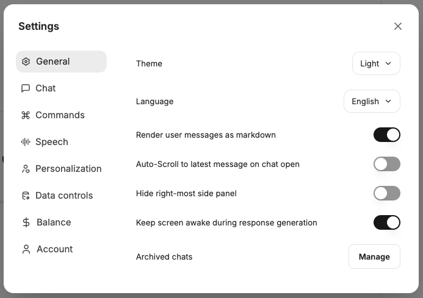

The settings can be accessed via the user menu in the lower left corner. The settings dialog is organized via the left-hand navigation into the areas **General**, **Chat**, **Language**, **Data & Privacy**, **Account**, and **About**.

## General

Appearance, layout, and accessibility are configured under **General**:

### Appearance

#### Design

- Light
- Dark
- System

#### Display language

Language in which the user interface is displayed.

#### Font size

Select the font size in which chat messages should be displayed.

#### Chat direction

- `ltr`: Left to right
- `rtl`: Right to left

### Layout

#### Maximise chat pane

The chat pane is expanded to full width.

#### Center chat input on the welcome screen

Chat input is centered or centered at the bottom on the welcome screen.

#### Scroll to bottom button

Displays a button at the bottom of the chat area that allows you to quickly scroll to the end of the chat.

### Accessibility

#### Keep screen active during response generation

Prevents the screen from going into sleep mode whilst a response is being generated.

## Chat

### General chat settings

#### Press Enter to send messages

When enabled, `Enter` is sufficient to send messages. New lines can be added with `Shift + Enter`. When disabled, `Ctrl / Cmd + Enter` must be used to send messages, `Enter` then adds a new line.

#### Always show code when using the code interpreter

Code is displayed by default.

#### Save drafts locally

When enabled, text and attachments entered into the chat form are automatically saved locally as drafts. These drafts are also available when the page is reloaded or when switching to another conversation. Drafts are stored locally on the device and are deleted once the message is sent.

#### Save badge status

When enabled, the status of the chat badges is saved. This means that the badges remain in the same state as in the previous chat when you create a new chat. If this option is disabled, the badges are reset to their default state every time you create a new chat.

### Commands

Commands are shortcuts that can be executed in the message input field, allowing quick access to models, prompts, and multiple responses.

#### @ command for switching models

Toggles the “@” command for switching endpoints, models, presets, etc.

#### Command + for multiple responses

Toggles the “+” command to add a multiple response setting.

#### Command / for prompt template

Toggles the “/” command to select a prompt template via the keyboard.

### Messages

#### Display user messages as Markdown

Controls the display of user messages as Markdown. Markdown is a lightweight syntax for marking up text. AIs also respond in Markdown, and the content is displayed accordingly (e.g., bold). This setting controls whether user messages should also be displayed in this format.

#### Show usernames in messages

When enabled, the sender's username will be displayed above each message that is sent. When disabled, “You” will be displayed above the messages.

#### Parse LaTeX in messages (may affect performance)

When enabled, LaTeX code in messages is rendered as mathematical equations. Disabling this may improve performance if LaTeX rendering is not required.

#### Open thought process dropdowns by default

When AI models are thinking, the thought process can be displayed by default or hidden behind a dropdown and opened when needed.

#### Auto-expand tool details

Automatically expands the detail view of tool calls so that the executed steps are immediately visible.

### Conversations

#### Switch to chat history on new chat

Automatically switches to the chat history view when a new chat is created.

#### Automatically scroll to the latest message when the chat is opened

This setting controls whether existing chats should automatically scroll to the bottom to the latest message when they are opened.

#### Allow changing endpoints mid-conversation

Allows the user to change the endpoint mid-conversation. This can be useful if, for example, you realise that a different model is better suited to the current task.

#### Temporary chat by default

When enabled, new chats start in temporary mode by default. Temporary chats are not saved in the history.

#### Use default branching option

Uses the default branching option when a new chat is created. This option can be configured in the AI settings.

#### Start branching from the target message by default

When enabled, branching starts from the target message and goes back to the last message in the conversation, in accordance with the selected behaviour.

### Prompts

#### Advanced prompt editor

Enables an advanced editor for creating and editing prompts with additional features.

#### Always apply new prompt versions to production

New versions of a prompt are automatically adopted as the production version, without having to be released manually.

#### Automatically send prompts when selected

When enabled, a prompt is sent directly when selected, instead of first being inserted into the input field.

## Language

Both speech-to-text (STT) and text-to-speech (TTS) are available in CompanyGPT. Both can be used via the integrated browser engine as well as via LLMs (the LLMs must be configured accordingly).

### Conversation mode

Conversation mode enables automatic audio transcription and allows you to set the decibel sensitivity

### Speech-to-text

Can be used to dictate prompt inputs instead of typing.

Engines:

- `External`: LLM
- `Browser`: Engine of the current browser

Language: The language of the input

Automatically transcribe audio

Automatically send text

Delay

### Text to Speech

Can be used to have messages read aloud.

Automatic playback of the latest message

Engines:

- `External`: LLM
- `Browser`: Engine of the current browser

Voice: Available voices, either from the browser engine or AI

Use cloud-based voices

Audio playback speed

Enable TTS caching

## Data & Privacy

### Use saved memories

Allow the AI to access and use your saved memories when responding.

### Import conversations

Conversations can be imported from an exported JSON file, for example, to share them with colleagues.

### Shared links

View conversations shared via links. The links can be accessed again, the source chats can be opened, or the shared links can be deleted.

### Agent API Keys

View the API keys assigned to agents. These can be created and revoked here.

### User API keys

If AI API keys have been assigned at the user level, they can be revoked here.

### TTS cache memory

The TTS cache memory can be cleared if it is used.

### Delete all chats

Delete all chats.

:::danger[Caution]
Deleting all chats cannot be undone.
:::

## Account

### Profile

#### Profile picture

Change the profile picture via **Change image**.

### Billing

#### Balance

Overview of the current balance.

#### Automatic top-up settings

Shows when the balance was last topped up, the top-up amount, the interval, and the time of the next automatic top-up.

### Danger zone

#### Delete account

Delete the user account.

:::danger[Caution]
Deleting your user account cannot be undone.
:::

## About

### Version information

Shows information about the installed version: **Version**, **Commit**, **Branch**, and **Built** (build date). Via **Copy diagnostics**, these details can be copied so that maintainers can identify the specific build.
