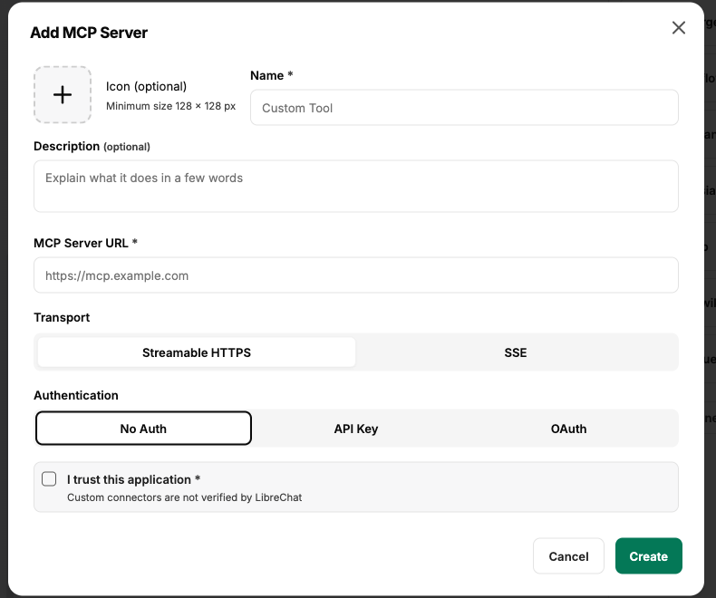
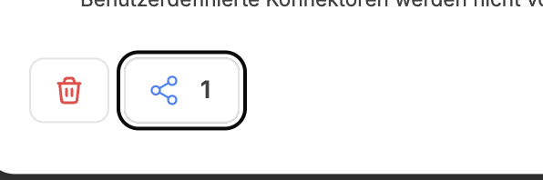
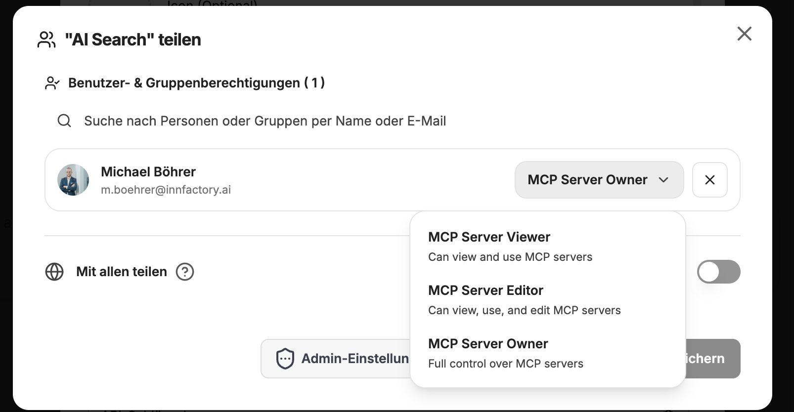

The Model Context Protocol (MCP) is a specialized protocol and interface that enables CompanyGPT to communicate seamlessly with external services. These services run on customer-specific MCP servers, which often host complex backend functionalities or orchestrate specific business processes. Originally developed by Anthropic, the MCP is now supported by almost all AI applications, allowing CompanyGPT to draw on a wide range of existing MCP servers. If necessary, custom servers can be developed to connect almost any application to CompanyGPT.

The MCP is based on a client-server architecture in which CompanyGPT, as the client, consumes the “tools” provided by the server. An MCP server can contain any number of such tools, with the integrated LLM independently deciding which tool to use and which parameters to pass. After execution, the LLM evaluates the results and formulates an appropriate response to the user.

More information about MCP can be found here: [Prompt Engineering / MCP](/prompt-engineering/prompt-techniken/tool-use#das-mcp-model-context-protocol-als-tool)

## Add MCP Server

MCP servers can be added in the right sidebar via the MCP settings. Admin users can configure how MCP servers can be used. Permissions can be assigned for use, creation, and sharing. 

)

Clicking on **+ Add MCP** opens the dialog for adding MCP servers. 

### MCP server properties

The following properties can be assigned:

- **Icon** `optional`: An icon that is displayed in the overview
- **Name**: The name of the MCP server, visible in the overview and in each selection
- **Description** `optional`: A description that is displayed in the overview
- **MCP Server URL**: The URL for the MCP server. These URLs can be for internal services (within the cluster) or MCP server URLs accessible via the Internet.
- **Server Type**: Streamable HTTP or SSE (specified by the server)
- **Authentication**:
- **Auto Detect**: Automatic detection with OAuth `Dynamic Client Registration` or without authentication
    - **API Key**: Authentication with API key, selectable whether an API key is for all users or on a per-user basis.
- **Manual OAuth**: OAuth 2.1 compliant client registration with client ID, secret, redirect URI, authorization and token URL.
- **I trust this application**: Checkbox for confirmation.

Once initialization is successful, the MCP server is now displayed in the overview in the right sidebar and can be used via [Chat](/company-gpt/chat/#integrations) or in [Agents](/company-gpt/agents/).

## Share MCP Server

Once an MCP Server has been added, it can be shared. To do this, click on the settings icon in the overview in the right sidebar. The familiar share menu can then be accessed: 

In the detail menu, you can select with whom and with what rights the MCP server should be shared.

